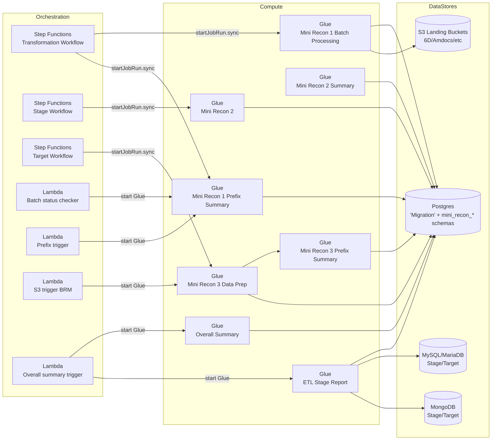
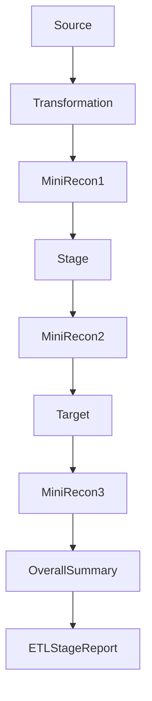

# Recon Module – Functional Specification

## Document Control

- Document Name: Recon Module – Functional Specification
- Module Name: Recon Module
- Version: 1.0
- Author: Vyanktesh Birdode
- Date: 2026-02-20
- Status: Draft

## Table of Contents

*This section is intentionally left without an auto-generated TOC; Confluence can generate it automatically from headings.*

## Module Overview

### Purpose

The Recon Module enforces data control gates across the migration ETL, ensuring that records and key measures (counts, balances, statuses) remain consistent as data moves from Source → Transformation → Stage → Target. The module produces reconciliation detail tables and summary tables in Postgres schemas `mini_recon_1`, `mini_recon_2`, `mini_recon_3`, plus reporting tables for overall and ETL stage reporting.

### High-Level Description

The module consists of:

- **AWS Step Functions** orchestrating batch/prefix workflows and calling **AWS Glue** jobs synchronously.
- **AWS Lambda** triggers that start Glue jobs based on status tables (`mini_recon_1.recon_status`) and log entries (`"Migration".log_table`).
- **AWS Glue jobs** (Spark + Python shell variants) that:
  - Read from multiple stores (Postgres, MySQL/MariaDB, MongoDB, and target schemas).
  - Compute reconciliation outputs and write them back to Postgres tables.
  - Update centralized execution log table `"Migration".log_table`.

> **Important (code-derived):** Most Glue jobs mark execution as **Passed/Failed** based on exceptions, not based on reconciliation mismatches; mismatch handling is generally implemented as **status columns written to recon tables**, not as job failures.

### Business Context

The business intent described for Mini Recon 1/2/3 (gatekeeping before Stage/Target loads) is only partially enforceable from code. The orchestration layer (Step Functions/Lambda) gates on **job execution status** and internal status tables, but explicit “stop on mismatch” logic is not consistently implemented as a hard failure in the Glue scripts. Where gating on mismatch is not found in code, this spec states **"Unable to determine from codebase."**

## Scope

### In-Scope

Static analysis and reverse-engineering of the Recon Module components present in the provided codebase, including:

- Mini Recon 1 Glue jobs and triggers
- Mini Recon 2 Glue jobs and summaries
- Mini Recon 3 data prep, triggers, and prefix summaries
- Overall summary and ETL stage report jobs
- Related Step Function definitions and Lambda triggers

### Out-of-Scope

- Runtime configuration not present in code (actual Glue job parameters in AWS console, IAM roles, VPC networking).
- External operational runbooks not present in repo.
- Any reconciliation rules that are not explicitly encoded in SQL/transform code.

## Objectives

- Provide a publication-ready, code-grounded functional specification for the Recon Module.
- Enumerate end-to-end orchestration, triggers, dependencies, and data/control flows.
- Extract reconciliation formulas and matching criteria directly from SQL and transformation logic.
- Identify control checkpoints that stop/fail/log/escalate.

## Business Requirements Mapping

| Requirement ID | Description | Priority | Mapped Component |
|---|---|---|---|
| BR-01 | Source ↔ Transformation reconciliation gate | Must | Mini Recon 1 (`tsel_mini_recon_01_*`) |
| BR-02 | Transformation ↔ Stage reconciliation gate | Must | Mini Recon 2 (`tsel_mini_recon_02*`) |
| BR-03 | Stage ↔ Target reconciliation gate | Must | Mini Recon 3 (`tsel_mini_recon_03*`) |
| BR-04 | Overall Source → Target consistency summary | Must | `tsel_recon_report_overall_summary` |
| BR-05 | Cross-layer ETL stage consistency report post Target load | Should | `tsel_recon_etl_stage_report` |

## Stakeholders

| Role | Responsibility |
|---|---|
| Data Engineering | Own Glue jobs, data pipelines, and recon outputs |
| Migration Ops | Operate batch/prefix workflows and respond to mismatches |
| QA / Data Control | Define acceptance thresholds and validate mismatch handling |
| Business Owners | Decide remediation and cutover readiness |

## Functional Description

### End-to-End Architecture

### Glue Job Orchestration

#### Step Functions – Transformation Workflow (Prod)

**Definition:** `stepfunctions/prod-stepfunctions/prod_tsel_batch_processing_transformation.json`

Key orchestration steps (code-derived):

1. `Workflow-Transformation` (Task) – starts the main transformation workflow (not part of recon scope).
2. `tsel_mini_recon_01` (Task) – starts Glue job `prod-tsel_mini_recon_01_batch_processing` with arguments:
   - `--env, --cohort_id, --batch_id, --prefix_id, --prefix, --msisdn_start, --msisdn_end`
3. `tsel_mini_recon_01_batch_summary` (Task) – starts Glue job `prod-tsel_mini_recon_01_batch_summary`.
4. `tsel_mini_recon_01_check` (Choice) – routes based on `$.glueResult.JobRunState` to SNS publish success/failure.

**Stop/Fail control point:** Step Function ends in `Fail` state when recon Glue job run state is `FAILED`.

> **Mismatch gating:** Unable to determine from codebase (Step Function checks Glue run state only).

#### Step Functions – Stage Workflow (SIT example)

**Definition:** `stepfunctions/sit-stepfunctions/sit_tsel_batch_processing_stage.json`

- Starts Glue job `sit-tsel_mini_recon_02` with standard batch/prefix arguments.
- On any `States.ALL` error, publishes failure to SNS and terminates.

#### Step Functions – Target Workflow (Prod)

**Definition:** `stepfunctions/prod-stepfunctions/prod_tsel_batch_processing_target.json`

1. `Workflow-target` (Task) – starts target load workflow (not part of recon scope).
2. `tsel_mini_recon_03` (Task) – starts Glue job `prod-tsel_mini_recon_03_data_prep` with args `--env, --cohort_id, --prefix_id, --prefix`.
3. `tsel_mini_recon_03_prefix_summary` (Task) – starts Glue job `prod-tsel_mini_recon_03_prefix_summary` with batch/prefix args.
4. Failure is caught (`States.ALL`) → SNS publish failed.

### Triggers

#### Lambda – Mini Recon 1 Prefix Trigger

**File:** `Lambda/tsel_mini_recon_01_prefix_trigger.py`

**Trigger selection logic (code-derived):**

- Retrieves active cohorts from `circles_dashboard.cohort_updation` where `status='ON'`.
- Selects candidate rows from `mini_recon_1.recon_status` with:
  - `recon_number='recon_01'`
  - `prefix_summary_status is null`
  - One of: `active_status / inflight_status / injected_status / inventory_status / brm_status = 'Passed'`
- Updates `mini_recon_1.recon_status.prefix_summary_status` to `'Started'`.
- Starts Glue job based on env mapping (prod/sit/perf/dev).

**Retry logic:** Unable to determine from codebase.

#### Lambda – Batch Status Check (Transformation)

**File:** `Lambda/tsel_batch_status_check_transform.py`

- Queries `"Migration".log_table` for `process_name='Transformation'` and `entity_name='Mini Recon 1'` and `lower(status)='passed'`.
- Triggers `tsel_mini_recon_01_prefix_summary` once batches are complete.

#### Lambda – Mini Recon 3 Prefix Trigger

**File:** `Lambda/tsel_mini_recon_03_prefix_trigger.py`

- Triggers `tsel_mini_recon_03_prefix_summary` and `tsel_mini_recon_03_prefix_summary_brm` based on Postgres queries.

**Mismatch gating:** Unable to determine from codebase.

#### Lambda – Mini Recon 3 S3 Trigger (BRM)

**File:** `Lambda/tsel_mini_recon_03_s3_trigger_brm.py`

- Starts Glue `tsel_mini_recon_03_data_prep_brm` from S3 event context.

#### Lambda – Overall Summary Trigger

**File:** `Lambda/tsel_recon_overall_summary_trigger.py`

- Starts Glue `tsel_recon_report_overall_summary` and `tsel_recon_etl_stage_report` based on readiness queries.

### Mini Recon 1

#### Components in codebase

| Component | Type | File / Job Script |
|---|---|---|

| tsel_mini_recon_01_batch_processing | Glue (Spark) | `Glue/tsel_mini_recon_01_batch_processing.py` |

| tsel_mini_recon_01_batch_processing_brm | Glue (Spark) | `Glue/tsel_mini_recon_01_batch_processing_brm.py` |

| tsel_mini_recon_01_inflight_trigger | Glue (Spark) | `Glue/tsel_mini_recon_01_inflight_trigger.py` |

| tsel_mini_recon_01_batch_processing_injected | Glue (Spark) | `Glue/tsel_mini_recon_01_batch_processing_injected.py` |

| tsel_mini_recon_01_batch_processing_inventory_py_shell | Glue (Python shell) | `Glue/tsel_mini_recon_01_batch_processing_inventory_py_shell.py` |

| tsel_mini_recon_01_prefix_summary | Glue (Spark) | `Glue/tsel_mini_recon_01_prefix_summary.py` |

#### Output Tables (Mini Recon 1)

| Table | Purpose (code-derived) |
|---|---|

| `mini_recon_1.tbl_addon_count` | Cleared at job start on retry; populated by report functions |

| `mini_recon_1.tbl_migratable_msisdn_count` | Cleared at job start on retry; populated by report functions |

| `mini_recon_1.tbl_migratable_subscriber_status` | Cleared at job start on retry; populated by report functions |

| `mini_recon_1.tbl_msisdn_prefix_count` | Cleared at job start on retry; populated by report functions |

| `mini_recon_1.tbl_non_migratable_count` | Cleared at job start on retry; populated by report functions |

| `mini_recon_1.tbl_payment_count` | Cleared at job start on retry; populated by report functions |

| `mini_recon_1.tbl_promotion_count` | Cleared at job start on retry; populated by report functions |

| `mini_recon_1.tbl_ucoin_balance_count` | Cleared at job start on retry; populated by report functions |

| `mini_recon_1.tbl_pulsa_balance_sum` | Cleared at job start on retry; populated by report functions |

| `mini_recon_1.tbl_user_app_login_count` | Cleared at job start on retry; populated by report functions |

| `mini_recon_1.tbl_report_voucher_open_loyalty` | Cleared at job start on retry; populated by report functions |

| `mini_recon_1.tbl_recon_report_prefix_summary` | Prefix-level consolidated summary |

| `mini_recon_1.recon_status` | Status ledger (inserted with `active_status`) |

#### Execution Flow – `tsel_mini_recon_01_batch_processing`

1. Resolve environment → S3 landing bucket/path.
2. Read Postgres creds from Secrets Manager (`tsel_mito_creds`).
3. Insert `In Progress` record into `"Migration".log_table`.
4. Delete existing rows for cohort+range from `mini_recon_1.*` output tables.
5. Read cohort membership from `"Migration".control_table` for msisdn range.
6. Read S3 source datasets (6D/MW/etc.) and prepare Spark DataFrames.
7. Execute report generators in parallel (ThreadPoolExecutor).
8. Insert `Passed` record into `mini_recon_1.recon_status` (`active_status`).
9. Update `"Migration".log_table` with final status and end time.

**Stop conditions:** Any exception → status `Failed` → Glue job fails.

**Mismatch stop conditions:** Unable to determine from codebase.

#### Validation Formulas – Prefix Summary (`tsel_mini_recon_01_prefix_summary`)

**Subscriber status match:** `(src_count - non_migratable_count) = trgt_count` → `Match` else `Mismatch`.

**Match percent:**
- `100.00%` when both 0
- `0.00%` when either side is 0
- Else `TRUNC(trgt_count * 100.0 / (src_count - non_migratable_count), 2)`.

**Migratable MSISDN Count rollup:**
- `SUM(source_system_count) == SUM(target_transform_count)` → `Passed` else `Failed`, then collapsed to a prefix-level `Match/Mismatch` with failed subset lists.

### Mini Recon 2

#### Output Tables

| Table | Validation Category |
|---|---|
| `mini_recon_2.tbl_transformed_msisdn` | Produced by job; category indicated by table name |
| `mini_recon_2.tbl_status_comparison` | Produced by job; category indicated by table name |
| `mini_recon_2.tbl_plan_validation` | Produced by job; category indicated by table name |
| `mini_recon_2.tbl_app_login` | Produced by job; category indicated by table name |
| `mini_recon_2.tbl_addon_validation` | Produced by job; category indicated by table name |
| `mini_recon_2.tbl_pulsa_balance` | Produced by job; category indicated by table name |
| `mini_recon_2.tbl_subscriber_promotion` | Produced by job; category indicated by table name |
| `mini_recon_2.tbl_payment_sub_count` | Produced by job; category indicated by table name |

#### Core reconciliation rule present in code

For each `(service, subset)` pair configured in `checks`, compute **distinct counts** and set:
- `subset_status = 'Passed'` if counts equal else `Failed`.

Output written to `mini_recon_2.tbl_transformed_msisdn` with cohort/batch/prefix metadata.

#### App Login eligibility (JSON rules)

A contact number is counted as **app-login eligible** when JSON indicates at least one SSO connection (`google|facebook|apple`) or a non-empty `external_operator_number`. This logic is applied across `target_user_service.users`, `injected.tbl_injected_users`, and `inflight.tbl_inflight_users_transform`.

### Mini Recon 3

Mini Recon 3 includes multiple data prep variants and prefix summaries (including BRM and inflight variants). Detailed reconciliation logic is encoded in the SQL blocks in these scripts:

- `Glue/tsel_mini_recon_03_data_prep_py_shell.py`
- `Glue/tsel_mini_recon_03_data_prep_py_shell_optimized.py`
- `Glue/tsel_mini_recon_03_prefix_summary.py`

Where specific match formulas are not expressed as explicit CASE rules or Python comparisons, this spec does not infer them.

**Hard stop on mismatch:** Unable to determine from codebase.

### Overall & Reporting

#### Overall Summary
**Glue:** `Glue/tsel_recon_report_overall_summary.py`

Produces a post-Recon-3 overall summary using SQL aggregations defined inside the script.

#### ETL Stage Report
**Glue:** `Glue/tsel_recon_etl_stage_report.py`

**Transform layer service/table matrix (as encoded in `transform_count_queries()`):**

| Layer | Service | Table Identifier |
|---|---|---|
| Transform | User | users |
| Transform | User | telco_accounts |
| Transform | User | user_preferences |
| Transform | Telco | service_account |
| Transform | KYC | kyc_application |
| Transform | OMS | orders |
| Transform | OMS | order_user_details |
| Transform | OMS | order_billing_details |
| Transform | OMS | order_initial_shipping_details |
| Transform | OMS | order_substate |
| Transform | OMS | order_item |
| Transform | OMS | order_item_properties |
| Transform | Subscription | subscription_order |
| Transform | Subscription | user_subscription |
| Transform | Subscription | user_subscription_product |
| Transform | Subscription | fulfillment |
| Transform | Subscription | product_fulfilment_status |
| Transform | Payment | profile |
| Transform | Payment | transactions |
| Transform | Payment | instruments |
| Transform | Promotion | reward |
| Transform | Promotion | reward_incentive |
| Transform | Promotion | reward_redeem_criteria |
| Transform | Inventory | unit |
| Transform | Inventory | unit_property |
| Transform | Wallet | wallets |
| Transform | Wallet | ledger |
| Transform | Logistics Connector | transaction |
| Transform | Logistics | shipments |
| Transform | Logistics | shipment_items |
| Transform | Logistics | slots |
| Transform | Logistics | pickup_location |

The job also builds corresponding Stage and Target count matrices and aggregates them into an overall comparison report.

## Process / Workflow

## Stage Validation Logic

- **Control checks:** Implemented as status fields in recon output tables and as Glue job success/failure based on exceptions.
- **Threshold rules / retries / escalation:** Unable to determine from codebase (no explicit thresholds or retries found in recon jobs; escalation appears limited to SNS publish on workflow failure).

## Control Checkpoints (Stop / Fail / Log / Escalate)

| Checkpoint | Component | Condition | Outcome |
|---|---|---|---|
| Execution audit insert | Glue (MR1/MR2/etc.) | Job start | Inserts `In Progress` into `"Migration".log_table` |
| Cleanup deletes | Glue | Start of job | Deletes prior cohort/range rows from recon tables |
| Exception handling | Glue | Any thrown exception | Updates `"Migration".log_table` to `Failed` with `error` and fails job |
| Step Functions choice/catch | Step Functions | `JobRunState=FAILED` or `States.ALL` catch | Publish SNS failure and stop workflow |
| Prefix trigger status update | Lambda | recon_status indicates passed | Updates `prefix_summary_status='Started'` then triggers Glue |
| Mismatch recording | Glue | Counts differ | Writes `Failed/Mismatch` status into recon output table rows (job may still succeed) |

## Appendix – Key Tables

| Table | Notes |
|---|---|
| `"Migration".log_table` | Central run audit table updated by most Glue jobs |
| `"Migration".control_table` | Cohort membership and `is_cohort` migratability flag |
| `mini_recon_1.recon_status` | Tracks per-batch status and prefix summary status |
