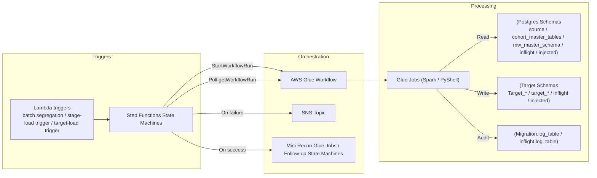
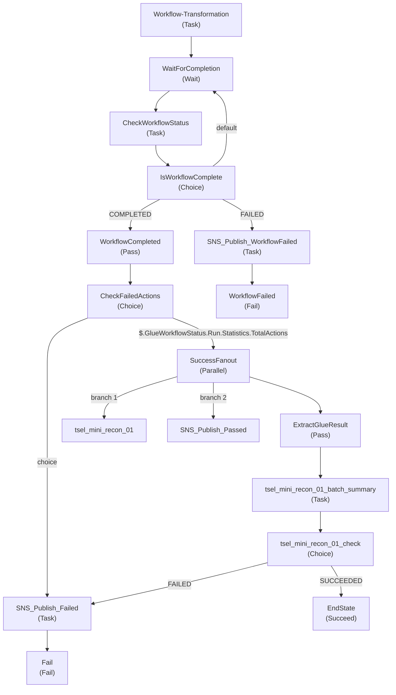
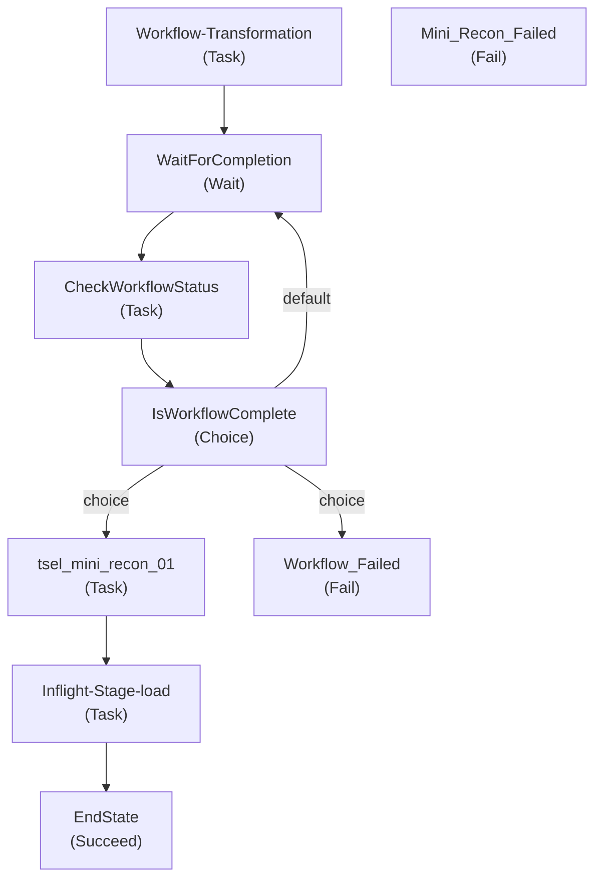
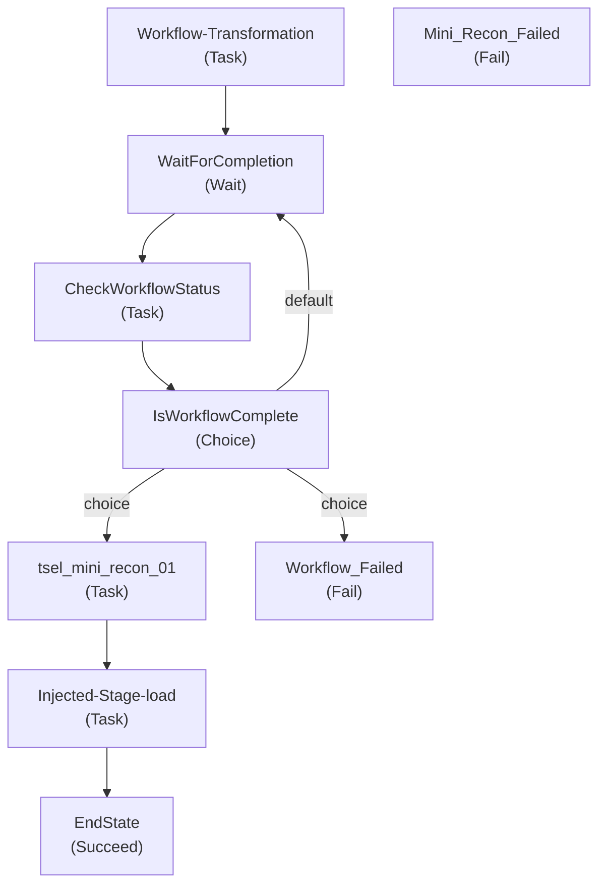
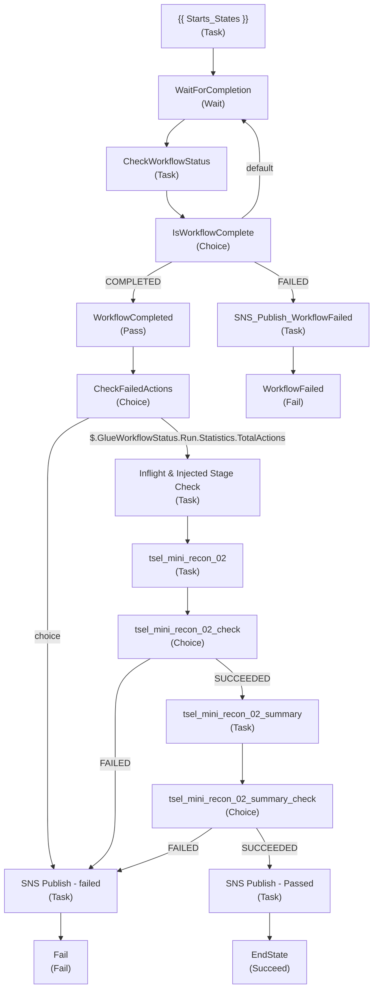
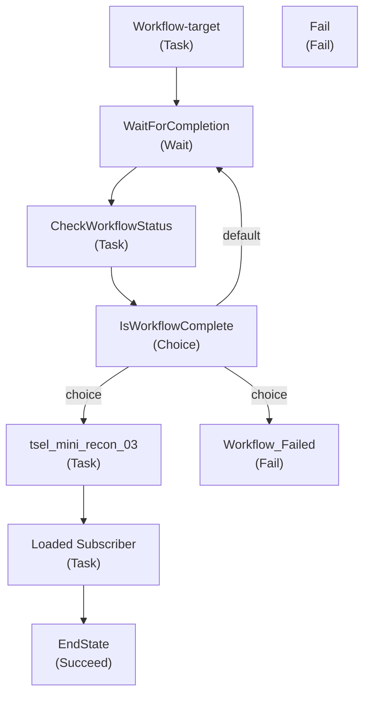

# Transformation Module – Functional Specification

## Document Control

- Document Name: Transformation Module – Functional Specification
- Module Name: Transformation Module
- Version: 1.0
- Author: Vyanktesh Birdode
- Date: 2026-02-20
- Status: Draft

## Table of Contents

> Confluence will auto-generate a Table of Contents from headings.

## Module Overview

### Purpose

This document reverse-engineers the Transformation Module codebase into a functional specification, derived **only** from the provided source code and configuration artifacts (Glue scripts, Step Functions definitions, and Lambda functions).

### High-Level Description

The module implements batch-oriented migration/ETL transformations across **Active**, **Inflight**, and **Injected** migration flows. Orchestration is primarily via **AWS Step Functions** invoking **AWS Glue Workflows**, with run-properties passed through the workflow context to Glue jobs. Jobs read from source/master schemas and write transformed outputs to target schemas/tables, while updating operational audit logs in PostgreSQL.

### Business Context

Business context provided externally (not derived from code) is included here for alignment:

- **Active Glue Workflow** prerequisites: Master table load, cohort validation with Pregen_ID generation, addon master table load; sources include Amdocs, 6D, Middleware, LMS, UPCC.
- **Inflight Glue Workflow** prerequisites: Inflight master table load, cohort validation with Pregen_ID generation.
- **Injected flow** prerequisites: Injected master table load, cohort validation with Pregen_ID generation.

**Note:** prerequisite enforcement is partially implemented in code via log-table checks (documented below).

## Scope
### In-Scope

- Glue transformation jobs listed under Active/Inflight/Injected flow in the request scope.
- Lambda trigger functions that start Step Functions and/or manage batching.
- Step Functions state machine definitions that orchestrate Glue workflows.

### Out-of-Scope
- Raw ingestion jobs and master-load jobs unless directly referenced as prerequisites by transformation jobs.
- Infrastructure-as-code (CloudFormation/Terraform) definitions for Glue Workflows/Triggers (not present in the codebase).

## Objectives

- Provide step-by-step execution, control, and data flows for each transformation job.
- Extract transformation rules and validation logic from SQL/DataFrame transformations.
- Identify stop/fail/control checkpoints and escalation paths.

## Business Requirements Mapping

| Requirement ID | Description | Priority | Mapped Component |
|---|---|---|---|
| BR-001 | Transform staged/master source datasets into target service schemas for migration execution. | High | Glue Transformation Jobs |
| BR-002 | Enforce cohort/batch scoping using cohort_id and MSISDN range (msisdn_start, msisdn_end) and control flags. | High | Control-table joins/filters in SQL/DataFrames |
| BR-003 | Provide auditable operational logging for each job run and entity. | High | Migration.log_table / inflight.log_table inserts |
| BR-004 | Stop processing when prerequisites are not met (master load / cohort validation). | High | Precheck SQL in Inventory and similar jobs; Step Functions fail states |
| BR-005 | Orchestrate transformations with retry and failure notifications. | High | Step Functions retries + SNS publish on failure |


## Stakeholders

| Role | Responsibility |
|---|---|
| Migration Data Engineering | Own ETL/Glue job code, schemas, and performance |
| Migration Operations / Runbook Owners | Operate Step Functions/Glue workflows, monitor failures, re-runs |
| Data Quality / Validation Owners | Define cohort validation rules and thresholds |
| Application Teams (Inventory/Payment/OMS/User/KYC/Promotion/Telco/Open Loyalty/Wallet) | Consume target tables / validate business outputs |
| Platform / AWS Engineering | Operate AWS Glue, Step Functions, Secrets Manager, RDS/Postgres |


## Functional Description

### End-to-End Architecture


### Step Functions Orchestration

#### State Machine: Batch Transformation

**Source:** `stepfunctions/common-stepfunctions/` JSON definitions.



**Key Behaviors (from definition):**

| State | Type | AWS Integration | Name/Target |
|---|---|---|---|
| Workflow-Transformation | Glue Workflow | startWorkflowRun | {{ States_Parameters_Name }} |
| SNS_Publish_WorkflowFailed | SNS | publish | {{ States_SNSPublish-Failed_Parameters_TopicArn }} |
| tsel_mini_recon_01_batch_summary | Glue Job | startJobRun.sync | {{ tsel_mini_recon_01_batch_summary_JobName }} |
| SNS_Publish_Failed | SNS | publish | {{ States_SNSPublish-Failed_Parameters_TopicArn }} |


#### State Machine: Inflight Transformation

**Source:** `stepfunctions/common-stepfunctions/` JSON definitions.



**Key Behaviors (from definition):**

| State | Type | AWS Integration | Name/Target |
|---|---|---|---|
| Workflow-Transformation | Glue Workflow | startWorkflowRun | {{ States_Parameters_Name }} |
| tsel_mini_recon_01 | Glue Job | startJobRun.sync | {{ Mini_recon_01_Inflight_Parameters_Name }} |


#### State Machine: Injected Transformation

**Source:** `stepfunctions/common-stepfunctions/` JSON definitions.



**Key Behaviors (from definition):**

| State | Type | AWS Integration | Name/Target |
|---|---|---|---|
| Workflow-Transformation | Glue Workflow | startWorkflowRun | {{ States_Parameters_Name }} |
| tsel_mini_recon_01 | Glue Job | startJobRun.sync | {{ Injected_mini_recon01_JobName }} |


#### State Machine: Batch Stage Load

**Source:** `stepfunctions/common-stepfunctions/` JSON definitions.



**Key Behaviors (from definition):**

| State | Type | AWS Integration | Name/Target |
|---|---|---|---|
| {{ Starts_States }} | Glue Workflow | startWorkflowRun | {{ States_Parameters_Name }} |
| SNS_Publish_WorkflowFailed | SNS | publish | {{ States_SNSPublish-WorkflowFailed_Parameters_TopicArn }} |
| tsel_mini_recon_02 | Glue Job | startJobRun.sync | {{ tsel_mini_recon_02_JobName }} |
| tsel_mini_recon_02_summary | Glue Job | startJobRun.sync | {{ tsel_mini_recon_02_summary_JobName }} |
| SNS Publish - Passed | SNS | publish | {{ States_SNSPublish-Passed_Parameters_TopicArn }} |
| SNS Publish - failed | SNS | publish | {{ States_SNSPublish-Failed_Parameters_TopicArn }} |


#### State Machine: Batch Target Load

**Source:** `stepfunctions/common-stepfunctions/` JSON definitions.



**Key Behaviors (from definition):**

| State | Type | AWS Integration | Name/Target |
|---|---|---|---|
| Workflow-target | Glue Workflow | startWorkflowRun | {{ States_Parameters_Name }} |
| tsel_mini_recon_03 | Glue Job | startJobRun.sync | {{ tsel_mini_recon_03_JobName }} |
| Loaded Subscriber | Glue Job | startJobRun.sync | {{ tsel_loaded_subcriber_JobName }} |


### Trigger Mechanisms

Trigger mechanisms are implemented via Lambda functions that prepare cohort/batch inputs and start Step Functions executions.

#### Lambda Functions Starting Step Functions

| Lambda File | Step Functions Start | Secrets Used | DB Used |
|---|---|---|---|
| tsel_batch_processing_segregation.py | start_execution present | tsel_mito_creds (SecretsManager) | Postgres |
| tsel_batch_processing_segregation_history.py | start_execution present | tsel_mito_creds (SecretsManager) | Postgres |
| tsel_batch_trigger_stage_load.py | start_execution present | tsel_mito_creds (SecretsManager) | Postgres |
| tsel_batch_trigger_stage_load_history.py | start_execution present |  |  |
| tsel_batch_trigger_target_load.py | start_execution present | tsel_mito_creds (SecretsManager) | Postgres |
| tsel_batch_trigger_target_load_history.py | start_execution present | tsel_mito_creds (SecretsManager) | Postgres |
| tsel_src_file_complete_check.py | start_execution present | tsel_mito_creds (SecretsManager) | Postgres |
| tsel_src_file_complete_check_history.py | start_execution present | tsel_mito_creds (SecretsManager) | Postgres |


### Active Flow

#### Job List

| Glue Job Name | Script File |
|---|---|
| tsel_batch_inventory_transformation-spark | tsel_batch_inventory_transformation-spark.py |
| tsel_wallet_transformation_batch_py_shell | tsel_wallet_transformation_batch_py_shell.py |
| tsel_oms_transformation_batch_py_shell | tsel_oms_transformation_batch_py_shell.py |
| tsel_batch_userservice_transformation | tsel_batch_userservice_transformation.py |
| tsel_batch_telco_transformation | tsel_batch_telco_transformation.py |
| tsel_batch_subscription_transformation | tsel_batch_subscription_transformation.py |
| tsel_batch_promotion_transformation | tsel_batch_promotion_transformation.py |
| tsel_batch_kyc_transformation | tsel_batch_kyc_transformation.py |
| tsel_batch_payment_transformation | tsel_batch_payment_transformation.py |
| tsel_open_loyalty_circles_adaptor_insertion_transformation | tsel_open_loyalty_circles_adaptor_insertion_transformation.py |
| tsel_open_loyalty_service_id_assignment | tsel_open_loyalty_service_id_assignment.py |
| tsel_open_loyalty_Voucher_transform | tsel_open_loyalty_Voucher_transform.py |
| tsel_open_loyalty_points_addition_transformation | tsel_open_loyalty_points_addition_transformation.py |


### Inflight Flow

#### Job List

| Glue Job Name | Script File |
|---|---|
| tsel_inflight_logistics_transformation | tsel_inflight_logistics_transformation.py |
| tsel_inflight_logistics_connector_transformation | tsel_inflight_logistics_connector_transformation.py |
| tsel_inflight_oms_transformation | tsel_inflight_oms_transformation.py |
| tsel_inflight_userservice_transformation | tsel_inflight_userservice_transformation.py |
| tsel_open_loyalty_inflight_circles_adaptor_insertion_transformation | tsel_open_loyalty_inflight_circles_adaptor_insertion_transformation.py |
| tsel_inflight_payment_transformation | tsel_inflight_payment_transformation.py |


### Injected Flow

#### Job List

| Glue Job Name | Script File |
|---|---|
| tsel_injected_oms_transformation | tsel_injected_oms_transformation.py |
| tsel_injected_userservice_transformation | tsel_injected_userservice_transformation.py |


### Glue Jobs (Per Job Deep Dive)

#### tsel_batch_inventory_transformation-spark

- Script Path: `tsel-migration-tool-trunk/Glue/tsel_batch_inventory_transformation-spark.py`

##### Purpose

Unable to determine from codebase.

##### Inputs

**Primary source schemas/tables referenced in code:**

| Source Table |
|---|
| cohort_master_tables.tbl_6d_iccid_info |
| cohort_master_tables.tbl_6d_iccid_logistic_info |
| cohort_master_tables.tbl_6d_infile_master |
| cohort_master_tables.tbl_6d_msisdn_info |
| inflight.control_table |
| inflight.log_table |
| inflight.tbl_inflight_mstr |
| inflight.tbl_pregen_ids_lookup |
| injected.control_table_injected |
| injected.log_table |
| injected.tbl_mstr_injected |
| injected.tbl_pregen_ids_lookup |
| mw_master_schema.tbl_mw_infile_esim_activation_code |
| source.subscription_plans |


**Control/Audit tables referenced in code:**

| Control/Audit Table |
|---|
| "Migration".control_table |
| "Migration".log_table |
| "Migration".migrated_inventory_subscriber |


##### Outputs

| Target Table |
|---|
| "Target_Inventory".unit |
| "Target_Inventory".unit_property |


##### Transformation logic


##### SQL Logic Extracted (Authoritative)

###### SQL Block 1

```sql
SELECT 1
        FROM inflight.log_table
        WHERE process_name = 'Pre Transformation'
          AND entity_name  = 'Master load'
          AND lower(status) = 'passed'
          AND cohort_id = %s
        LIMIT 1
```
###### SQL Block 2

```sql
SELECT 1
        FROM injected.log_table
        WHERE process_name = 'Pre Transformation'
          AND entity_name  = 'Cohort Validation'
          AND lower(status) = 'passed'
          AND cohort_id = %s
        LIMIT 1
```
###### SQL Block 3

```sql
INSERT INTO "Migration".log_table
(cohort_id, batch_id, start_msisdn, end_msisdn, count, process_name, entity_name, status, "date",
 glue_name, glue_run_id, glue_start_time, glue_end_time, prefix)
VALUES ('{cohort_id}', '{batch_id}', '', '', null, 'Transformation', 'Inventory', 'In Progress',
'{mig_timestamp}', '{job_name}', '{job_run_id}', '{start_time}', '{end_time}', '{','.join(range_values)}')
```
###### SQL Block 4

```sql
SELECT DISTINCT planid, subscription_product_id_mapping 
    FROM source.subscription_plans 
    WHERE planid IN ('e_sim_inventory', 'physical_sim_inventory', 'number_inventory', 
                     'Legacy Numbers', 'esim-Standard Numbers', 'Standard Numbers')
```
###### SQL Block 5

```sql
SELECT DISTINCT a.icc_id as identifier,
            CASE 
                WHEN lower(a.sim_type) = 'esim' THEN '{esim_sku}'
                WHEN lower(a.sim_type) = 'physical_sim' THEN '{physical_sku}'
                ELSE '{physical_sku}'
            END AS sku,
            'Assigned' as asset_status,
            CASE
                WHEN lower(a.sim_type) = 'esim' THEN 'esim'
                ELSE 'physical_sim'
            END AS identifier_key,
            a.cxo as external_id,
            a.serial_number as correlation_id,
            a.imsi_number as imsi,
            CASE 
                WHEN lower(a.subscriber_type) = 'regular' THEN 'SA'
                WHEN lower(a.subscriber_type) = 'legacy' AND lower(a.sim_type) = 'physical_sim' THEN 'BY'
                WHEN lower(a.subscriber_type) = 'legacy' AND lower(a.sim_type) = 'esim' THEN 'ES'
                ELSE 'SA'
            END AS category,
            a.t_msisdn as optional_identifier,
            a.a4ki, a.puk1, a.puk2, a.hlr, a.pin1, a.pin2,
            a.cxu, a.cxa,
            'used' as inventory_type,
            a.service_id::BIGINT, 
            CAST(a.icc_id_expiry_date::DATE as VARCHAR) as expirydate,
            a.esim_activation_code_activation_code AS qr_code,
            a.icc_id_create_date as created_at
        FROM cohort_master_tables.tbl_6d_infile_master a
        JOIN "Migration".control_table b ON a.service_id = b.serviceid
        WHERE b.is_cohort = 'Y' and b.cohort_batch_id = '{cohort_id}'
        AND ({where_clause_iccid1})
        UNION ALL 
        SELECT DISTINCT i.product_value as identifier,
            '{physical_sku}' AS sku,
            'Consumed' as asset_status,
            'physical_sim' AS identifier_key,
            a.cxo as external_id,
            l.serial_number as correlation_id,
            l.imsi as imsi,
            'BY' AS category,
            l.t_msisdn as optional_identifier,
            l.a4ki, l.puk1, l.puk2, l.hlr, l.pin1, l.puk2,
            a.cxu, a.cxa,
            'injected' as inventory_type,
            a.legacy_whitelist_service_id::BIGINT as service_id, 
            CAST(a.legacy_whitelist_simcard_expired::DATE AS VARCHAR) as expirydate,
            c.esim_activation_code_activation_code AS qr_code,
            i.create_date as created_at
        FROM injected.tbl_mstr_injected a
        JOIN injected.control_table_injected j 
            ON a.legacy_whitelist_service_id = j.serviceid 
            AND j.is_cohort = 'Y' 
            AND j.cohort_batch_id = '{cohort_id}'
        LEFT JOIN injected.tbl_pregen_ids_lookup b ON a.legacy_whitelist_service_id = b.service_id
        LEFT JOIN cohort_master_tables.tbl_6d_iccid_logistic_info l ON a.legacy_whitelist_service_id = l.t_msisdn
        LEFT JOIN cohort_master_tables.tbl_6d_iccid_info i ON l.asset_id = i.asset_id 
        LEFT JOIN mw_master_schema.tbl_mw_infile_esim_activation_code c ON c.esim_activation_code_service_id = a.legacy_whitelist_service_id
        WHERE i.asset_status  IN ('1','14')
        AND ({where_clause_iccid})
        UNION ALL 
        SELECT DISTINCT i.product_value as identifier,
                    '{esim_sku}' AS sku,
                    'Consumed' as asset_status,
                    'esim' AS identifier_key,
                    c.cxo as external_id,
                    l.serial_number as correlation_id,
                    l.imsi as imsi,
                    'ES' AS category,
                    l.t_msisdn as optional_identifier,
                    l.a4ki, l.puk1, l.puk2, l.hlr, l.pin1, l.puk2,
                    c.cxu, c.cxa,
                    'inflight' as inventory_type,
                    a.msisdn::BIGINT as service_id, 
                    CAST(i.expiry_date::DATE AS VARCHAR) as expirydate,
                    d.esim_activation_code_activation_code AS qr_code,
                    i.create_date as created_at
        FROM inflight.tbl_inflight_mstr a 
        JOIN inflight.control_table b ON a.msisdn = b.serviceid
        JOIN inflight.tbl_pregen_ids_lookup c ON a.msisdn = c.service_id
        LEFT JOIN cohort_master_tables.tbl_6d_iccid_logistic_info l ON a.msisdn = l.t_msisdn
        LEFT JOIN cohort_master_tables.tbl_6d_iccid_info i ON l.asset_id = i.asset_id 
        JOIN mw_master_schema.tbl_mw_infile_esim_activation_code d ON d.esim_activation_code_service_id = a.msisdn
        WHERE b.is_cohort = 'Y' and b.cohort_batch_id = '{cohort_id}'
        AND i.asset_status NOT IN ('999','888')
        AND ({where_clause_iccid1})
```
###### SQL Block 6

```sql
SELECT DISTINCT 
            a.service_id AS identifier,
            CASE 
                WHEN lower(a.subscriber_type) = 'regular' THEN '{std_num}'
                WHEN lower(a.subscriber_type) = 'legacy' AND lower(a.sim_type) = 'physical_sim' THEN '{legacy_num}'
                WHEN lower(a.subscriber_type) = 'legacy' AND lower(a.sim_type) = 'esim' THEN '{esim_standard}'
                ELSE '{std_num}'
            END AS sku,
            'Assigned' as asset_status,
            'number' AS identifier_key,
            a.cxo AS external_id,
            a.cxu, a.cxa,
            'used' as inventory_type,
            NULL as optional_identifier,
            NULL AS correlation_id,
            a.service_id,
            a.msisdn_create_date as created_at
        FROM cohort_master_tables.tbl_6d_infile_master a
        JOIN "Migration".control_table b ON a.service_id = b.serviceid
        WHERE b.is_cohort = 'Y' AND ({where_clause_msisdn}) and b.cohort_batch_id = '{cohort_id}'
        UNION ALL 
        SELECT DISTINCT 
            m.product_value AS identifier,
            CASE
                WHEN c.esim_activation_code_activation_code IS NOT NULL THEN '{esim_standard}'
                ELSE '{std_num}'
            END AS sku,
            'Consumed' as asset_status,
            'number' AS identifier_key,
            t.cxo AS external_id,
            t.cxu, t.cxa,
            'inflight' as inventory_type,
            NULL as optional_identifier,
            NULL AS correlation_id,
            m.product_value as service_id,
            m.create_date as created_at
        FROM cohort_master_tables.tbl_6d_msisdn_info m
        JOIN inflight.control_table b ON m.product_value = b.serviceid
        JOIN inflight.tbl_inflight_mstr t ON t.msisdn = b.serviceid
        LEFT JOIN inflight.tbl_pregen_ids_lookup a ON a.service_id = m.product_value
        LEFT JOIN mw_master_schema.tbl_mw_infile_esim_activation_code c ON c.esim_activation_code_service_id = m.product_value 
        WHERE b.is_cohort = 'Y' AND ({where_clause_msisdn_product}) and b.cohort_batch_id = '{cohort_id}'
        UNION ALL 
        SELECT DISTINCT 
            m.product_value AS identifier,
            CASE
                WHEN c.esim_activation_code_activation_code IS NOT NULL THEN '{esim_standard}'
                ELSE '{legacy_num}'
            END AS sku,
            'Consumed' as asset_status,
            'number' AS identifier_key,
            b.cxo AS external_id,
            b.cxu, b.cxa,
            'injected' as inventory_type,
            NULL as optional_identifier,
            NULL AS correlation_id,
            m.product_value as service_id,
            m.create_date as created_at
        FROM cohort_master_tables.tbl_6d_msisdn_info m
        JOIN injected.tbl_mstr_injected b ON m.product_value = b.legacy_whitelist_service_id
        JOIN injected.control_table_injected j 
            ON b.legacy_whitelist_service_id = j.serviceid 
            AND j.is_cohort = 'Y' 
            AND j.cohort_batch_id = '{cohort_id}'
        LEFT JOIN injected.tbl_pregen_ids_lookup a ON a.service_id = m.product_value
        LEFT JOIN mw_master_schema.tbl_mw_infile_esim_activation_code c ON c.esim_activation_code_service_id = m.product_value 
        WHERE ({where_clause_msisdn_product})
```
###### SQL Block 7

```sql
SELECT DISTINCT i.product_value as identifier,
            CASE 
                WHEN c.esim_activation_code_activation_code IS NOT NULL THEN '{esim_sku}'
                WHEN c.esim_activation_code_activation_code IS NULL THEN '{physical_sku}'
            END AS sku,
            i.asset_status,
            CASE
                WHEN c.esim_activation_code_activation_code IS NOT NULL THEN 'esim'
                ELSE 'physical_sim'
            END AS identifier_key,
            l.serial_number as correlation_id,
            l.imsi as imsi,
            CASE 
                WHEN c.esim_activation_code_activation_code IS NOT NULL THEN 'ES'
                ELSE 'BY'
            END AS category,
            l.t_msisdn as optional_identifier,
            l.a4ki, l.puk1, l.puk2, l.hlr, l.pin1, l.pin2,
            'unused' as inventory_type, 
            i.expiry_date as expirydate,
            CASE 
                WHEN c.esim_activation_code_activation_code IS NOT NULL THEN c.esim_activation_code_activation_code
                ELSE NULL
            END AS qr_code,
            l.t_msisdn as service_id,
            i.create_date as created_at
        FROM cohort_master_tables.tbl_6d_iccid_info i
        LEFT JOIN cohort_master_tables.tbl_6d_iccid_logistic_info l ON i.asset_id = l.asset_id
        LEFT JOIN mw_master_schema.tbl_mw_infile_esim_activation_code c ON c.esim_activation_code_service_id = l.t_msisdn
        LEFT JOIN (
            SELECT serviceid AS identifier FROM "Migration".control_table WHERE is_cohort = 'Y' AND ({where_clause_not_in})
            UNION
            SELECT serviceid AS identifier FROM inflight.control_table WHERE is_cohort = 'Y' AND ({where_clause_not_in})
            UNION 
            SELECT serviceid AS identifier FROM injected.control_table_injected WHERE is_cohort = 'Y' and  ({where_clause_not_in_legacy})
        ) t ON l.t_msisdn = t.identifier
        WHERE i.asset_status in ('1','14')
        AND t.identifier IS NULL
        AND i.category = '16'
        AND ({where_clause_iccid_unused})
```
###### SQL Block 8

```sql
SELECT DISTINCT
            m.product_value AS identifier,
            CASE 
                WHEN c.esim_activation_code_activation_code IS NOT NULL THEN '{esim_standard}'
                WHEN m.category = '15' AND c.esim_activation_code_activation_code IS NULL THEN '{legacy_num}'
                ELSE '{std_num}'
            END AS sku,
            m.asset_status,
            m.category AS raw_category,
            'number' AS identifier_key,
            'unused' as inventory_type,
            NULL as optional_identifier,
            NULL AS correlation_id,
            m.product_value as service_id,
            m.create_date as created_at
        FROM cohort_master_tables.tbl_6d_msisdn_info m
        LEFT JOIN mw_master_schema.tbl_mw_infile_esim_activation_code c ON c.esim_activation_code_service_id = m.product_value 
        LEFT JOIN (
            SELECT serviceid AS identifier FROM "Migration".control_table WHERE is_cohort = 'Y' AND ({where_clause_not_in})
            UNION
            SELECT serviceid AS identifier FROM inflight.control_table WHERE is_cohort = 'Y' AND ({where_clause_not_in})
            UNION 
            SELECT serviceid AS identifier FROM injected.control_table_injected WHERE is_cohort = 'Y' and  ({where_clause_not_in_legacy})
        ) t ON m.product_value = t.identifier 
        WHERE t.identifier IS NULL 
        and m.asset_status in ('1','14')
        and m.category!= '11'
        AND ({where_clause_iccid_unused_msisdn})
```
###### SQL Block 9

```sql
SELECT id, created_at, updated_at, identifier, lock_id, sku, status, unlock_at, item_id, external_id,
              identifier_key, reference, inventory_from, correlation_id, category, property_id, service_id, icc_id,
              imsi, serial_number, a4ki, puk1, puk2, hlr, cxu, cxa, pin1, pin2, expirydate, qr_code, cohort_id, 
              inventory_type, mig_date
        FROM "Target_Inventory".unit
        where cohort_id = '{cohort_id}'
```
###### SQL Block 10

```sql
SELECT aws_s3.table_import_from_s3(
                            %s,
                            %s,
                            %s,
                            aws_commons.create_s3_uri(%s, %s, %s),
                            aws_commons.create_aws_credentials(%s, %s, %s)
                        );
```
###### SQL Block 11

```sql
INSERT INTO "Migration".log_table
(cohort_id, batch_id, start_msisdn, end_msisdn, count, process_name, entity_name, status, "date",
 glue_name, glue_run_id, glue_start_time, glue_end_time, prefix)
VALUES ('{cohort_id}', '{batch_id}', '', '', null, 'Transformation', 'Inventory', 'Passed',
'{mig_timestamp}', '{job_name}', '{job_run_id}', '{start_time}', '{end_time}', '{prefix_value}')
```
###### SQL Block 12

```sql
INSERT INTO "Migration".log_table
(cohort_id, batch_id, start_msisdn, end_msisdn, count, process_name, entity_name, status, "date",
 glue_name, glue_run_id, glue_start_time, glue_end_time, error, prefix)
VALUES ('{cohort_id}', '{batch_id}', '', '', null, 'Transformation', 'Inventory', 'Failed',
'{mig_timestamp}', '{job_name}', '{job_run_id}', '{start_time}', '{end_time}', '{error}', '{prefix_value}')
```

##### Validation checks

- dropDuplicates used to enforce uniqueness on specified columns.
- Record counts computed using DataFrame.count() and logged.
- Raises ValueError on missing env/workflow properties or failed prerequisite checks.


##### Error handling, retries, escalation

- Top-level try/except captures exceptions; stack traces logged via traceback.
- Errors logged to CloudWatch via Python logging.
- Failure status written to log_table with error message (where implemented).


##### Control checkpoints (stop/fail/log/escalate)

- Prerequisite check against log_table for status='passed' (job stops on failure).
- Writes execution audit row to log_table (In Progress / Passed / Failed).


#### tsel_wallet_transformation_batch_py_shell

- Script Path: `tsel-migration-tool-trunk/Glue/tsel_wallet_transformation_batch_py_shell.py`

##### Purpose

Unable to determine from codebase.

##### Inputs

**Primary source schemas/tables referenced in code:**

| Source Table |
|---|
| cohort_master_tables.tbl_6d_infile_master |
| cohort_master_tables.tbl_amdocs_master |
| source.tbl_pregen_ids_lookup |


**Control/Audit tables referenced in code:**

| Control/Audit Table |
|---|
| "Migration".log_table |


##### Outputs

| Target Table |
|---|
| target_wallet.ledger |
| target_wallet.wallets |


##### Transformation logic


##### SQL Logic Extracted (Authoritative)

###### SQL Block 1

```sql
WITH CTE AS (
                SELECT CAST(msisdn AS TEXT) AS msisdn, creation_date
                FROM cohort_master_tables.tbl_amdocs_master 
                WHERE msisdn BETWEEN '{batch_start}' AND '{batch_end}'
            ), wallet_data AS (
                SELECT 
                    a.cwam AS wallet_id,
                    CASE WHEN b.status = '1' THEN 1 
                         WHEN b.status = '2' THEN 0 
                         ELSE CAST(b.status AS INTEGER) END AS status,
                    CAST(EXTRACT(EPOCH FROM (COALESCE(c.creation_date::timestamp, CURRENT_TIMESTAMP) - INTERVAL '7 hours')) * 1000 AS BIGINT) AS created_at,
                    CAST(EXTRACT(EPOCH FROM (CURRENT_TIMESTAMP AT TIME ZONE 'UTC')) * 1000 AS BIGINT) AS updated_at,
                    CAST(2145920461000 AS TEXT) AS expired_at
                FROM cohort_master_tables.tbl_6d_infile_master b
                JOIN source.tbl_pregen_ids_lookup a ON a.service_id = b.service_id
                LEFT JOIN CTE c ON CAST(b.service_id AS TEXT) = c.msisdn
                WHERE b.is_cohort = 'Y'
                  AND b.cohort_batch_id = '{cohort_id}'
                  AND b.service_id BETWEEN '{batch_start}' AND '{batch_end}'
            )
            SELECT COUNT(*) AS row_count,
                CASE
                    WHEN EXISTS (SELECT 1 FROM wallet_data WHERE wallet_id IS NULL or status IS NULL LIMIT 1) 
                    THEN 'wallet_id'
                    ELSE NULL
                END AS failing_column
            FROM wallet_data;
```
###### SQL Block 2

```sql
WITH cte_amdocs AS (
                    SELECT distinct CAST(msisdn AS TEXT) AS msisdn, creation_date
                    FROM cohort_master_tables.tbl_amdocs_master 
                    WHERE msisdn BETWEEN '{batch_start}' AND '{batch_end}'
                ),
                base AS (
                    SELECT 
                        distinct CAST(b.service_id AS TEXT) AS service_id,
                        a.cwam AS wallet_id,
                        0 AS wallet_type_id,
                        b.cxa AS customer_id,
                        CASE WHEN b.status = '1' THEN 1 
                             WHEN b.status = '2' THEN 0 
                             ELSE CAST(b.status AS INTEGER) END AS status,
                        'by.U_Migration' AS created_by,
                        'by.U_Migration' AS updated_by,
                        1 AS can_debit,
                        NULL::bigint AS enabled_at,
                        NULL::bigint AS disabled_at,
                        CAST(2145920461000 AS TEXT) AS expired_at,
                        CAST(EXTRACT(EPOCH FROM (COALESCE(c.creation_date::timestamp, CURRENT_TIMESTAMP AT TIME ZONE 'UTC') - INTERVAL '7 hours')) * 1000 AS BIGINT) AS created_at,
                        CAST(EXTRACT(EPOCH FROM (CURRENT_TIMESTAMP AT TIME ZONE 'UTC')) * 1000 AS BIGINT) AS updated_at,
                        NULL::bigint AS deleted_at,
                        NULL::text AS created_at_ts,
                        NULL::text AS updated_at_ts,
                        NULL::text AS deleted_at_ts,
                        1 AS allow_external_usage,
                        CAST(100000000000000 AS BIGINT) AS credit_txn_limit,
                        2 AS credit_txn_limit_period,
                        CAST(100000000000000 AS BIGINT) AS debit_txn_limit,
                        2 AS debit_txn_limit_period,
                        CAST(100000000000000 AS BIGINT) AS balance_limit,
                        '{mig_date}' AS mig_date,
                        '{cohort_id}' AS cohort_id
                    FROM cohort_master_tables.tbl_6d_infile_master b
                    JOIN source.tbl_pregen_ids_lookup a ON a.service_id = b.service_id
                    LEFT JOIN cte_amdocs c ON b.service_id = c.msisdn
                    WHERE b.is_cohort = 'Y'
                      AND b.cohort_batch_id = '{cohort_id}'
                      AND b.service_id BETWEEN '{batch_start}' AND '{batch_end}'
                )
                INSERT INTO target_wallet.wallets (
                    service_id, wallet_id, wallet_type_id, customer_id, status, created_by, updated_by,
                    can_debit, enabled_at, disabled_at, expired_at, created_at, updated_at, deleted_at,
                    created_at_ts, updated_at_ts, deleted_at_ts, allow_external_usage, credit_txn_limit,
                    credit_txn_limit_period, debit_txn_limit, debit_txn_limit_period, balance_limit,
                    mig_date, cohort_id
                )
                SELECT service_id, wallet_id, wallet_type_id, customer_id, status, created_by, updated_by,
                       can_debit, enabled_at, disabled_at, expired_at, created_at, updated_at, deleted_at,
                       created_at_ts, updated_at_ts, deleted_at_ts, allow_external_usage, credit_txn_limit,
                       credit_txn_limit_period, debit_txn_limit, debit_txn_limit_period, balance_limit,
                       mig_date, cohort_id
                FROM base;
```
###### SQL Block 3

```sql
WITH amdocs_cash AS (
                    SELECT msisdn, balance_value
                    FROM cohort_master_tables.tbl_amdocs_master
                    WHERE unit_type IN ('CASH', 'N') 
                      AND msisdn BETWEEN '{batch_start}' AND '{batch_end}'
                ),
                base AS (
                    SELECT b.wallet_id,
                           1 AS txn_type,
                           e.balance_value,
                           ROUND(e.balance_value::numeric / 1000000, 2)::text AS amount,
                           NULL::timestamp AS credit_expiry_ts,
                           1 AS credit_status,
                           'Migration Carry forward Balance' AS txn_remark,
                           NULL::text AS parent_txn_ref_id,
                           ROUND(e.balance_value::numeric / 1000000, 2)::text AS available_bal,
                           ROUND(e.balance_value::numeric / 1000000, 2)::text AS redeemable_bal,
                           'by.U_Migration' AS created_by,
                           'by.U_Migration' AS updated_by,
                            CAST(
                               EXTRACT(EPOCH FROM (
                                   TO_TIMESTAMP(b.created_at / 1000.0) - INTERVAL '7 hours'
                               )) * 1000 AS BIGINT
                           ) AS created_at,
                           CAST(EXTRACT(EPOCH FROM (CURRENT_TIMESTAMP AT TIME ZONE 'UTC')) * 1000 AS BIGINT) AS updated_at,
                           NULL::text AS created_at_ts,
                           NULL::text AS updated_at_ts,
                           b.customer_id AS ext_ref_id,
                           NULL::text AS ext_ref_type,
                           b.service_id,
                           '{mig_date}' AS mig_date,
                           '{cohort_id}' AS cohort_id
                    FROM cohort_master_tables.tbl_6d_infile_master c
                    INNER JOIN target_wallet.wallets b ON CAST(c.service_id AS TEXT) = b.service_id
                    LEFT JOIN amdocs_cash e ON e.msisdn = CAST(c.service_id AS TEXT)
                    WHERE c.is_cohort = 'Y'
                      AND c.cohort_batch_id = '{cohort_id}'
                      AND c.service_id BETWEEN '{batch_start}' AND '{batch_end}'
                ),
                dedup AS (
                    SELECT * FROM (
                        SELECT base.*,
                               ROW_NUMBER() OVER (PARTITION BY base.service_id ORDER BY base.service_id DESC) AS rn
                        FROM base
                    ) t WHERE rn = 1
                )
                INSERT INTO target_wallet.ledger (
                    txn_ref_id, wallet_id, txn_type, amount, credit_expiry_ts, credit_status, txn_remark,
                    parent_txn_ref_id, available_bal, redeemable_bal, created_by, updated_by, created_at,
                    updated_at, created_at_ts, updated_at_ts, ext_ref_id, ext_ref_type, service_id, mig_date, cohort_id
                )
                SELECT gen_random_uuid(), wallet_id, txn_type, amount, credit_expiry_ts, credit_status, txn_remark,
                       parent_txn_ref_id, available_bal, redeemable_bal, created_by, updated_by, created_at,
                       updated_at, created_at_ts, updated_at_ts, ext_ref_id, ext_ref_type, service_id, mig_date, cohort_id 
                FROM dedup;
```
###### SQL Block 4

```sql
INSERT INTO "Migration".log_table
    (cohort_id,batch_id,start_msisdn,end_msisdn,count,process_name,entity_name,status,"date",
     glue_name,glue_run_id,glue_start_time,glue_end_time,stepfunction_name,stepfunction_execute_id,
     stepfunction_start_time,prefix_id,workflow_name,workflow_run_id,workflow_previous_run_id,prefix)
    VALUES (
        '{cohort_id}','{batch_id}','{msisdn_start}','{msisdn_end}',NULL,
        'Transformation','Wallet','In Progress','{mig_timestamp}',
        '{job_name}','{job_run_id}','{start_time}','{start_time}',
        '{state_machine_name}','{stepfunction_execute_id}',
        '{str(execution_start_time)}','{prefix_id}',
        '{workflow_name}','{workflow_run_id}',NULL,'{prefix}'
    );
```
###### SQL Block 5

```sql
INSERT INTO "Migration".log_table
    (cohort_id,batch_id,start_msisdn,end_msisdn,count,process_name,entity_name,status,"date",
     glue_name,glue_run_id,glue_start_time,glue_end_time,stepfunction_name,stepfunction_execute_id,
     stepfunction_start_time,prefix_id,workflow_name,workflow_run_id,workflow_previous_run_id,prefix)
    VALUES (
        '{cohort_id}','{batch_id}','{msisdn_start}','{msisdn_end}','{wallet_inserted}',
        'Transformation','Wallet','Passed','{mig_timestamp}',
        '{job_name}','{job_run_id}','{start_time}','{end_time}',
        '{state_machine_name}','{stepfunction_execute_id}',
        '{str(execution_start_time)}','{prefix_id}',
        '{workflow_name}','{workflow_run_id}',NULL,'{prefix}'
    );
```
###### SQL Block 6

```sql
INSERT INTO "Migration".log_table
    (cohort_id,batch_id,start_msisdn,end_msisdn,count,process_name,entity_name,status,"date",
     glue_name,glue_run_id,glue_start_time,glue_end_time,stepfunction_name,stepfunction_execute_id,
     stepfunction_start_time,prefix_id,workflow_name,workflow_run_id,workflow_previous_run_id,error,prefix)
    VALUES (
        '{cohort_id}','{batch_id}','{msisdn_start}','{msisdn_end}',NULL,
        'Transformation','Wallet','Failed','{mig_timestamp}',
        '{job_name}','{job_run_id}','{start_time}','{end_time}',
        '{state_machine_name}','{stepfunction_execute_id}',
        '{str(execution_start_time)}','{prefix_id}',
        '{workflow_name}','{workflow_run_id}',NULL,'{error}','{prefix}'
    );
```

##### Validation checks

- Raises ValueError on missing env/workflow properties or failed prerequisite checks.


##### Error handling, retries, escalation

- Top-level try/except captures exceptions; stack traces logged via traceback.
- Errors logged to CloudWatch via Python logging.
- Failure status written to log_table with error message (where implemented).


##### Control checkpoints (stop/fail/log/escalate)

- Writes execution audit row to log_table (In Progress / Passed / Failed).


#### tsel_oms_transformation_batch_py_shell

- Script Path: `tsel-migration-tool-trunk/Glue/tsel_oms_transformation_batch_py_shell.py`

##### Purpose

Unable to determine from codebase.

##### Inputs

**Primary source schemas/tables referenced in code:**

| Source Table |
|---|
| "source".bundle_plan |
| "source".subscription_plans |
| "source".tbl_subcription_addon_mstr_test |
| cohort_master_tables.tbl_6d_infile_master |
| cohort_master_tables.tbl_6d_order_info_master |
| cohort_master_tables.tbl_6d_subscriptions_information_master |
| cohort_master_tables.tbl_amdocs_master |
| cohort_master_tables.tbl_upcc_master |
| mw_master_schema.tbl_mw_infile_esim_activation_code |
| source.subscription_plans |
| source.tbl_subcription_addon_mstr_test |


**Control/Audit tables referenced in code:**

| Control/Audit Table |
|---|
| "Migration".control_table |
| "Migration".log_table |


##### Outputs

| Target Table |
|---|
| target_oms_poc.order_billing_details |
| target_oms_poc.order_initial_shipping_details |
| target_oms_poc.order_item |
| target_oms_poc.order_item_properties |
| target_oms_poc.order_substate |
| target_oms_poc.order_user_details |
| target_oms_poc.orders |


##### Transformation logic


##### SQL Logic Extracted (Authoritative)

###### SQL Block 1

```sql
INSERT INTO "Migration".log_table
        (cohort_id, batch_id, start_msisdn, end_msisdn, count, process_name, entity_name, status, "date", glue_name, glue_run_id, glue_start_time, glue_end_time,
        stepfunction_name, stepfunction_execute_id, stepfunction_start_time, prefix_id, workflow_name, workflow_run_id, workflow_previous_run_id, prefix)
        VALUES (
        '{cohort_id}', '{batch_id}', '{msisdn_start}', '{msisdn_end}', '0', 'Transformation', 'OMS', 'In Progress',
        '{mig_timestamp}', '{job_name}', '{workflow_run_id}', '{start_time}', '{end_time}', '{state_machine_name}', '{stepfunction_execute_id}', '{execution_start_time}', '{prefix_id}', '{workflow_name}', '{workflow_run_id}', NULL, '{prefix}'
        )
```
###### SQL Block 2

```sql
INSERT INTO target_oms_poc.orders(channel, customer_id, order_reference, order_type, primary_state, sim_type, service_type, 
        cart_id, cohort_id, msisdn, created_at,updated_at,mig_date,order_category,beneficiary_customer_id,referral_code)
            SELECT DISTINCT 
                                    'web' AS channel, 
                                    b.cxu AS customer_id, 
                                    b.cxo AS order_reference, 
                                    'Sim Only' AS order_type, 
                                    'COMPLETED' AS primary_state,
                                    b.sim_type  AS sim_type,
                                    NULL::text AS service_type,
                                    NULL::text AS cart_id, 
                                    '{cohort_id}' AS cohort_id,
                                    b.service_id AS msisdn, 
                                    TO_CHAR((TO_TIMESTAMP(b.activation_date, 'YYYY-MM-DD HH24:MI:SS') - INTERVAL '7 hours')::timestamp, 'YYYY-MM-DD HH24:MI:SS') AS created_at,
                                    CAST((TO_TIMESTAMP(b.activation_date, 'YYYY-MM-DD HH24:MI:SS') - INTERVAL '7 hours') AS TIMESTAMP) AS updated_at,
                                    CAST('{mig_date}' AS DATE) AS mig_date,
                                    'prepaid' AS order_category,
                                    NULL::text AS beneficiary_customer_id,
                                    NULL::text AS referral_code            
                                FROM cohort_master_tables.tbl_6d_infile_master b
                                WHERE is_cohort = 'Y' 
                                AND cohort_batch_id = '{cohort_id}'
                                AND service_id BETWEEN '{msisdn_start}' AND '{msisdn_end}'
```
###### SQL Block 3

```sql
INSERT INTO target_oms_poc.orders (
                    channel, customer_id, order_reference, order_type, primary_state,
                    billing_details_id, initial_shipping_details_id,sim_type, service_type,
                    cart_id, order_category, beneficiary_customer_id, 
                    cohort_id, msisdn, created_at, updated_at, mig_date
                )
                with cte as(SELECT DISTINCT 
                               'app' AS channel,
                                a.cxu AS customer_id,
                                cxo_addon AS order_reference,
                                'On App Purchases' AS order_type, 
                                'COMPLETED' AS primary_state, 
                                NULL::integer AS billing_details_id,
                                NULL::integer AS initial_shipping_details_id,
                                NULL::text AS sim_type, 
                                NULL::text AS service_type, 
                                NULL::integer AS cart_id,
                                'prepaid' AS order_category,
                                NULL::text AS beneficiary_customer_id,
                                '{cohort_id}' AS cohort_id,
                                a.service_id AS msisdn,
                                TO_CHAR((TO_TIMESTAMP(a.start_date, 'YYYY-MM-DD HH24:MI:SS') - INTERVAL '7 hours')::timestamp, 'YYYY-MM-DD HH24:MI:SS') AS created_at,
                                CAST((TO_TIMESTAMP(a.start_date, 'YYYY-MM-DD HH24:MI:SS') - INTERVAL '7 hours') AS TIMESTAMP) AS updated_at,
                                CAST('{mig_date}' AS DATE)  AS mig_date,
                                Row_number() over(partition by cxo_addon order by a.start_date desc) as rn
                            FROM  
                                "source".tbl_subcription_addon_mstr_test a
                            WHERE 
                                a.is_cohort = 'Y' 
                                AND a.is_addon_eligible = 'Y'
                                AND a.cohort_batch_id = '{cohort_id}'
                                AND a.service_id BETWEEN '{msisdn_start}' AND '{msisdn_end}')
                            select channel,customer_id,order_reference,order_type,primary_state,billing_details_id,initial_shipping_details_id,sim_type,service_type,cart_id,order_category,beneficiary_customer_id,cohort_id,msisdn,created_at,updated_at,mig_date
                            from cte where rn = 1
```
###### SQL Block 4

```sql
INSERT INTO target_oms_poc.order_user_details(id,contact_number,email,first_name,last_name,middle_name,date_of_birth,temporary_contact_number,nationality,identification_number,identification_expiry_date,full_name,cohort_id,msisdn,created_at,updated_at,mig_date
        )
            SELECT DISTINCT
                                        c.user_details_id AS id,
                                        COALESCE(NULLIF(a.service_id, ''), '') AS contact_number,
                                        a.email_id AS email,
                                        COALESCE(NULLIF(a.profile_first_name, ''), '') AS first_name,
                                        '' AS last_name,
                                        '' AS middle_name,
                                        TO_DATE(TRIM(a.date_of_birth), 'YYYY-MM-DD') AS date_of_birth,
                                        NULL AS temporary_contact_number,
                                        NULL AS nationality,
                                        NULL AS identification_number,
                                        NULL::DATE AS identification_expiry_date,
                                        COALESCE(NULLIF(a.profile_first_name, ''), '') AS full_name,
                                        '{cohort_id}' AS cohort_id,
                                        a.service_id AS msisdn,
                                        CASE 
                                            WHEN c.order_type = 'Sim Only' THEN 
                                                TO_CHAR((TO_TIMESTAMP(a.activation_date, 'YYYY-MM-DD HH24:MI:SS') - INTERVAL '7 hours')::timestamp, 'YYYY-MM-DD HH24:MI:SS')
                                            WHEN c.order_type = 'On App Purchases' THEN 
                                                c.created_at
                                        END AS created_at,
                                        CASE 
                                            WHEN c.order_type = 'Sim Only' THEN 
                                                (TO_TIMESTAMP(a.activation_date, 'YYYY-MM-DD HH24:MI:SS') - INTERVAL '7 hours')::timestamp
                                            WHEN c.order_type = 'On App Purchases' THEN 
                                                c.updated_at
                                        END AS updated_at,
                                        CAST('{mig_date}' AS DATE)  AS mig_date
                                    FROM 
                                        cohort_master_tables.tbl_6d_infile_master a
                                    JOIN 
                                        target_oms_poc.orders c ON a.cxu = c.customer_id 
                                    WHERE 
                                        a.is_cohort = 'Y' 
                                        AND a.cohort_batch_id = '{cohort_id}'
                                        AND a.service_id BETWEEN '{msisdn_start}' AND '{msisdn_end}'
```
###### SQL Block 5

```sql
INSERT INTO target_oms_poc.order_billing_details (
        id, address_line_one, address_line_two, address_line_three, province, area, landmark,
        city, country, postal_code, state, city_in_province, unit, floor, street, building_name,
        block_number, district, first_name, middle_name, last_name, cohort_id, msisdn,created_at,updated_at,mig_date)
        SELECT DISTINCT
                                        a.billing_details_id::int AS id,
                                        COALESCE(NULLIF(b.addr_line1, ''), '') AS address_line_one,
                                        COALESCE(NULLIF(b.addr_line2, ''), '') AS address_line_two,
                                        COALESCE(NULLIF(b.addr_line3, ''), '') AS address_line_three,
                                        NULL AS province,
                                        NULL AS area,
                                        NULL AS landmark,
                                        NULL AS city,
                                        'Indonesia' AS country,
                                        NULL AS postal_code,
                                        NULL AS state,
                                        NULL AS city_in_province,
                                        NULL AS unit,
                                        NULL AS floor,
                                        NULL AS street,
                                        NULL AS building_name,
                                        NULL AS block_number,
                                        NULL AS district,
                                        COALESCE(NULLIF(b.profile_first_name, ''), '') AS first_name,
                                        '' AS middle_name,
                                        '' AS last_name,
                                        '{cohort_id}' AS cohort_id,
                                        b.service_id AS msisdn,
                                        CASE 
                                            WHEN a.order_type = 'Sim Only' THEN 
                                                TO_CHAR((TO_TIMESTAMP(b.activation_date, 'YYYY-MM-DD HH24:MI:SS') - INTERVAL '7 hours')::timestamp, 'YYYY-MM-DD HH24:MI:SS')
                                            WHEN a.order_type = 'On App Purchases' THEN 
                                                a.created_at
                                        END AS created_at,
                                        CASE 
                                            WHEN a.order_type = 'Sim Only' THEN 
                                                (TO_TIMESTAMP(b.activation_date, 'YYYY-MM-DD HH24:MI:SS') - INTERVAL '7 hours')::timestamp
                                            WHEN a.order_type = 'On App Purchases' THEN 
                                                a.updated_at
                                        END AS updated_at,
                                        CAST('{mig_date}' AS DATE) AS mig_date
                                    FROM target_oms_poc.orders a
                                    LEFT JOIN cohort_master_tables.tbl_6d_infile_master b ON a.customer_id = b.cxu
                                    WHERE a.billing_details_id IS NOT NULL 
                                    AND b.is_cohort = 'Y' 
                                    AND b.cohort_batch_id = '{cohort_id}'
                                    AND b.service_id BETWEEN '{msisdn_start}' AND '{msisdn_end}'
```
###### SQL Block 6

```sql
INSERT INTO target_oms_poc.order_initial_shipping_details (
            id, address_line_one, address_line_two, address_line_three, province, area, landmark, city, country, postal_code, 
            courier_name, selected_date, slot_identifier, special_instructions, state, currency, price, delivery_method, 
            self_pickup_location_id, city_in_province, unit, floor, street, building_name, block_number, district, 
            delivery_instructions, discount, retail_store_id, cohort_id, msisdn, created_at, updated_at,mig_date)
            SELECT DISTINCT
                                        c.initial_shipping_details_id,
                                        COALESCE(NULLIF(b.addr_line1, ''), '') AS address_line_one,
                                        COALESCE(NULLIF(b.addr_line2, ''), '') AS address_line_two,
                                        COALESCE(NULLIF(b.addr_line3, ''), '') AS address_line_three,
                                        NULL AS province,
                                        NULL AS area,
                                        NULL AS landmark,
                                        NULL AS city,
                                        'Indonesia' AS country,
                                        NULL AS postal_code,
                                        NULL AS courier_name,
                                        NULL::date AS selected_date,
                                        NULL::uuid AS slot_identifier,
                                        NULL AS special_instructions,
                                        NULL AS state,
                                        'IDR' AS currency,
                                        '0' AS price,
                                        'DOORSTEP_DELIVERY' AS delivery_method,
                                        NULL::integer AS self_pickup_location_id,
                                        NULL AS city_in_province,
                                        '' AS unit,
                                        '' AS floor,
                                        '' AS street,
                                        '' AS building_name,
                                        '' AS block_number,
                                        '' AS district,
                                        '' AS delivery_instructions,
                                        NULL AS discount,
                                        NULL AS retail_store_id,
                                        '{cohort_id}' AS cohort_id,
                                        b.service_id AS msisdn,
                                        CASE 
                                            WHEN c.order_type = 'Sim Only' THEN 
                                                TO_CHAR((TO_TIMESTAMP(b.activation_date, 'YYYY-MM-DD HH24:MI:SS') - INTERVAL '7 hours')::timestamp, 'YYYY-MM-DD HH24:MI:SS')
                                            WHEN c.order_type = 'On App Purchases' THEN 
                                                c.created_at
                                        END AS created_at,
                                        CASE 
                                            WHEN c.order_type = 'Sim Only' THEN 
                                                (TO_TIMESTAMP(b.activation_date, 'YYYY-MM-DD HH24:MI:SS') - INTERVAL '7 hours')::timestamp
                                            WHEN c.order_type = 'On App Purchases' THEN 
                                                c.updated_at
                                        END AS updated_at,
                                        CAST('{mig_date}' AS DATE) AS mig_date
                                    FROM 
                                        cohort_master_tables.tbl_6d_infile_master b
                                    JOIN target_oms_poc.orders c ON b.cxu = c.customer_id
                                    WHERE 
                                        c.initial_shipping_details_id IS NOT NULL 
                                        AND b.is_cohort = 'Y' 
                                        AND b.cohort_batch_id = '{cohort_id}'
                                        AND b.service_id BETWEEN '{msisdn_start}' AND '{msisdn_end}'
```
###### SQL Block 7

```sql
INSERT INTO target_oms_poc.order_substate (actor_id, external_tracking_id, reason, attempt_count, state, type, order_id, cohort_id, msisdn,created_at,updated_at,mig_date)
        WITH cte AS (
                                    SELECT DISTINCT 
                                        CASE
                                            WHEN b.type = 'INITIALIZATION' THEN a.customer_id
                                            WHEN b.type = 'LOGISTICS_FULFILLMENT' THEN 'LAASSERV'
                                            WHEN b.type = 'PAYMENT' THEN 'CPS'
                                            WHEN b.type = 'TELCO_FULFILLMENT' THEN 'TELCOSERV'
                                            WHEN b.type = 'APPROVAL' THEN 'Admin'
                                        END AS actor_id,
                                        CASE WHEN b.type IN ('INITIALIZATION', 'LOGISTICS_FULFILLMENT') THEN NULL 
                                             WHEN b.type = 'PAYMENT' THEN c.cxt 
                                             WHEN b.type = 'TELCO_FULFILLMENT' THEN c.cxa 
                                             WHEN b.type = 'APPROVAL' THEN 'kyc' END AS external_tracking_id,
                                        NULL AS reason,
                                        NULL AS attempt_count,
                                        'SUCCESS' AS state,
                                        b.type,
                                        id AS order_id,
                                        c.service_id AS msisdn,
                                        TO_CHAR((TO_TIMESTAMP(c.activation_date, 'YYYY-MM-DD HH24:MI:SS') - INTERVAL '7 hours')::timestamp, 'YYYY-MM-DD HH24:MI:SS') AS created_at,
                                        CAST((TO_TIMESTAMP(c.activation_date, 'YYYY-MM-DD HH24:MI:SS') - INTERVAL '7 hours') AS TIMESTAMP) AS updated_at,
                                        CAST('{mig_date}' AS DATE)  as mig_date
                                    FROM 
                                        target_oms_poc.orders a 
                                    JOIN cohort_master_tables.tbl_6d_infile_master c ON a.customer_id = c.cxu 
                                    CROSS JOIN (VALUES ('INITIALIZATION'), ('PAYMENT'), ('APPROVAL'), ('LOGISTICS_FULFILLMENT'), ('TELCO_FULFILLMENT')) AS b(type)
                                    WHERE 
                                        a.order_type = 'Sim Only' and a.sim_type = 'PHYSICAL_SIM'
                                        AND c.is_cohort = 'Y' 
                                        AND c.cohort_batch_id = '{cohort_id}'
                                        AND c.service_id BETWEEN '{msisdn_start}' AND '{msisdn_end}'
                                    UNION ALL 
                                    SELECT DISTINCT 
                                        CASE
                                            WHEN b.type = 'INITIALIZATION' THEN a.customer_id
                                            WHEN b.type = 'PAYMENT' THEN 'CPS'
                                            WHEN b.type = 'TELCO_FULFILLMENT' THEN 'TELCOSERV'
                                            WHEN b.type = 'APPROVAL' THEN 'Admin'
                                        END AS actor_id,
                                        CASE WHEN b.type IN ('INITIALIZATION') THEN NULL 
                                             WHEN b.type = 'PAYMENT' THEN c.cxt 
                                             WHEN b.type = 'TELCO_FULFILLMENT' THEN c.cxa 
                                             WHEN b.type = 'APPROVAL' THEN 'kyc' END AS external_tracking_id,
                                        NULL AS reason,
                                        NULL AS attempt_count,
                                        'SUCCESS' AS state,
                                        b.type,
                                        id AS order_id,
                                        c.service_id AS msisdn,
                                        TO_CHAR((TO_TIMESTAMP(c.activation_date, 'YYYY-MM-DD HH24:MI:SS') - INTERVAL '7 hours')::timestamp, 'YYYY-MM-DD HH24:MI:SS') AS created_at,
                                        CAST((TO_TIMESTAMP(c.activation_date, 'YYYY-MM-DD HH24:MI:SS') - INTERVAL '7 hours') AS TIMESTAMP) AS updated_at,
                                        CAST('{mig_date}' AS DATE)  as mig_date
                                    FROM 
                                        target_oms_poc.orders a 
                                    JOIN cohort_master_tables.tbl_6d_infile_master c ON a.customer_id = c.cxu 
                                    CROSS JOIN (VALUES ('INITIALIZATION'), ('PAYMENT'), ('APPROVAL'), ('TELCO_FULFILLMENT')) AS b(type)
                                    WHERE 
                                        a.order_type = 'Sim Only' and a.sim_type = 'ESIM'
                                        AND c.is_cohort = 'Y' 
                                        AND c.cohort_batch_id = '{cohort_id}'
                                        AND c.service_id BETWEEN '{msisdn_start}' AND '{msisdn_end}'
                                    UNION ALL 
                                    SELECT DISTINCT 
                                        CASE
                                            WHEN b.type = 'INITIALIZATION' THEN a.customer_id
                                            WHEN b.type = 'PAYMENT' THEN 'CPS'
                                            WHEN b.type = 'TELCO_FULFILLMENT' THEN 'TELCOSERV'
                                        END AS actor_id,
                                        CASE WHEN b.type IN ('INITIALIZATION') THEN NULL 
                                             WHEN b.type = 'PAYMENT' THEN c.cxt 
                                             WHEN b.type = 'TELCO_FULFILLMENT' THEN c.cxa 
                                        END AS external_tracking_id,
                                        NULL AS reason,
                                        NULL AS attempt_count,
                                        'SUCCESS' AS state,
                                        b.type,
                                        a.id AS order_id,
                                        c.service_id AS msisdn,
                                        TO_CHAR( a.created_at::timestamp, 'YYYY-MM-DD HH24:MI:SS') as created_at,
                                        a.updated_at AS updated_at,
                                        CAST('{mig_date}' AS DATE) as mig_date
                                    FROM 
                                        target_oms_poc.orders a 
                                    LEFT JOIN cohort_master_tables.tbl_6d_infile_master c ON a.customer_id = c.cxu
                                    CROSS JOIN (VALUES ('INITIALIZATION'), ('PAYMENT'), ('TELCO_FULFILLMENT')) AS b(type)
                                    WHERE 
                                        a.order_type = 'On App Purchases' 
                                        AND c.is_cohort = 'Y' 
                                        AND c.cohort_batch_id = '{cohort_id}'
                                        AND c.service_id BETWEEN '{msisdn_start}' AND '{msisdn_end}'
                                )
                                SELECT actor_id, external_tracking_id, reason, attempt_count, state, type, order_id, '{cohort_id}' AS cohort_id, msisdn, created_at, updated_at, mig_date 
                                FROM cte
```
###### SQL Block 8

```sql
INSERT INTO target_oms_poc.order_item
    (amount_in_cents, currency_code, fulfillment_channel, origin, item_type, sku, name, status, order_id, 
                             inventory_channel, subscription_id, cohort_id, msisdn, created_at, updated_at, mig_date,addon_subscription_id,fulfillment_status)
    WITH sim_addon AS (
        -- PHYSICAL_SIM item (for physical sim types)
        SELECT DISTINCT 
            '0' AS amount_in_cents,
            'IDR' AS currency_code,
            'LOGISTICS' AS fulfillment_channel,
            'USER' AS origin,
            'PHYSICAL_SIM' AS item_type,
            NULL AS sku,
            'PHYSICAL_SIM' AS name,
            'VALIDATED' AS status,
            b.id AS order_id,
            'INVENTORY' AS inventory_channel,
            NULL AS subscription_id,
            a.service_id AS msisdn,
            TO_CHAR((TO_TIMESTAMP(a.activation_date, 'YYYY-MM-DD HH24:MI:SS') - INTERVAL '7 hours')::timestamp, 'YYYY-MM-DD HH24:MI:SS') AS created_at,
            CAST((TO_TIMESTAMP(a.activation_date, 'YYYY-MM-DD HH24:MI:SS') - INTERVAL '7 hours') AS TIMESTAMP) AS updated_at,
            CAST('{mig_date}' AS DATE) AS mig_date,
            Null as addon_subscription_id,
            NULL AS fulfillment_status
        FROM cohort_master_tables.tbl_6d_infile_master a
        JOIN target_oms_poc.orders b ON a.cxu = b.customer_id
        WHERE b.order_type = 'Sim Only' 
            AND a.sim_type IN ('PHYSICAL_SIM', 'SIM')
            AND a.cohort_batch_id = '{cohort_id}'
            AND a.service_id BETWEEN '{msisdn_start}' AND '{msisdn_end}'
        UNION ALL 
        -- ESIM item (for esim types)
        SELECT DISTINCT 
            '0' AS amount_in_cents,
            'IDR' AS currency_code,
            'TELCO' AS fulfillment_channel,
            'USER' AS origin,
            'ESIM' AS item_type,
            '8888888888888' AS sku,
            'ESIM' AS name,
            'VALIDATED' AS status,
            b.id AS order_id,
            'NO_INVENTORY' AS inventory_channel,
            NULL AS subscription_id,
            a.service_id AS msisdn,
            TO_CHAR((TO_TIMESTAMP(a.activation_date, 'YYYY-MM-DD HH24:MI:SS') - INTERVAL '7 hours')::timestamp, 'YYYY-MM-DD HH24:MI:SS') AS created_at,
            CAST((TO_TIMESTAMP(a.activation_date, 'YYYY-MM-DD HH24:MI:SS') - INTERVAL '7 hours') AS TIMESTAMP) AS updated_at,
            CAST('{mig_date}' AS DATE) AS mig_date,
            Null as addon_subscription_id,
            NULL AS fulfillment_status
        FROM cohort_master_tables.tbl_6d_infile_master a
        JOIN target_oms_poc.orders b ON a.cxu = b.customer_id
        WHERE b.order_type = 'Sim Only' 
            AND a.sim_type = 'ESIM'
            AND a.cohort_batch_id = '{cohort_id}'
            AND a.service_id BETWEEN '{msisdn_start}' AND '{msisdn_end}'
        UNION ALL 
        -- NEW_NUMBER item (for all Sim Only orders)
        SELECT DISTINCT 
            '0' AS amount_in_cents,
            'IDR' AS currency_code,
            'TELCO' AS fulfillment_channel,
            'USER' AS origin,
            'NEW_NUMBER' AS item_type,
            CASE
                WHEN a.subscriber_type = 'Legacy' AND b.sim_type = 'PHYSICAL_SIM' THEN
                    (SELECT subscription_product_id_mapping
                    FROM "source".subscription_plans
                    WHERE planid = 'Legacy Numbers'
                    LIMIT 1)
                WHEN a.subscriber_type = 'Legacy' AND b.sim_type = 'ESIM' THEN
                    (SELECT subscription_product_id_mapping
                    FROM "source".subscription_plans
                    WHERE planid = 'esim-Standard Numbers'
                    LIMIT 1)
                ELSE
                    (SELECT subscription_product_id_mapping
                    FROM "source".subscription_plans
                    WHERE planid = 'Standard Numbers'
                    LIMIT 1)
            END AS sku,
            CASE
                WHEN a.subscriber_type = 'Legacy' AND b.sim_type = 'PHYSICAL_SIM' THEN
                    (SELECT subscription_product_name
                    FROM "source".subscription_plans
                    WHERE planid = 'Legacy Numbers'
                    LIMIT 1)
                WHEN a.subscriber_type = 'Legacy' AND b.sim_type = 'ESIM' THEN
                    (SELECT subscription_product_name
                    FROM "source".subscription_plans
                    WHERE planid = 'esim-Standard Numbers'
                    LIMIT 1)
                ELSE
                    (SELECT subscription_product_name
                    FROM "source".subscription_plans
                    WHERE planid = 'Standard Numbers'
                    LIMIT 1)
            END AS name,
            'CONSUMED' AS status,
            b.id AS order_id,
            'INVENTORY' AS inventory_channel,
            NULL AS subscription_id,
            a.service_id AS msisdn,
            TO_CHAR((TO_TIMESTAMP(a.activation_date, 'YYYY-MM-DD HH24:MI:SS') - INTERVAL '7 hours')::timestamp, 'YYYY-MM-DD HH24:MI:SS') AS created_at,
            CAST((TO_TIMESTAMP(a.activation_date, 'YYYY-MM-DD HH24:MI:SS') - INTERVAL '7 hours') AS TIMESTAMP) AS updated_at,
            CAST('{mig_date}' AS DATE) AS mig_date,
            Null as addon_subscription_id,
            NULL AS fulfillment_status
        FROM cohort_master_tables.tbl_6d_infile_master a
        JOIN target_oms_poc.orders b ON a.cxu = b.customer_id
        WHERE b.order_type = 'Sim Only' 
            AND a.cohort_batch_id = '{cohort_id}'
            AND a.service_id BETWEEN '{msisdn_start}' AND '{msisdn_end}'
        UNION ALL 
        -- PLAN item (for all Sim Only orders)
        SELECT DISTINCT 
            '0' AS amount_in_cents,
            'IDR' AS currency_code,
            'TELCO' AS fulfillment_channel,
            'USER' AS origin,
            'PLAN' AS item_type,
            (SELECT subscription_product_id_mapping
             FROM "source".subscription_plans
             WHERE planid = '10009'
             LIMIT 1) AS sku,
            'BasePlan_Telekomsel' AS name,
            'CONSUMED' AS status,
            b.id AS order_id,
            'NO_INVENTORY' AS inventory_channel,
            NULL AS subscription_id,
            a.service_id AS msisdn,
            TO_CHAR((TO_TIMESTAMP(a.activation_date, 'YYYY-MM-DD HH24:MI:SS') - INTERVAL '7 hours')::timestamp, 'YYYY-MM-DD HH24:MI:SS') AS created_at,
            CAST((TO_TIMESTAMP(a.activation_date, 'YYYY-MM-DD HH24:MI:SS') - INTERVAL '7 hours') AS TIMESTAMP) AS updated_at,
            CAST('{mig_date}' AS DATE) AS mig_date,
            Null as addon_subscription_id,
            NULL AS fulfillment_status
        FROM cohort_master_tables.tbl_6d_infile_master a
        JOIN target_oms_poc.orders b ON a.cxu = b.customer_id
        WHERE b.order_type = 'Sim Only' 
            AND a.cohort_batch_id = '{cohort_id}'
            AND a.service_id BETWEEN '{msisdn_start}' AND '{msisdn_end}'
        UNION ALL 
        -- ADDON item (for On App Purchases)
        SELECT DISTINCT 
            COALESCE(a.amount,'0') AS amount_in_cents,
            'IDR' AS currency_code,
            'TELCO' AS fulfillment_channel,
            'USER' AS origin,
            case when is_bundle='Y' then 'BUNDLE' else 'ADDON' end AS item_type,
            a.subscription_product_id_mapping AS sku,
            a.subscription_product_name AS name,
            'VALIDATED' AS status,
            b.id AS order_id,
            'NO_INVENTORY' AS inventory_channel,
            a.subscription_id,
            a.service_id AS msisdn,
            b.created_at::text AS created_at,
            CAST(b.updated_at AS TIMESTAMP) AS updated_at,
            CAST('{mig_date}' AS DATE) AS mig_date,
            a.subscription_id as addon_subscription_id,
            'SUCCESS' AS fulfillment_status 
        FROM "source".tbl_subcription_addon_mstr_test a 
        LEFT JOIN target_oms_poc.orders b ON a.cxo_addon = b.order_reference 
        WHERE b.order_type = 'On App Purchases' 
            AND a.cohort_batch_id = '{cohort_id}'
            AND a.service_id BETWEEN '{msisdn_start}' AND '{msisdn_end}'
    )
    SELECT amount_in_cents, currency_code, fulfillment_channel, origin, item_type, sku, name, status, order_id, 
           inventory_channel, subscription_id, '{cohort_id}' AS cohort_id, msisdn, created_at, updated_at, mig_date,addon_subscription_id,fulfillment_status
    FROM sim_addon
```
###### SQL Block 9

```sql
INSERT INTO target_oms_poc.order_item_properties
    (order_item_id, property_value, property_key, cohort_id, msisdn, mig_date)
    WITH base AS (
        SELECT DISTINCT 
            a.id, 
            a.item_type AS itemtype, 
            c.icc_id AS iccid, 
            c.service_id, 
            c.imsi_number, 
            c.sim_type,
            c.is_cohort,
            c.subscriber_type,
            b.order_reference,
            e.esim_activation_code_activation_code,
            lower(a_addon.is_renewal) AS is_renewal,
            a_addon.plan_name,
            a_addon.subscription_product_id_mapping,
            a_addon.is_bundle
        FROM target_oms_poc.order_item a
        JOIN target_oms_poc.orders b ON a.order_id = b.id
        JOIN cohort_master_tables.tbl_6d_infile_master c ON b.customer_id = c.cxu
        LEFT JOIN mw_master_schema.tbl_mw_infile_esim_activation_code e ON c.service_id = e.esim_activation_code_service_id
        LEFT JOIN source.tbl_subcription_addon_mstr_test a_addon ON a_addon.cxo_addon = b.order_reference and a_addon.subscription_id = a.addon_subscription_id
        WHERE c.cohort_batch_id = '{cohort_id}'
            AND c.is_cohort = 'Y'
            AND c.service_id BETWEEN '{msisdn_start}' AND '{msisdn_end}'

    ),
    bundle_cte as(
        select bundle_sku ,STRING_AGG(addon_sku, ', ') as addon_sku from "source".bundle_plan
        group by bundle_sku        
    )    
    , cte AS (
        -- ADVANCE_PAYMENT for PHYSICAL_SIM, NEW_NUMBER, ADDON, PLAN, ESIM
        SELECT 
            id AS order_item_id,
            CASE 
                WHEN itemtype = 'PHYSICAL_SIM' THEN 'false'
                WHEN itemtype = 'NEW_NUMBER' THEN 'true'
                WHEN itemtype = 'ADDON' THEN 'true'
                WHEN itemtype = 'PLAN' THEN 'true'
                WHEN itemtype = 'ESIM' THEN 'false'
                WHEN itemtype = 'BUNDLE' THEN 'true'
            END AS property_value,
            'ADVANCE_PAYMENT' AS property_key,
            '{cohort_id}' AS cohort_id,
            service_id AS msisdn,
            CAST('{mig_date}' AS DATE) AS mig_date
        FROM base
        WHERE itemtype IN ('PHYSICAL_SIM', 'NEW_NUMBER', 'ADDON', 'PLAN', 'ESIM','BUNDLE')
        
        -- ICCID for PHYSICAL_SIM (Legacy and Regular)
        UNION ALL
        SELECT 
            id AS order_item_id,
            iccid AS property_value,
            'ICCID' AS property_key,
            '{cohort_id}' AS cohort_id,
            service_id AS msisdn,
            CAST('{mig_date}' AS DATE) AS mig_date
        FROM base
        WHERE itemtype = 'PHYSICAL_SIM' AND subscriber_type = 'Regular'
            AND iccid IS NOT NULL
        
        -- TYPE_OF_SIM for PHYSICAL_SIM and NEW_NUMBER (Legacy Physical SIM only)
        UNION ALL
        SELECT 
            id AS order_item_id,
            'PSIM - Legacy' AS property_value,
            'TYPE_OF_SIM' AS property_key,
            '{cohort_id}' AS cohort_id,
            service_id AS msisdn,
            CAST('{mig_date}' AS DATE) AS mig_date
        FROM base
        WHERE itemtype IN ('PHYSICAL_SIM', 'NEW_NUMBER')
            AND sim_type IN ('PHYSICAL_SIM', 'SIM')
            AND subscriber_type = 'Legacy' -- Legacy Physical SIM
        
        -- INVENTORY_ID for NEW_NUMBER
        UNION ALL
        SELECT 
            id AS order_item_id,
            service_id AS property_value,
            -- CASE 
               -- WHEN is_cohort = 'Y' AND sim_type IN ('PHYSICAL_SIM', 'SIM') THEN '623717000000000'  -- Legacy Physical SIM
                -- ELSE service_id  -- Regular Physical SIM or eSIM
            -- END AS property_value,
            'INVENTORY_ID' AS property_key,
            '{cohort_id}' AS cohort_id,
            service_id AS msisdn,
            CAST('{mig_date}' AS DATE) AS mig_date
        FROM base
        WHERE itemtype = 'NEW_NUMBER'
        
        -- PRODUCT_CODE for NEW_NUMBER
        UNION ALL
        SELECT 
            id AS order_item_id,
            CASE 
                WHEN sim_type IN ('PHYSICAL_SIM', 'SIM') AND subscriber_type = 'Legacy' THEN 'Legacy-1'  -- Legacy Physical SIM
                WHEN sim_type = 'ESIM' THEN 'esim-Standard-1'  -- Legacy eSIM
                ELSE 'Standard-1'  -- Regular Physical SIM
            END AS property_value,
            'PRODUCT_CODE' AS property_key,
            '{cohort_id}' AS cohort_id,
            service_id AS msisdn,
            CAST('{mig_date}' AS DATE) AS mig_date
        FROM base
        WHERE itemtype = 'NEW_NUMBER'
        
        -- TAX_PERCENTAGE for NEW_NUMBER (Legacy Physical SIM only)
        UNION ALL
        SELECT 
            id AS order_item_id,
            '0' AS property_value,
            'TAX_PERCENTAGE' AS property_key,
            '{cohort_id}' AS cohort_id,
            service_id AS msisdn,
            CAST('{mig_date}' AS DATE) AS mig_date
        FROM base
        WHERE itemtype = 'NEW_NUMBER'
            AND sim_type IN ('PHYSICAL_SIM', 'SIM')
        
        -- PRODUCT_CATEGORY for ADDON
        UNION ALL
        SELECT 
            id AS order_item_id,
            'prepaid' AS property_value,
            'PRODUCT_CATEGORY' AS property_key,
            '{cohort_id}' AS cohort_id,
            service_id AS msisdn,
            CAST('{mig_date}' AS DATE) AS mig_date
        FROM base
        WHERE itemtype in ('ADDON','BUNDLE')
        
        -- AUTO_RENEW for ADDON
        UNION ALL
        SELECT DISTINCT
            id AS order_item_id,
            CASE 
                WHEN plan_name LIKE '%dummy%' THEN 'false'
                ELSE COALESCE(is_renewal, 'false')
            END AS property_value,
            'AUTO_RENEW' AS property_key,
            '{cohort_id}' AS cohort_id,
            service_id AS msisdn,
            CAST('{mig_date}' AS DATE) AS mig_date
        FROM base
        WHERE itemtype in ('ADDON','BUNDLE')
        
        -- PRODUCT_CODE for PLAN
        UNION ALL
        SELECT 
            id AS order_item_id,
            'SIMPLE_PLAN' AS property_value,
            'PRODUCT_CODE' AS property_key,
            '{cohort_id}' AS cohort_id,
            service_id AS msisdn,
            CAST('{mig_date}' AS DATE) AS mig_date
        FROM base
        WHERE itemtype = 'PLAN'
        
        -- ICCID for ESIM (Legacy eSIM)
        UNION ALL
        SELECT 
            id AS order_item_id,
            iccid AS property_value,
            'ICCID' AS property_key,
            '{cohort_id}' AS cohort_id,
            service_id AS msisdn,
            CAST('{mig_date}' AS DATE) AS mig_date
        FROM base
        WHERE itemtype = 'ESIM'
            AND sim_type = 'ESIM'
            AND iccid IS NOT NULL
        
        -- IMSI for ESIM (Legacy eSIM)
        UNION ALL
        SELECT 
            id AS order_item_id,
            imsi_number AS property_value,
            'IMSI' AS property_key,
            '{cohort_id}' AS cohort_id,
            service_id AS msisdn,
            CAST('{mig_date}' AS DATE) AS mig_date
        FROM base
        WHERE itemtype = 'ESIM'
            AND sim_type = 'ESIM'
            AND imsi_number IS NOT NULL
        
        -- PRODUCT_CODE for ESIM (Legacy eSIM)
        UNION ALL
        SELECT 
            id AS order_item_id,
            'ESIM' AS property_value,
            'PRODUCT_CODE' AS property_key,
            '{cohort_id}' AS cohort_id,
            service_id AS msisdn,
            CAST('{mig_date}' AS DATE) AS mig_date
        FROM base
        WHERE itemtype = 'ESIM'
            AND sim_type = 'ESIM'
        
        -- QR_CODE for ESIM (Legacy eSIM)
        UNION ALL
        SELECT 
            id AS order_item_id,
            esim_activation_code_activation_code AS property_value,
            'QR_CODE' AS property_key,
            '{cohort_id}' AS cohort_id,
            service_id AS msisdn,
            CAST('{mig_date}' AS DATE) AS mig_date
        FROM base
        WHERE itemtype = 'ESIM'
            AND sim_type = 'ESIM'
            AND esim_activation_code_activation_code IS NOT NULL

        UNION ALL
        SELECT 
            id AS order_item_id,
            bc.addon_sku AS property_value,
            'ASSOCIATED_PRODUCTS' AS property_key,
            '{cohort_id}' AS cohort_id,
            service_id AS msisdn,
            CAST('{mig_date}' AS DATE) AS mig_date
        FROM base b
        join bundle_cte bc on b.subscription_product_id_mapping=bc.bundle_sku
        WHERE is_bundle = 'Y'
            and itemtype = 'BUNDLE'
    )
    SELECT order_item_id, property_value, property_key, cohort_id, msisdn, mig_date
    FROM cte
```
###### SQL Block 10

```sql
SELECT COUNT(1) FROM target_oms_poc.orders
        WHERE cohort_id = '{cohort_id}'
        AND msisdn BETWEEN '{msisdn_start}' AND '{msisdn_end}'
```

###### SQL Block 11

```sql
INSERT INTO "Migration".log_table
        (cohort_id, batch_id, start_msisdn, end_msisdn, count, process_name, entity_name, status, "date", glue_name, glue_run_id, glue_start_time, glue_end_time,
        stepfunction_name, stepfunction_execute_id, stepfunction_start_time, prefix_id, workflow_name, workflow_run_id, workflow_previous_run_id, prefix)
        VALUES (
        '{cohort_id}', '{batch_id}', '{msisdn_start}', '{msisdn_end}', '{order_count}', 'Transformation', 'OMS', 'Passed',
        '{mig_timestamp}', '{job_name}', '{workflow_run_id}', '{start_time}', '{end_time}', '{state_machine_name}', '{stepfunction_execute_id}', '{execution_start_time}', '{prefix_id}', '{workflow_name}', '{workflow_run_id}', NULL, '{prefix}'
        )
```
###### SQL Block 12

```sql
INSERT INTO "Migration".log_table
        (cohort_id, batch_id, start_msisdn, end_msisdn, count, process_name, entity_name, status, "date", glue_name, glue_run_id, glue_start_time, glue_end_time,
        stepfunction_name, stepfunction_execute_id, stepfunction_start_time, prefix_id, workflow_name, workflow_run_id, workflow_previous_run_id, error, prefix)
        VALUES (
        '{cohort_id}', '{batch_id}', '{msisdn_start}', '{msisdn_end}', NULL, 'Transformation', 'OMS', 'Failed',
        '{mig_timestamp}', '{job_name}', '{workflow_run_id}', '{start_time}', '{end_time}', '{state_machine_name}', '{stepfunction_execute_id}', '{execution_start_time}', '{prefix_id}', '{workflow_name}', '{workflow_run_id}', NULL, '{error}', '{prefix}'
        )
```

##### Validation checks

Unable to determine from codebase.


##### Error handling, retries, escalation

- Top-level try/except captures exceptions; stack traces logged via traceback.
- Errors logged to CloudWatch via Python logging.
- Failure status written to log_table with error message (where implemented).


##### Control checkpoints (stop/fail/log/escalate)

- Writes execution audit row to log_table (In Progress / Passed / Failed).


#### tsel_batch_userservice_transformation

- Script Path: `tsel-migration-tool-trunk/Glue/tsel_batch_userservice_transformation.py`

##### Purpose

Unable to determine from codebase.

##### Inputs

**Primary source schemas/tables referenced in code:**

| Source Table |
|---|
| cohort_master_tables.tbl_6d_infile_master |
| mw_master_schema.tbl_mw_infile_users |
| source.subscription_plans |


**Control/Audit tables referenced in code:**

| Control/Audit Table |
|---|
| "Migration".log_table |


##### Outputs

| Target Table |
|---|
| "target_user_service.telco_accounts |
| "target_user_service.user_preferences |
| "target_user_service.users |


**Direct JDBC writes detected (`write_partitioned_data`)**

| DataFrame Variable | Target Table |
|---|---|
| users_df | target_user_service.users |
| telco_df | target_user_service.telco_accounts |
| preferences_df | target_user_service.user_preferences |


##### Transformation logic

###### Output Mapping: `target_user_service.users`

Unable to determine from codebase.


**Code excerpt (authoritative):**

```python
users_df = None
    telco_df = None
    preferences_df = None
```
###### Output Mapping: `target_user_service.telco_accounts`

Unable to determine from codebase.


**Code excerpt (authoritative):**

```python
telco_df = None
    preferences_df = None
```
###### Output Mapping: `target_user_service.user_preferences`

Unable to determine from codebase.


**Code excerpt (authoritative):**

```python
preferences_df = None
```

##### SQL Logic Extracted (Authoritative)

###### SQL Block 1

```sql
insert into "Migration".log_table
        (cohort_id,batch_id,start_msisdn,end_msisdn,count,process_name,entity_name,status,"date",glue_name,glue_run_id,glue_start_time,glue_end_time,stepfunction_name,stepfunction_execute_id,
        stepfunction_start_time,prefix_id,workflow_name,workflow_run_id,workflow_previous_run_id,prefix)
        values (
        '{cohort_id}','{batch_id}','{msisdn_start}','{msisdn_end}',null,'Transformation','Userservice','In Progress',
        '{mig_timestamp}','{job_name}','{job_run_id}','{start_time}','{end_time}','{state_machine_name}','{stepfunction_execute_id}','{execution_start_time}','{prefix_id}','{workflow_name}','{workflow_run_id}',null,'{prefix}'
        )
```
###### SQL Block 2

```sql
SELECT DISTINCT
                CAST(a.service_id AS BIGINT) as contact_number,
                a.cxu::TEXT as external_id,
                ------a.users_created_at as created_at,
                EXTRACT(EPOCH FROM  (TO_TIMESTAMP(a.users_created_at, 'YYYY-MM-DD HH24:MI:SS') - INTERVAL '7 hours')::TIMESTAMP)::BIGINT as created_at,
                EXTRACT(EPOCH FROM NOW())::BIGINT as updated_at,
                'Created' AS status,
                '{mig_date}' AS mig_date,
                jsonb_build_object(
                    'external_id', a.cxu,
                    'first_name', COALESCE(a.profile_first_name,''),
                    'last_name', '',
                    'billing_address', jsonb_build_object(
                        'city', coalesce(NULLIF(a.addr_line3, 'NULL'), ''),
                        'postal_code', '',
                        'state', '',
                        'country', 'Indonesia',
                        'address_line_1', coalesce(NULLIF(a.addr_line1, 'NULL'), ''),
                        'address_line_2', coalesce(NULLIF(a.addr_line2, 'NULL'), ''),
                        'province', '',
                        'city_in_province', '',
                        'area', '',
                        'landmark', '',
                        'district', '',
                        'street', '',
                        'building_name', '',
                        'block_number', '',
                        'floor', '',
                        'unit', ''
                    ),
                    'shipping_address', jsonb_build_object(
                        'city', coalesce(NULLIF(a.addr_line3, 'NULL'), ''),
                        'postal_code',  '',
                        'state',  '',
                        'country', 'Indonesia',
                        'address_line_1', coalesce(NULLIF(a.addr_line1, 'NULL'), ''),
                        'address_line_2', coalesce(NULLIF(a.addr_line2, 'NULL'), ''),
                        'city_in_province',  '',
                        'district',  '',
                        'province',  '',
                        'area',  '',
                        'landmark',  '',
                        'street',  '',
                        'building_name',  '',
                        'block_number',  '',
                        'floor',  '',
                        'unit',  ''
                    ),
                    'email',a.users_email,
                    'password', '',
                    'email_confirmed',
                    CASE
                        WHEN   
                                ( a.users_email IS not null and  trim(a.users_email)<>'' and a.users_email not LIKE '%@email.com')
                                OR ((lower(a.users_source) ILIKE '%google%' OR lower(a.users_source) ILIKE '%facebook%' OR lower(a.users_source) 
                                ILIKE '%apple%') AND a.users_sub IS NOT NULL and trim(a.users_sub)<>'') THEN TRUE
                        ELSE FALSE
                    END,
                    'phone_confirmed',
                    CASE
                        WHEN a.users_source ILIKE  '%mobile%' AND a.users_sub IS NOT NULL and trim(a.users_sub)<>'' THEN TRUE
                        ELSE FALSE
                    END,
                    'created_at', EXTRACT(EPOCH FROM  (TO_TIMESTAMP(a.users_created_at, 'YYYY-MM-DD HH24:MI:SS') - INTERVAL '7 hours')::TIMESTAMP)::BIGINT,
                    'updated_at', EXTRACT(EPOCH FROM NOW())::BIGINT,
                    'first_login_time', NULL,
                    'contact_number', a.service_id,
                    'external_operator_number', 
                        CASE WHEN a.users_source ILIKE  '%mobile%' AND 
                        a.users_sub is not null
                        THEN regexp_replace(a.users_sub, '^\+62', '') ELSE '' END,
                    'lastlogintime', NULL,
                    'status', 'Created',
                    'external-auth-id', jsonb_build_object(),
                    'is_guest', FALSE,
                    'guest_verified', FALSE,
                    'success', FALSE,
                    'sso_connections',
                    CASE
                        WHEN a.users_source ILIKE '%google%' AND a.users_sub IS NOT NULL and trim(a.users_sub)<>'' THEN jsonb_build_object(
                            'google', jsonb_build_object('id', a.users_sub),
                            'facebook', NULL,
                            'apple', NULL
                        )
                        WHEN a.users_source = 'facebook' AND a.users_sub IS NOT NULL and trim(a.users_sub)<>'' THEN jsonb_build_object(
                            'google', NULL,
                            'facebook', jsonb_build_object('id', a.users_sub),
                            'apple', NULL
                        )
                        WHEN a.users_source = 'apple' AND a.users_sub IS NOT NULL and trim(a.users_sub)<>'' THEN jsonb_build_object(
                            'google', NULL,
                            'facebook', NULL,
                            'apple', jsonb_build_object('id', a.users_sub)
                        )
                        ELSE NULL
                    END
                ) ||
                CASE
                    WHEN a.date_of_birth IS NOT NULL and trim(a.date_of_birth)<>'' THEN
                        jsonb_build_object(
                            'dob', jsonb_build_object(
                                'timestamp', CASE WHEN EXTRACT(EPOCH FROM a.date_of_birth::TIMESTAMP) < 0 THEN 0 ELSE EXTRACT(EPOCH FROM a.date_of_birth::TIMESTAMP) END::BIGINT,
                                'day', COALESCE(EXTRACT(DAY FROM a.date_of_birth::TIMESTAMP), 0),
                                'month', COALESCE(EXTRACT(MONTH FROM a.date_of_birth::TIMESTAMP), 0),
                                'year', COALESCE(EXTRACT(YEAR FROM a.date_of_birth::TIMESTAMP), 0)
                            )
                        )
                    ELSE jsonb_build_object()
                END AS constructed_json,
                a.cohort_batch_id as cohort_id
            FROM cohort_master_tables.tbl_6d_infile_master a
            WHERE
                a.is_cohort = 'Y'
                AND a.cohort_batch_id = '{cohort_id}'
                AND a.service_id::BIGINT BETWEEN {int(msisdn_start)} AND {int(msisdn_end)}
```
###### SQL Block 3

```sql
SELECT
                DISTINCT CAST(a.service_id AS BIGINT) as phone_no,
                CASE
                    WHEN a.activation_date IS NULL THEN NULL
                    ELSE TO_CHAR((TO_TIMESTAMP(a.activation_date, 'YYYY-MM-DD HH24:MI:SS') - INTERVAL '7 hours')::TIMESTAMP, 'YYYY-MM-DD"T"HH24:MI:SS"Z"')
                END as activation_date,
                a.cxu as user_id,
                a.cxo as order_reference_number,
                a.cxa as service_instance_no,
                a.ctx as service_account_identifier,
                a.cxa as service_account_number,
                a.users_email as service_account_email,
                a.profile_first_name as customer_name,
                TO_CHAR((TO_TIMESTAMP(a.activation_date, 'YYYY-MM-DD HH24:MI:SS') - INTERVAL '7 hours')::TIMESTAMP, 'YYYY-MM-DD"T"HH24:MI:SS"Z"') as creation_date,
                'Active' AS status,
                'BasePlan_Telekomsel' as service_instance_base_plan_name,
                a.cxa as customer_account,
                a.cxa as billing_account_number,
                CASE
                    WHEN a.activation_date IS NULL THEN EXTRACT(EPOCH FROM NOW())::BIGINT
                    ELSE EXTRACT(EPOCH FROM (TO_TIMESTAMP(a.activation_date, 'YYYY-MM-DD HH24:MI:SS') - INTERVAL '7 hours')::TIMESTAMP)::BIGINT
                END AS created_at,
                EXTRACT(EPOCH FROM NOW())::BIGINT as updated_at,
                c.subscription_product_id_mapping as plan_sku,
                '{mig_date}' AS mig_date,
                jsonb_build_object(
                    'user_id', a.cxu,
                    'service_instance_no', a.cxa,
                    'service_account_email', a.users_email,
                    'dob', jsonb_build_object(),
                    'customer_name', a.profile_first_name,
                    'isd_code', '62',
                    'nric', '',
                    'phone_no', a.service_id,
                    'creation_date', TO_CHAR((TO_TIMESTAMP(a.activation_date, 'YYYY-MM-DD HH24:MI:SS') - INTERVAL '7 hours')::TIMESTAMP, 'YYYY-MM-DD"T"HH24:MI:SS"Z"'),
                    'activation_date', CASE
                        WHEN a.activation_date IS NULL THEN NULL
                        ELSE TO_CHAR((TO_TIMESTAMP(a.activation_date, 'YYYY-MM-DD HH24:MI:SS') - INTERVAL '7 hours')::TIMESTAMP, 'YYYY-MM-DD"T"HH24:MI:SS"Z"')
                    END,
                    'channel','app',
                    'status_update_date', '',
                    'status', 'Active',
                    'identifier_info', jsonb_build_object('required_fields', NULL, 'hashed_info', jsonb_build_object()),
                    'circles_info', jsonb_build_object(
                        'previous_account_number', '',
                        'service_account_email', a.users_email,
                        'service_account_number', a.cxa,
                        'billing_account_number', a.cxa,
                        'service_instance_base_plan_name', 'BasePlan_Telekomsel',
                        'customer_account', a.cxa,
                        'order_reference_number', a.cxo,
                        'user_name', jsonb_build_object(
                            'displayName', coalesce(a.profile_first_name,''),
                            'name', jsonb_build_object(
                                'salutation', '',
                                'first', coalesce(a.profile_first_name,''),
                                'middle', '',
                                'last', ''
                            )
                        ),
                        'billing_address', jsonb_build_object(
                            'city', coalesce(NULLIF(a.addr_line3, 'NULL'), ''),
                            'postal_code', '',
                            'state', '',
                            'country', 'Indonesia',
                            'address_line_1', coalesce(NULLIF(a.addr_line1, 'NULL'), ''),
                            'address_line_2', coalesce(NULLIF(a.addr_line2, 'NULL'), ''),
                            'province', '',
                            'city_in_province', '',
                            'area', '',
                            'landmark', '',
                            'district', '',
                            'street', '',
                            'building_name', '',
                            'block_number', '',
                            'floor', '',
                            'unit', ''
                        )   
                    ),
                    'created_at', 
                        CASE
                          WHEN a.activation_date IS NULL THEN EXTRACT(EPOCH FROM NOW())::BIGINT
                          ELSE EXTRACT(EPOCH FROM (TO_TIMESTAMP(a.activation_date, 'YYYY-MM-DD HH24:MI:SS') - INTERVAL '7 hours')::TIMESTAMP)::BIGINT
                        END,
                    'updated_at', 
                        EXTRACT(EPOCH FROM NOW())::BIGINT,
                    'kanji_name', '',
                    'secondary_accounts', NULL,  
                    'user_name', jsonb_build_object(
                        'displayName', coalesce(a.profile_first_name,''),
                        'name', jsonb_build_object(
                            'salutation', '',
                            'first', coalesce(a.profile_first_name,''),
                            'middle', '',
                            'last', ''
                        )
                    ),
                    'plan_sku', c.subscription_product_id_mapping,
                    'derived_fields', NULL,
                    'product_category', 'prepaid',
                    'termination_reason', '',
                    'service_account_number', a.cxa,
                    'service_account_identifier', a.ctx,
                    'child_dob', jsonb_build_object()
                ) AS constructed_json,
                a.cohort_batch_id as cohort_id
            FROM
                cohort_master_tables.tbl_6d_infile_master a
            LEFT JOIN
                source.subscription_plans c ON c.planid = '10009'
            LEFT JOIN
            (
                SELECT
                    users_phone,
                    users_email,
                    users_source,
                    users_sub,
                    users_name,
                    users_picture,
                    users_profile_id,
                    ROW_NUMBER() OVER (PARTITION BY users_phone ORDER BY users_profile_id asc, users_source asc, users_updated_at desc) as rn
                FROM mw_master_schema.tbl_mw_infile_users where users_phone::BIGINT BETWEEN {int(msisdn_start)} AND {int(msisdn_end)}
            ) mw ON mw.users_phone = a.service_id AND mw.rn = 1
            WHERE
                a.is_cohort = 'Y'
                AND a.cohort_batch_id = '{cohort_id}'
                AND a.service_id::BIGINT BETWEEN {int(msisdn_start)} AND {int(msisdn_end)}
```
###### SQL Block 4

```sql
SELECT DISTINCT
                a.cxu::TEXT as user_id,
                CAST(a.service_id AS BIGINT) as msisdn,
                CASE
                    WHEN a.activation_date IS NULL THEN EXTRACT(EPOCH FROM NOW())::BIGINT
                    ELSE EXTRACT(EPOCH FROM (TO_TIMESTAMP(a.activation_date, 'YYYY-MM-DD HH24:MI:SS') - INTERVAL '7 hours')::TIMESTAMP)::BIGINT
                END AS created_at,
                CASE 
                    WHEN a.activation_date IS NULL THEN EXTRACT(EPOCH FROM NOW())::BIGINT 
                    ELSE EXTRACT(EPOCH FROM (TO_TIMESTAMP(a.activation_date, 'YYYY-MM-DD HH24:MI:SS') - INTERVAL '7 hours')::TIMESTAMP)::BIGINT
                END AS updated_at,
                a.cohort_batch_id as cohort_id,
                '{mig_date}' AS mig_date
            FROM cohort_master_tables.tbl_6d_infile_master a
            WHERE
                a.is_cohort = 'Y'
                AND a.cohort_batch_id = '{cohort_id}'
                AND a.service_id::BIGINT BETWEEN {int(msisdn_start)} AND {int(msisdn_end)}
```
###### SQL Block 5

```sql
insert into "Migration".log_table
            (cohort_id,batch_id,start_msisdn,end_msisdn,count,process_name,entity_name,status,"date",glue_name,glue_run_id,glue_start_time,glue_end_time,stepfunction_name,stepfunction_execute_id,
            stepfunction_start_time,prefix_id,workflow_name,workflow_run_id,workflow_previous_run_id,prefix)
            values (
            '{cohort_id}','{batch_id}','{msisdn_start}','{msisdn_end}','{users_df_count}','Transformation','Userservice','Passed',
            '{mig_timestamp}','{job_name}','{job_run_id}','{start_time}','{end_time}','{state_machine_name}','{stepfunction_execute_id}','{execution_start_time}','{prefix_id}','{workflow_name}','{workflow_run_id}',null,'{prefix}'
            )
```
###### SQL Block 6

```sql
insert into "Migration".log_table
            (cohort_id,batch_id,start_msisdn,end_msisdn,count,process_name,entity_name,status,"date",glue_name,glue_run_id,glue_start_time,glue_end_time,stepfunction_name,stepfunction_execute_id,
            stepfunction_start_time,prefix_id,workflow_name,workflow_run_id,workflow_previous_run_id,error,prefix)
            values (
            '{cohort_id}','{batch_id}','{msisdn_start}','{msisdn_end}',null,'Transformation','Userservice','Failed',
            '{mig_timestamp}','{job_name}','{job_run_id}','{start_time}','{end_time}','{state_machine_name}','{stepfunction_execute_id}','{execution_start_time}','{prefix_id}','{workflow_name}','{workflow_run_id}',null,'{error}','{prefix}'
            )
```

##### Validation checks

- Record counts computed using DataFrame.count() and logged.
- Raises ValueError on missing env/workflow properties or failed prerequisite checks.


##### Error handling, retries, escalation

- Top-level try/except captures exceptions; stack traces logged via traceback.
- Errors logged to CloudWatch via Python logging.
- Failure status written to log_table with error message (where implemented).


##### Control checkpoints (stop/fail/log/escalate)

- Writes execution audit row to log_table (In Progress / Passed / Failed).


#### tsel_batch_telco_transformation

- Script Path: `tsel-migration-tool-trunk/Glue/tsel_batch_telco_transformation.py`

##### Purpose

Unable to determine from codebase.

##### Inputs

**Primary source schemas/tables referenced in code:**

| Source Table |
|---|
| cohort_master_tables.tbl_6d_infile_master |
| source.subscription_plans |


**Control/Audit tables referenced in code:**

| Control/Audit Table |
|---|
| "Migration".log_table |


##### Outputs

| Target Table |
|---|
| "Target_Telco".telco_service_account |


##### Transformation logic


##### SQL Logic Extracted (Authoritative)

###### SQL Block 1

```sql
insert into "Migration".log_table
        (cohort_id,batch_id,start_msisdn,end_msisdn,count,process_name,entity_name,status,"date",glue_name,glue_run_id,glue_start_time,glue_end_time,stepfunction_name,stepfunction_execute_id,
        stepfunction_start_time,prefix_id,workflow_name,workflow_run_id,workflow_previous_run_id,prefix)
        values (
        '{cohort_id}','{batch_id}','{msisdn_start}','{msisdn_end}',null,'Transformation','Telco','In Progress',
        '{mig_timestamp}','{job_name}','{job_run_id}','{start_time}','{end_time}','{state_machine_name}','{stepfunction_execute_id}','{execution_start_time}','{prefix_id}','{workflow_name}','{workflow_run_id}',null,'{prefix}'
        )
```
###### SQL Block 2

```sql
SELECT distinct a.ctx AS service_account_id,
                CAST(a.service_id AS BIGINT) AS msisdn,
                a.cxa AS billing_account_id,
                'prepaid'::text AS product_category,
                a.cxu AS customer_id,
                a.cxo AS order_id,
                ''::text AS status_reason,
                'Active'::text AS status,
            CASE
                WHEN a.sim_type = 'PHYSICAL_SIM' THEN 'physical_sim'
                WHEN a.sim_type = 'ESIM' THEN 'esim'
            END AS sim_type,
            a.icc_id AS iccid,
            a.imsi_number AS imsi,
            d.subscription_product_id_mapping::text AS plan_id,
            d.subscription_product_id_mapping::text AS current_plan_id,
            
            -- FIXED: Cast text to timestamp before subtracting interval
            to_char(
                (a.activation_date::timestamp AT TIME ZONE 'Asia/Jakarta') AT TIME ZONE 'UTC',
                'YYYY-MM-DD"T"HH24:MI:SS.000Z'
            ) AS created_at,
            
            to_char(NOW() AT TIME ZONE 'UTC', 'YYYY-MM-DD"T"HH24:MI:SS.000Z') AS updated_at,
            
            -- FIXED: Same fix for activation_date
            to_char(
                (a.activation_date::timestamp AT TIME ZONE 'Asia/Jakarta') AT TIME ZONE 'UTC',
                'YYYY-MM-DD"T"HH24:MI:SSZ'
            ) AS activation_date,
            
            'asia.circles.cxtelco.domain.serviceaccount.entity.ServiceAccount'::text AS _class,
            false AS migrated,
            CASE
                WHEN a.sim_type = 'PHYSICAL_SIM' AND a.subscriber_type = 'Legacy'
                    THEN 'BY'::text
                WHEN a.sim_type = 'ESIM' AND a.subscriber_type = 'Legacy'
                    THEN 'ES'::text
                ELSE 'SA'::text
            END AS sim_category,
            a.esim_activation_code_activation_code AS qr_code
        FROM cohort_master_tables.tbl_6d_infile_master a
        LEFT JOIN source.subscription_plans d ON d.planid = '10009'
        WHERE a.is_cohort = 'Y'
            AND a.cohort_batch_id = '{cohort_id}'
            AND a.service_id::BIGINT BETWEEN {int(msisdn_start)} AND {int(msisdn_end)}
```
###### SQL Block 3

```sql
insert into "Migration".log_table
            (cohort_id,batch_id,start_msisdn,end_msisdn,count,process_name,entity_name,status,"date",glue_name,glue_run_id,glue_start_time,glue_end_time,stepfunction_name,stepfunction_execute_id,
            stepfunction_start_time,prefix_id,workflow_name,workflow_run_id,workflow_previous_run_id,prefix)
            values (
            '{cohort_id}','{batch_id}','{msisdn_start}','{msisdn_end}','{service_account_df_count}','Transformation','Telco','Passed',
            '{mig_timestamp}','{job_name}','{job_run_id}','{start_time}','{end_time}','{state_machine_name}','{stepfunction_execute_id}','{execution_start_time}','{prefix_id}','{workflow_name}','{workflow_run_id}',null,'{prefix}'
            )
```
###### SQL Block 4

```sql
insert into "Migration".log_table
            (cohort_id,batch_id,start_msisdn,end_msisdn,count,process_name,entity_name,status,"date",glue_name,glue_run_id,glue_start_time,glue_end_time,stepfunction_name,stepfunction_execute_id,
            stepfunction_start_time,prefix_id,workflow_name,workflow_run_id,workflow_previous_run_id,error,prefix)
            values (
            '{cohort_id}','{batch_id}','{msisdn_start}','{msisdn_end}',null,'Transformation','Telco','Failed',
            '{mig_timestamp}','{job_name}','{job_run_id}','{start_time}','{end_time}','{state_machine_name}','{stepfunction_execute_id}','{execution_start_time}','{prefix_id}','{workflow_name}','{workflow_run_id}',null,'{str(e)}','{prefix}'
            )
```

##### Validation checks

- dropDuplicates used to enforce uniqueness on specified columns.
- Record counts computed using DataFrame.count() and logged.
- Raises ValueError on missing env/workflow properties or failed prerequisite checks.


##### Error handling, retries, escalation

- Top-level try/except captures exceptions; stack traces logged via traceback.
- Errors logged to CloudWatch via Python logging.
- Failure status written to log_table with error message (where implemented).


##### Control checkpoints (stop/fail/log/escalate)

- Writes execution audit row to log_table (In Progress / Passed / Failed).


#### tsel_batch_subscription_transformation

- Script Path: `tsel-migration-tool-trunk/Glue/tsel_batch_subscription_transformation.py`

##### Purpose

Unable to determine from codebase.

##### Inputs

**Primary source schemas/tables referenced in code:**

| Source Table |
|---|
| "source".bundle_plan |
| source.subscription_plans |
| source.tbl_subcription_addon_mstr_test |


**Control/Audit tables referenced in code:**

| Control/Audit Table |
|---|
| "Migration".log_table |


##### Outputs

| Target Table |
|---|
| Unable to determine from codebase. |


**Direct JDBC writes detected (`write_partitioned_data`)**

| DataFrame Variable | Target Table |
|---|---|
| subscription_order_df | subscription.tbl_subscription_order |
| user_subscription_df | subscription.tbl_user_subscription |
| user_subscription_product_df | subscription.tbl_user_subscription_product |
| fulfillment_insert_df | subscription.tbl_fullfilment |
| product_fulfillment_status_insert_df | subscription.tbl_product_fullfilment_status |


##### Transformation logic

###### Output Mapping: `subscription.tbl_subscription_order`

Unable to determine from codebase.


**Code excerpt (authoritative):**

```python
subscription_order_df = read_partitioned_data(subscription_order_insert, "service_id",msisdn_start,msisdn_end)
    # subscription_order_df_count=subscription_order_df.count()
    # logger.info(f"subscription_order_df.count: {subscription_order_df_count}")
    # users_df.persist(StorageLevel.MEMORY_AND_DISK_SER)
    write_partitioned_data(subscription_order_df, "subscription.tbl_subscription_order")
    
    # Read telco data with partitioning
    user_subscription_insert = f"""
        SELECT DISTINCT ON (t3.subscription_id)
            timezone('UTC',coalesce(t3.start_date::TIMESTAMP AT TIME ZONE 'Asia/Jakarta',NOW()::TIMESTAMP)) AS created_at,
            timezone('UTC',NOW()::TIMESTAMP) AS updated_at,
            COALESCE(t3.is_renewal::bool, FALSE) as auto_renew,
            timezone('UTC',COALESCE(NULLIF(t3.end_date, '')::TIMESTAMP, NOW()::TIMESTAMP)::timestamp AT TIME ZONE 'Asia/Jakarta') AS end_date,
            t3.service_id AS msisdn,
            t3.cxo_addon AS order_id,
            COALESCE(NULLIF(sp.price, '')::numeric, 0::numeric) AS price,
            -- COALESCE(sp.price, 0) AS price,
            t3.subscription_product_id_mapping AS product_id,
            FALSE AS renewed,
            t3.cxa AS service_account_id,
            timezone('UTC',COALESCE(NULLIF(t3.start_date, '')::TIMESTAMP, NOW()::TIMESTAMP)::timestamp AT TIME ZONE 'Asia/Jakarta') AS start_date, 
          -- t3.start_date AS start_date,
            'ACTIVE' AS status,
            concat('CXSM-', t3.subscription_id) AS subscription_id,
            t4.id AS subscription_order_id,
            t3.cxu AS user_id,
            TRUE AS advanced_payment_subscription,
            t3.cxa AS billing_account_id,
            FALSE AS recurring,
            NULL AS discount_id,
            NULL AS payment_id,
            'TELCO_PRODUCT_SUBSCRIPTION' AS subscription_type,
            case when t3.is_bundle = 'Y' then TRUE else FALSE end as bundle,
            t3.ctx AS service_account_number,
            FALSE AS is_foc_product,
            t3.subscription_id as sub_id,
            NOW()::TIMESTAMP AS mig_date,
            t3.cohort_batch_id AS cohort_id
        FROM  subscription.tbl_subscription_order AS t4
        JOIN source.tbl_subcription_addon_mstr_test AS t3 ON t4.order_id = t3.cxo_addon
        INNER JOIN source.subscription_plans AS sp ON t3.plan_id = sp.planid
        where t3.cohort_batch_id = '{cohort_id}'
        AND t3.is_addon_eligible = 'Y'
        AND t3.service_id::BIGINT between {int(msisdn_start)} and {int(msisdn_end)}
        ORDER BY t3.subscription_id, timezone('UTC',COALESCE(NULLIF(t3.start_date, '')::TIMESTAMP, NOW()::TIMESTAMP)::timestamp AT TIME ZONE 'Asia/Jakarta')
    """
    
    user_subscription_df = read_partitioned_data(user_subscription_insert, "msisdn",msisdn_start,msisdn_end)
    # user_subscription_df_count=user_subscription_df.count()
    # logger.info(f"telco_df.count: {user_subscription_df_count}")
    # telco_df.persist(StorageLevel.MEMORY_AND_DISK_SER)
    write_partitioned_data(user_subscription_df, "subscription.tbl_user_subscription")
```
###### Output Mapping: `subscription.tbl_user_subscription`

Unable to determine from codebase.


**Code excerpt (authoritative):**

```python
user_subscription_df = read_partitioned_data(user_subscription_insert, "msisdn",msisdn_start,msisdn_end)
    # user_subscription_df_count=user_subscription_df.count()
    # logger.info(f"telco_df.count: {user_subscription_df_count}")
    # telco_df.persist(StorageLevel.MEMORY_AND_DISK_SER)
    write_partitioned_data(user_subscription_df, "subscription.tbl_user_subscription")
```
###### Output Mapping: `subscription.tbl_user_subscription_product`

Unable to determine from codebase.


**Code excerpt (authoritative):**

```python
user_subscription_product_df = read_partitioned_data(user_subscription_product_insert, "msisdn",msisdn_start,msisdn_end)
    # user_subscription_product_df_count=user_subscription_product_df.count()
    # logger.info(f"telco_df.count: {user_subscription_product_df_count}")
    write_partitioned_data(user_subscription_product_df, "subscription.tbl_user_subscription_product")    
    logger.info('user_subscription_product_insert finished..!')
```
###### Output Mapping: `subscription.tbl_fullfilment`

Unable to determine from codebase.


**Code excerpt (authoritative):**

```python
fulfillment_insert_df = read_partitioned_data(fulfillment_insert, "msisdn",msisdn_start,msisdn_end)
    # fulfillment_insert_df_count=fulfillment_insert_df.count()
    # logger.info(f"fulfillment_insert_df.count: {fulfillment_insert_df_count}")
    write_partitioned_data(fulfillment_insert_df, "subscription.tbl_fullfilment")    
    logger.info('user_subscription_product_insert finished..!')
```
###### Output Mapping: `subscription.tbl_product_fullfilment_status`

Unable to determine from codebase.


**Code excerpt (authoritative):**

```python
product_fulfillment_status_insert_df = read_partitioned_data(product_fulfillment_status_insert, "msisdn",msisdn_start,msisdn_end)
    # product_fulfillment_status_insert_df_count=product_fulfil lment_status_insert_df.count()
    # logger.info(f"product_fulfillment_status_insert_df_count.count: {product_fulfillment_status_insert_df_count}")
    write_partitioned_data(product_fulfillment_status_insert_df, "subscription.tbl_product_fullfilment_status")     
    logger.info('product_fulfillment_status_insert finished..!')
```

##### SQL Logic Extracted (Authoritative)

###### SQL Block 1

```sql
insert into "Migration".log_table
        (cohort_id,batch_id,start_msisdn,end_msisdn,count,process_name,entity_name,status,"date",glue_name,glue_run_id,glue_start_time,glue_end_time,stepfunction_name,stepfunction_execute_id,
        stepfunction_start_time,prefix_id,workflow_name,workflow_run_id,workflow_previous_run_id,prefix)
        values (
        '{cohort_id}','{batch_id}','{msisdn_start}','{msisdn_end}',0,'Transformation','Subscription','In Progress',
        '{mig_timestamp}','{job_name}','{job_run_id}','{start_time}','{end_time}','{state_machine_name}','{stepfunction_execute_id}','{execution_start_time}','{prefix_id}','{workflow_name}','{workflow_run_id}',null,'{prefix}'
        )
```
###### SQL Block 2

```sql
WITH ranked_addons AS (
            SELECT
                timezone('UTC', COALESCE(t3.start_date::TIMESTAMP AT TIME ZONE 'Asia/Jakarta', NOW()::TIMESTAMP)) AS created_at,
                timezone('UTC', NOW()::TIMESTAMP) AS updated_at,
                'migration_tool' AS initiator,
                t3.service_id,
                t3.cxo_addon AS order_id,
                t3.cxa AS service_account_id,
                'Completed' AS status,
                t3.cxu AS user_id,
                t3.cxa AS billing_account_id,
                NULL AS initiator_type,
                'OMS' AS source,
                t3.subscription_id AS sub_id,
                NOW()::TIMESTAMP AS mig_date,
                t3.cohort_batch_id AS cohort_id,
                ROW_NUMBER() OVER (
                    PARTITION BY t3.cxo_addon, t3.service_id
                    ORDER BY 
                        COALESCE(t3.start_date::TIMESTAMP AT TIME ZONE 'Asia/Jakarta', NOW()::TIMESTAMP) ASC,
                        t3.subscription_id ASC
                ) AS rn
            FROM source.tbl_subcription_addon_mstr_test AS t3
            WHERE t3.cohort_batch_id = '{cohort_id}' 
              AND t3.is_addon_eligible = 'Y'
              AND t3.service_id::BIGINT BETWEEN {int(msisdn_start)} AND {int(msisdn_end)}
        )
        SELECT
            created_at, updated_at, initiator, service_id, order_id,
            service_account_id, status, user_id, billing_account_id,
            initiator_type, source, sub_id, mig_date, cohort_id
        FROM ranked_addons
        WHERE rn = 1
```
###### SQL Block 3

```sql
SELECT DISTINCT ON (t3.subscription_id)
            timezone('UTC',coalesce(t3.start_date::TIMESTAMP AT TIME ZONE 'Asia/Jakarta',NOW()::TIMESTAMP)) AS created_at,
            timezone('UTC',NOW()::TIMESTAMP) AS updated_at,
            COALESCE(t3.is_renewal::bool, FALSE) as auto_renew,
            timezone('UTC',COALESCE(NULLIF(t3.end_date, '')::TIMESTAMP, NOW()::TIMESTAMP)::timestamp AT TIME ZONE 'Asia/Jakarta') AS end_date,
            t3.service_id AS msisdn,
            t3.cxo_addon AS order_id,
            COALESCE(NULLIF(sp.price, '')::numeric, 0::numeric) AS price,
            -- COALESCE(sp.price, 0) AS price,
            t3.subscription_product_id_mapping AS product_id,
            FALSE AS renewed,
            t3.cxa AS service_account_id,
            timezone('UTC',COALESCE(NULLIF(t3.start_date, '')::TIMESTAMP, NOW()::TIMESTAMP)::timestamp AT TIME ZONE 'Asia/Jakarta') AS start_date, 
          -- t3.start_date AS start_date,
            'ACTIVE' AS status,
            concat('CXSM-', t3.subscription_id) AS subscription_id,
            t4.id AS subscription_order_id,
            t3.cxu AS user_id,
            TRUE AS advanced_payment_subscription,
            t3.cxa AS billing_account_id,
            FALSE AS recurring,
            NULL AS discount_id,
            NULL AS payment_id,
            'TELCO_PRODUCT_SUBSCRIPTION' AS subscription_type,
            case when t3.is_bundle = 'Y' then TRUE else FALSE end as bundle,
            t3.ctx AS service_account_number,
            FALSE AS is_foc_product,
            t3.subscription_id as sub_id,
            NOW()::TIMESTAMP AS mig_date,
            t3.cohort_batch_id AS cohort_id
        FROM  subscription.tbl_subscription_order AS t4
        JOIN source.tbl_subcription_addon_mstr_test AS t3 ON t4.order_id = t3.cxo_addon
        INNER JOIN source.subscription_plans AS sp ON t3.plan_id = sp.planid
        where t3.cohort_batch_id = '{cohort_id}'
        AND t3.is_addon_eligible = 'Y'
        AND t3.service_id::BIGINT between {int(msisdn_start)} and {int(msisdn_end)}
        ORDER BY t3.subscription_id, timezone('UTC',COALESCE(NULLIF(t3.start_date, '')::TIMESTAMP, NOW()::TIMESTAMP)::timestamp AT TIME ZONE 'Asia/Jakarta')
```
###### SQL Block 4

```sql
with addon as (
            SELECT DISTINCT ON (t3.subscription_id)
                timezone('UTC',coalesce(t3.start_date::TIMESTAMP AT TIME ZONE 'Asia/Jakarta',NOW()::TIMESTAMP)) AS created_at,
                timezone('UTC',NOW()::TIMESTAMP) AS updated_at,
                t4.id AS user_subscription_id,
                NULL AS external_product_id,
                t3.subscription_product_id_mapping AS product_id,
                case 
                    when t5.plan_type =  'ROAMINGDATA' then 'Telco'
                    else null 
                end  AS fulfilment_channel,
                NULL AS fulfiler_id,
                NULL AS external_subscription_id,
                3 AS current_status,
                t3.cxa AS service_account_id,
                NULL AS activation_handle,
                timezone('UTC',COALESCE(NULLIF(t3.end_date, '')::TIMESTAMP, NOW()::TIMESTAMP)::timestamp AT TIME ZONE 'Asia/Jakarta') AS expiry_date,
                NULL AS details,
                NULL AS user_name,
                NULL AS password,
                0 AS last_success_status,
                NULL AS start_date,
                t4.msisdn,
                t3.subscription_id as sub_id,
                NOW()::TIMESTAMP AS mig_date,
                t3.cohort_batch_id AS cohort_id
            FROM source.tbl_subcription_addon_mstr_test AS t3 
            JOIN "subscription".tbl_user_subscription AS t4 ON t4.sub_id = t3.subscription_id
            join source.subscription_plans t5 on t3.plan_id = t5.planid
            where t3.cohort_batch_id = '{cohort_id}'
            AND t3.is_addon_eligible = 'Y'
            AND t3.is_bundle is NULL
            AND t3.service_id::BIGINT between {int(msisdn_start)} and {int(msisdn_end)}
            ORDER BY t3.subscription_id, timezone('UTC',COALESCE(NULLIF(t3.start_date, '')::TIMESTAMP, NOW()::TIMESTAMP)::timestamp AT TIME ZONE 'Asia/Jakarta')
            ),
            bundle as (
            SELECT
                timezone('UTC',coalesce(t3.start_date::TIMESTAMP AT TIME ZONE 'Asia/Jakarta',NOW()::TIMESTAMP)) AS created_at,
                timezone('UTC',NOW()::TIMESTAMP) AS updated_at,
                t4.id AS user_subscription_id,
                NULL AS external_product_id,
                b.addon_sku AS product_id,
                b.fulfilment_channel AS fulfilment_channel,
                b.fulfiler_id AS fulfiler_id,
                NULL AS external_subscription_id,
                3 AS current_status,
                t3.cxa AS service_account_id,
                NULL AS activation_handle,
                timezone('UTC',COALESCE(NULLIF(t3.end_date, '')::TIMESTAMP, NOW()::TIMESTAMP)::timestamp AT TIME ZONE 'Asia/Jakarta') AS expiry_date,
                NULL AS details,
                NULL AS user_name,
                NULL AS password,
                0 AS last_success_status,
                NULL AS start_date,
                t4.msisdn,
                t3.subscription_id as sub_id,
                NOW()::TIMESTAMP AS mig_date,
                t3.cohort_batch_id AS cohort_id
            FROM source.tbl_subcription_addon_mstr_test AS t3 
            inner join "source".bundle_plan as b on b.bundle_sku = t3.subscription_product_id_mapping
            JOIN "subscription".tbl_user_subscription AS t4 ON t4.sub_id = t3.subscription_id
            where t3.cohort_batch_id = '{cohort_id}'
            AND t3.is_addon_eligible = 'Y'
            AND t3.is_bundle = 'Y' 
            AND t3.service_id::BIGINT between {int(msisdn_start)} and {int(msisdn_end)}
            ORDER BY t3.subscription_id, timezone('UTC',COALESCE(NULLIF(t3.start_date, '')::TIMESTAMP, NOW()::TIMESTAMP)::timestamp AT TIME ZONE 'Asia/Jakarta')
            )
            select * from addon
            union all
            select * from bundle
```
###### SQL Block 5

```sql
SELECT DISTINCT ON (t2.subscription_id)
            timezone('UTC',coalesce(t2.start_date::TIMESTAMP AT TIME ZONE 'Asia/Jakarta',NOW()::TIMESTAMP)) AS created_at,
            '{subscription_json}' AS request,
            '{subscription_json}' AS response,
            'SUCCESSFUL' AS status,
            t4.id AS user_subscription_id,
            t2.external_reference,
            'BRM' AS fulfiller_id,
            'CREATE' AS fulfillment_type,
            FALSE AS is_recovery_attempt,
            t2.service_id AS msisdn,
            t2.subscription_id as sub_id,
            NOW()::TIMESTAMP AS mig_date,
            t2.cohort_batch_id AS cohort_id
        FROM source.tbl_subcription_addon_mstr_test t2 
        JOIN "subscription".tbl_user_subscription AS t4 ON t2.subscription_id = t4.sub_id
        WHERE t2.cohort_batch_id = '{cohort_id}'
        AND t2.is_addon_eligible = 'Y'
        AND t2.service_id::BIGINT between {int(msisdn_start)} and {int(msisdn_end)}
        ORDER BY t2.subscription_id, timezone('UTC',COALESCE(NULLIF(t2.start_date, '')::TIMESTAMP, NOW()::TIMESTAMP)::timestamp AT TIME ZONE 'Asia/Jakarta')
```
###### SQL Block 6

```sql
with addon as (
            SELECT DISTINCT ON (t2.subscription_id)
                timezone('UTC',coalesce(t2.start_date::TIMESTAMP AT TIME ZONE 'Asia/Jakarta',NOW()::TIMESTAMP)) AS created_at,
                t4.id AS user_subscription_product_id,
                'ACTIVE' AS fulfilment_status,
                t4.user_subscription_id,
                t4.msisdn,
                t4.sub_id as sub_id,
                NOW()::TIMESTAMP AS mig_date,
                t2.cohort_batch_id AS cohort_id
            FROM source.tbl_subcription_addon_mstr_test t2 
            JOIN "subscription".tbl_user_subscription_product AS t4 ON t2.subscription_id = t4.sub_id
            WHERE t2.cohort_batch_id = '{cohort_id}'
            AND t2.is_addon_eligible = 'Y'
            AND t2.is_bundle is null
            AND t2.service_id::BIGINT between {int(msisdn_start)} and {int(msisdn_end)}
            ORDER BY t2.subscription_id, timezone('UTC',COALESCE(NULLIF(t2.start_date, '')::TIMESTAMP, NOW()::TIMESTAMP)::timestamp AT TIME ZONE 'Asia/Jakarta')
        ),
        bundle as(
            SELECT
                timezone('UTC',coalesce(t2.start_date::TIMESTAMP AT TIME ZONE 'Asia/Jakarta',NOW()::TIMESTAMP)) AS created_at,
                t4.id AS user_subscription_product_id,
                'ACTIVE' AS fulfilment_status,
                t4.user_subscription_id,
                t4.msisdn,
                t4.sub_id as sub_id,
                NOW()::TIMESTAMP AS mig_date,
                t2.cohort_batch_id AS cohort_id
            FROM source.tbl_subcription_addon_mstr_test t2 
            JOIN "subscription".tbl_user_subscription_product AS t4 ON t2.subscription_id = t4.sub_id
            WHERE t2.cohort_batch_id = '{cohort_id}'
            AND t2.is_addon_eligible = 'Y'
            AND t2.is_bundle = 'Y'
            AND t2.service_id::BIGINT between {int(msisdn_start)} and {int(msisdn_end)}
            ORDER BY t2.subscription_id, timezone('UTC',COALESCE(NULLIF(t2.start_date, '')::TIMESTAMP, NOW()::TIMESTAMP)::timestamp AT TIME ZONE 'Asia/Jakarta')
        )
        select * from addon 
        union all
        select * from bundle
```
###### SQL Block 7

```sql
insert into "Migration".log_table
            (cohort_id,batch_id,start_msisdn,end_msisdn,count,process_name,entity_name,status,"date",glue_name,glue_run_id,glue_start_time,glue_end_time,stepfunction_name,stepfunction_execute_id,
            stepfunction_start_time,prefix_id,workflow_name,workflow_run_id,workflow_previous_run_id,prefix)
            values (
            '{cohort_id}','{batch_id}','{msisdn_start}','{msisdn_end}','{subscription_order_df_count}','Transformation','Subscription','Passed',
            '{mig_timestamp}','{job_name}','{job_run_id}','{start_time}','{end_time}','{state_machine_name}','{stepfunction_execute_id}','{execution_start_time}','{prefix_id}','{workflow_name}','{workflow_run_id}',null,'{prefix}'
            )
```
###### SQL Block 8

```sql
insert into "Migration".log_table
            (cohort_id,batch_id,start_msisdn,end_msisdn,count,process_name,entity_name,status,"date",glue_name,glue_run_id,glue_start_time,glue_end_time,stepfunction_name,stepfunction_execute_id,
            stepfunction_start_time,prefix_id,workflow_name,workflow_run_id,workflow_previous_run_id,error,prefix)
            values (
            '{cohort_id}','{batch_id}','{msisdn_start}','{msisdn_end}',0,'Transformation','Subscription','Failed',
            '{mig_timestamp}','{job_name}','{job_run_id}','{start_time}','{end_time}','{state_machine_name}','{stepfunction_execute_id}','{execution_start_time}','{prefix_id}','{workflow_name}','{workflow_run_id}',null,'{error}','{prefix}'
            )
```

##### Validation checks

- Record counts computed using DataFrame.count() and logged.
- Raises ValueError on missing env/workflow properties or failed prerequisite checks.


##### Error handling, retries, escalation

- Top-level try/except captures exceptions; stack traces logged via traceback.
- Errors logged to CloudWatch via Python logging.
- Failure status written to log_table with error message (where implemented).


##### Control checkpoints (stop/fail/log/escalate)

- Writes execution audit row to log_table (In Progress / Passed / Failed).


#### tsel_batch_promotion_transformation

- Script Path: `tsel-migration-tool-trunk/Glue/tsel_batch_promotion_transformation.py`

##### Purpose

Unable to determine from codebase.

##### Inputs

**Primary source schemas/tables referenced in code:**

| Source Table |
|---|
| "cohort_master_tables.tbl_6d_infile_master |
| "mw_master_schema.tbl_mw_infile_users_referral |
| "source.tbl_pregen_ids_lookup |
| mw_master_schema.tbl_mw_infile_users_referral |
| source.tbl_pregen_ids_lookup |


**Control/Audit tables referenced in code:**

| Control/Audit Table |
|---|
| "Migration".log_table |
| "Migration.control_table |


##### Outputs

| Target Table |
|---|
| "target_promotions.promotion_lookup |
| "target_promotions.reward |
| "target_promotions.reward_incentive |
| "target_promotions.reward_redeem_criteria |
| target_promotions.reward |


**Direct JDBC writes detected (`write_partitioned_data`)**

| DataFrame Variable | Target Table |
|---|---|
| df_reward_referrer | target_promotions.reward |
| df_reward_incentive | target_promotions.reward_incentive |
| df_reward_redeem_criteria | target_promotions.reward_redeem_criteria |


##### Transformation logic

###### Output Mapping: `target_promotions.reward`

| Target Column | Expression / Rule (as in code) | Notes/Comments |
|---|---|---|
| state | F.lit("GRANTED") | Static value as state |
| customer_id | F.col("cxu") | Alias referee_msisdn as customer_id |
| msisdn | F.col("users_referral_msisdn") |  |
| allocated_at | F.date_format( F.to_utc_timestamp(F.col("users_referral_created_at"), 'Asia/Jakarta'), "yyyy-MM-dd HH:mm:ss") | Alias created_at as allocated_at |
| granted_at | F.date_format( F.to_utc_timestamp(F.col("users_referral_created_at"), 'Asia/Jakarta'), "yyyy-MM-dd HH:mm:ss") | Alias created_at as granted_at |
| redeemed_at | F.lit(None).cast(StringType()) | Alias created_at as redeemed_at |
| fulfilled_at | F.lit(None).cast(StringType()) | Alias created_at as fulfilled_at |
| created_at | F.date_format( F.to_utc_timestamp(F.col("users_referral_created_at"), 'Asia/Jakarta'), "yyyy-MM-dd HH:mm:ss") | Alias created_at as created_at |
| updated_at | F.date_format(F.current_timestamp(), "yyyy-MM-dd HH:mm:ss") | Alias updated_at as updated_at |
| allocated_from_source | F.lit("ORDER") | Static value ORDER |
| allocated_from_source_type | F.lit("ORDER") | Static value ORDER |
| granted_from_source | F.lit("ORDER") | Static value ORDER |
| granted_from_source_type | F.lit("ORDER") | Static value ORDER |
| redeemed_to_source | F.lit("ORDER").cast(StringType()) | Static value ORDER |
| redeemed_to_source_type | F.lit("ORDER").cast(StringType()) | Static value ORDER |
| grant_at | F.lit(None).cast(StringType()) | Static value NULL |
| expire_at | F.date_format(F.to_utc_timestamp(F.col("users_referral_expired_at"), 'Asia/Jakarta'), "yyyy-MM-dd HH:mm:ss") | Add interval dynamically |
| order_ref | F.lit("CXOM-DUMMY").cast(StringType()) | Alias referral_order_ref as order_ref |
| allocated_from_source_id | F.lit("CXOM-DUMMY") | Alias referral_order_ref |
| code | F.lit(None).cast(StringType()) |  |
| granted_from_source_id | F.lit("CXOM-DUMMY") | Alias referral_order_ref |
| redeemed_to_source_id | F.lit("CXOM-DUMMY").cast(StringType()) | Alias referral_order_ref |
| created_by | F.lit("anonymousUser") |  |
| updated_by | F.lit("Migration") |  |
| uri | F.substring(F.concat(F.lit("pms:reward#"), F.expr("uuid()")), 1, 50) | "), F.expr("uuid()")), 1, 50).alias("uri"), |
| cohort_id | F.lit(cohort_id) |  |
| service_account | F.col("cxa") |  |
| mig_date | F.lit(mig_date).cast(StringType()) | Add mig_date column |


**Code excerpt (authoritative):**

```python
df_reward_referrer = df_referral.select(
            F.lit("GRANTED").alias("state"),                    # Static value as state
            F.col("cxu").alias("customer_id"),         # Alias referee_msisdn as customer_id
            F.col("users_referral_msisdn").alias("msisdn"),
            F.date_format( F.to_utc_timestamp(F.col("users_referral_created_at"), 'Asia/Jakarta'), "yyyy-MM-dd HH:mm:ss").alias("allocated_at"),            # Alias created_at as allocated_at
            F.date_format( F.to_utc_timestamp(F.col("users_referral_created_at"), 'Asia/Jakarta'), "yyyy-MM-dd HH:mm:ss").alias("granted_at"),              # Alias created_at as granted_at
            F.lit(None).cast(StringType()).alias("redeemed_at"),             # Alias created_at as redeemed_at
            F.lit(None).cast(StringType()).alias("fulfilled_at"),          # Alias created_at as fulfilled_at
            F.date_format( F.to_utc_timestamp(F.col("users_referral_created_at"), 'Asia/Jakarta'), "yyyy-MM-dd HH:mm:ss").alias("created_at"),              # Alias created_at as created_at
            F.date_format(F.current_timestamp(), "yyyy-MM-dd HH:mm:ss").alias("updated_at"),          # Alias updated_at as updated_at
            F.lit("ORDER").alias("allocated_from_source"),        # Static value ORDER
            F.lit("ORDER").alias("allocated_from_source_type"),   # Static value ORDER
            F.lit("ORDER").alias("granted_from_source"),          # Static value ORDER
            F.lit("ORDER").alias("granted_from_source_type"),     # Static value ORDER
            F.lit("ORDER").cast(StringType()).alias("redeemed_to_source"),           # Static value ORDER
            F.lit("ORDER").cast(StringType()).alias("redeemed_to_source_type"),      # Static value ORDER
            F.col("promotion_uri"),
            F.col("promotion_id"),
            F.lit(None).cast(StringType()).alias("grant_at"),                      # Static value NULL
            F.date_format(F.to_utc_timestamp(F.col("users_referral_expired_at"), 'Asia/Jakarta'), "yyyy-MM-dd HH:mm:ss").alias("expire_at"),  # Add interval dynamically
            F.lit("CXOM-DUMMY").cast(StringType()).alias("order_ref"),       # Alias referral_order_ref as order_ref
            F.lit("CXOM-DUMMY").alias("allocated_from_source_id"),  # Alias referral_order_ref
            F.lit(None).cast(StringType()).alias("code"),
            F.lit("CXOM-DUMMY").alias("granted_from_source_id"),    # Alias referral_order_ref
            F.lit("CXOM-DUMMY").cast(StringType()).alias("redeemed_to_source_id"),     # Alias referral_order_ref
            F.lit("anonymousUser").alias("created_by"),
            F.lit("Migration").alias("updated_by"),
            F.substring(F.concat(F.lit("pms:reward#"), F.expr("uuid()")), 1, 50).alias("uri"),
            F.lit(cohort_id).alias("cohort_id"),
            F.col("validity"), 
            F.col("cxa").alias("service_account"),
            F.col("incentive_id"),
            F.col("criteria_spec_id"),
            F.lit(mig_date).cast(StringType()).alias("mig_date")  # Add mig_date column
        )
```
###### Output Mapping: `target_promotions.reward_incentive`

| Target Column | Expression / Rule (as in code) | Notes/Comments |
|---|---|---|
| reward_id | F.col("id") | Map id to reward_id |
| cohort_id | F.lit(cohort_id) |  |
| mig_date | F.lit(mig_date).cast(StringType()) | Add mig_date column |


**Code excerpt (authoritative):**

```python
df_reward_incentive = df_reward.select(
        F.col("msisdn"),
        F.col("id").alias("reward_id"),  # Map id to reward_id
        F.col("incentive_id"),
        F.col("created_at"),
        F.lit(cohort_id).alias("cohort_id"),
        F.lit(mig_date).cast(StringType()).alias("mig_date")  # Add mig_date column
    )
```
###### Output Mapping: `target_promotions.reward_redeem_criteria`

| Target Column | Expression / Rule (as in code) | Notes/Comments |
|---|---|---|
| reward_id | F.col("id") | Map id to reward_id |
| cohort_id | F.lit(cohort_id) |  |
| mig_date | F.lit(mig_date).cast(StringType()) | Add mig_date column |


**Code excerpt (authoritative):**

```python
df_reward_redeem_criteria = df_reward.select(
        F.col("msisdn"),
        F.col("id").alias("reward_id"),  # Map id to reward_id
        F.col("criteria_spec_id"),
        F.col("created_at"),
        F.lit(cohort_id).alias("cohort_id"),
        F.lit(mig_date).cast(StringType()).alias("mig_date")  # Add mig_date column
    )
```

##### SQL Logic Extracted (Authoritative)

###### SQL Block 1

```sql
insert into "Migration".log_table
            (cohort_id,batch_id,start_msisdn,end_msisdn,count,process_name,entity_name,status,"date",glue_name,glue_run_id,glue_start_time,glue_end_time,stepfunction_name,stepfunction_execute_id,
            stepfunction_start_time,prefix_id,workflow_name,workflow_run_id,workflow_previous_run_id,prefix)
            values (
            '{cohort_id}','{batch_id}','{msisdn_start}','{msisdn_end}',0,'Transformation','Promotion','In Progress',
            '{mig_timestamp}','{job_name}','{job_run_id}','{start_time}','{end_time}','{state_machine_name}','{stepfunction_execute_id}','{execution_start_time}','{prefix_id}','{workflow_name}','{workflow_run_id}',null,'{prefix}'
            )
```
###### SQL Block 2

```sql
insert into "Migration".log_table
            (cohort_id,batch_id,start_msisdn,end_msisdn,count,process_name,entity_name,status,"date",glue_name,glue_run_id,glue_start_time,glue_end_time,stepfunction_name,stepfunction_execute_id,
            stepfunction_start_time,prefix_id,workflow_name,workflow_run_id,workflow_previous_run_id,error,prefix)
            values (
            '{cohort_id}','{batch_id}','{msisdn_start}','{msisdn_end}',0,'Transformation','Promotion','{status}',
            '{mig_timestamp}','{job_name}','{job_run_id}','{start_time}','{end_time}','{state_machine_name}','{stepfunction_execute_id}','{execution_start_time}','{prefix_id}','{workflow_name}','{workflow_run_id}',null,'{error_msg}','{prefix}'
            )
```

##### Validation checks

- dropDuplicates used to enforce uniqueness on specified columns.
- Record counts computed using DataFrame.count() and logged.
- Raises ValueError on missing env/workflow properties or failed prerequisite checks.


##### Error handling, retries, escalation

- Top-level try/except captures exceptions; stack traces logged via traceback.
- Errors logged to CloudWatch via Python logging.
- Failure status written to log_table with error message (where implemented).


##### Control checkpoints (stop/fail/log/escalate)

- Writes execution audit row to log_table (In Progress / Passed / Failed).


#### tsel_batch_kyc_transformation

- Script Path: `tsel-migration-tool-trunk/Glue/tsel_batch_kyc_transformation.py`

##### Purpose

Unable to determine from codebase.

##### Inputs

**Primary source schemas/tables referenced in code:**

| Source Table |
|---|
| cohort_master_tables.tbl_6d_infile_master |
| source.tbl_pregen_ids_lookup |


**Control/Audit tables referenced in code:**

| Control/Audit Table |
|---|
| "Migration".log_table |


##### Outputs

| Target Table |
|---|
| "Target_kyc".tbl_transform |


##### Transformation logic


##### SQL Logic Extracted (Authoritative)

###### SQL Block 1

```sql
insert into "Migration".log_table
            (cohort_id,batch_id,start_msisdn,end_msisdn,count,process_name,entity_name,status,"date",glue_name,glue_run_id,glue_start_time,glue_end_time,stepfunction_name,stepfunction_execute_id,
            stepfunction_start_time,prefix_id,workflow_name,workflow_run_id,workflow_previous_run_id,prefix)
            values (
            '{cohort_id}','{batch_id}','{msisdn_start}','{msisdn_end}',null,'Transformation','KYC','In Progress',
            '{mig_timestamp}','{job_name}','{job_run_id}','{start_time}','{end_time}','{state_machine_name}','{stepfunction_execute_id}','{execution_start_time}','{prefix_id}','{workflow_name}','{workflow_run_id}',null,'{prefix}'
            )
```
###### SQL Block 2

```sql
SELECT DISTINCT
                    a.service_id::BIGINT AS service_id,
                    a.users_email AS email_id,
                    b.cxo,
                    b.cxu,
                    a.subscriber_type,
                    a.activation_date,
                    '{cohort_id}' AS cohort_id
                FROM cohort_master_tables.tbl_6d_infile_master a
                LEFT JOIN source.tbl_pregen_ids_lookup b
                    ON a.service_id = b.service_id
                WHERE is_cohort = 'Y'
      AND a.cohort_batch_id = '{cohort_id}'
      AND a.service_id::BIGINT between {int(msisdn_start)} and {int(msisdn_end)}
```
###### SQL Block 3

```sql
INSERT INTO "Target_kyc".tbl_transform (msisdn, json_data ,mig_date, cohort_id)
        VALUES (%s, %s::jsonb , %s, %s)
```
###### SQL Block 4

```sql
INSERT INTO "Migration".log_table
            (cohort_id, batch_id, start_msisdn, end_msisdn, count, process_name, entity_name, status, "date",
             glue_name, glue_run_id, glue_start_time, glue_end_time, stepfunction_name, stepfunction_execute_id,
             stepfunction_start_time, stepfunction_end_time, prefix_id, workflow_name, workflow_run_id, workflow_previous_run_id, error,prefix)
            VALUES (
                '{cohort_id}', '{batch_id}', '{msisdn_start}', '{msisdn_end}', '{kyc_count}', 'Transformation', 'KYC', 'Passed',
                '{mig_timestamp}', '{job_name}', '{job_run_id}', '{execution_start_time}', '{datetime.now().strftime("%Y-%m-%d %H:%M:%S")}', '{state_machine_name}', '{stepfunction_execute_id}',
                '{execution_start_time}', '{datetime.now().strftime("%Y-%m-%d %H:%M:%S")}', '{prefix_id}', '{workflow_name}', '{workflow_run_id}', null, null, '{prefix}'
            )
```
###### SQL Block 5

```sql
INSERT INTO "Migration".log_table
            (cohort_id, batch_id, start_msisdn, end_msisdn, count, process_name, entity_name, status, "date",
             glue_name, glue_run_id, glue_start_time, glue_end_time, stepfunction_name, stepfunction_execute_id,
             stepfunction_start_time, stepfunction_end_time, prefix_id, workflow_name, workflow_run_id, workflow_previous_run_id, error,prefix)
            VALUES (
                '{cohort_id}', '{batch_id}', '{msisdn_start}', '{msisdn_end}', '{kyc_count}', 'Transformation', 'KYC', 'Failed',
                '{mig_timestamp}', '{job_name}', '{job_run_id}', '{execution_start_time}', '{datetime.now().strftime("%Y-%m-%d %H:%M:%S")}', '{state_machine_name}', '{stepfunction_execute_id}',
                '{execution_start_time}', '{datetime.now().strftime("%Y-%m-%d %H:%M:%S")}', '{prefix_id}', '{workflow_name}', '{workflow_run_id}', null, '{error}', '{prefix}'
            )
```

##### Validation checks

- Record counts computed using DataFrame.count() and logged.
- Raises ValueError on missing env/workflow properties or failed prerequisite checks.


##### Error handling, retries, escalation

- Top-level try/except captures exceptions; stack traces logged via traceback.
- Errors logged to CloudWatch via Python logging.
- Failure status written to log_table with error message (where implemented).


##### Control checkpoints (stop/fail/log/escalate)

- Writes execution audit row to log_table (In Progress / Passed / Failed).


#### tsel_batch_payment_transformation

- Script Path: `tsel-migration-tool-trunk/Glue/tsel_batch_payment_transformation.py`

##### Purpose

Unable to determine from codebase.

##### Inputs

**Primary source schemas/tables referenced in code:**

| Source Table |
|---|
| "source".tbl_subcription_addon_mstr_test |
| cohort_master_tables.tbl_6d_infile_master |
| cohort_master_tables.tbl_6d_order_info_master |
| mw_master_schema.tbl_mw_infile_users_transaction |
| mw_master_schema.tbl_mw_infile_users_transaction_log |
| source.tbl_payment_partnerid_gateway_config |
| source.tbl_subcription_addon_mstr_test |


**Control/Audit tables referenced in code:**

| Control/Audit Table |
|---|
| "Migration".control_table |
| "Migration".log_table |


##### Outputs

| Target Table |
|---|
| "target_payment.payment_instruments |
| "target_payment.payment_profile |
| "target_payment.payment_transactions |
| target_payment.payment_instruments |
| target_payment.payment_method_config |
| target_payment.payment_profile |
| target_payment.payment_transactions |


**Direct JDBC writes detected (`write_partitioned_data`)**

| DataFrame Variable | Target Table |
|---|---|
| transactions_sim_df | target_payment.payment_transactions |
| transactions_addon_df | target_payment.payment_transactions |
| transactions_df | target_payment.payment_transactions |
| profile_df | target_payment.payment_profile |
| instrumentation_df | target_payment.payment_instruments |


##### Transformation logic

###### Output Mapping: `target_payment.payment_transactions`

Unable to determine from codebase.


**Code excerpt (authoritative):**

```python
transactions_sim_df = spark.read.format("jdbc") \
            .option("url", jdbc_url) \
            .option("user", connection_properties["user"]) \
            .option("password", connection_properties["password"]) \
            .option("driver", connection_properties["driver"]) \
            .option("dbtable", f"({transactions_sim_query}) AS subquery") \
            .load()
        logger.info(f"transactions_sim_df show before:{transactions_sim_df.show()}")    
        transactions_sim_df = transactions_sim_df.withColumn("mig_date", F.to_date("mig_date", "yyyy-MM-dd"))
```
###### Output Mapping: `target_payment.payment_transactions`

Unable to determine from codebase.


**Code excerpt (authoritative):**

```python
transactions_addon_df = spark.read.format("jdbc") \
            .option("url", jdbc_url) \
            .option("user", connection_properties["user"]) \
            .option("password", connection_properties["password"]) \
            .option("driver", connection_properties["driver"]) \
            .option("dbtable", f"({transactions_addon_query}) AS subquery") \
            .load()
        transactions_addon_df = transactions_addon_df.withColumn("mig_date", F.to_date("mig_date", "yyyy-MM-dd"))
        # transactions_addon_df=transactions_addon_df.withColumn("profile_id", F.col("profile_id").cast("string")) \
        #           .withColumn("instrument_id", F.col("instrument_id").cast("string"))
        logger.info(f"transactions_addon_df INSERT STARTED...")    
        write_partitioned_data(transactions_addon_df, "target_payment.payment_transactions")
        logger.info(f"transactions_addon_df INSERTED...")
        
        
        # Union SIM-Only and Add-On transactions
        # transactions_df = transactions_sim_df.unionByName(transactions_addon_df)
        # logger.info(f"transactions_df:{transactions_df.columns}")
```
###### Output Mapping: `target_payment.payment_transactions`

Unable to determine from codebase.


**Code excerpt (authoritative):**

```python
transactions_df = transactions_sim_df.unionByName(transactions_addon_df)
        # logger.info(f"transactions_df:{transactions_df.columns}")
```
###### Output Mapping: `target_payment.payment_profile`

Unable to determine from codebase.


**Code excerpt (authoritative):**

```python
profile_df = spark.read.format("jdbc") \
            .option("url", jdbc_url) \
            .option("user", connection_properties["user"]) \
            .option("password", connection_properties["password"]) \
            .option("driver", connection_properties["driver"]) \
            .option("dbtable", f"({profile_query}) AS subquery") \
            .load()
        profile_df = profile_df.withColumn("mig_date", F.to_date("mig_date", "yyyy-MM-dd"))
        # Write payment_profile with append mode
        write_partitioned_data(profile_df, "target_payment.payment_profile")
        logger.info(f"Inserted {profile_df.count()} rows into target_payment.payment_profile")
```
###### Output Mapping: `target_payment.payment_instruments`

Unable to determine from codebase.


**Code excerpt (authoritative):**

```python
instrumentation_df = spark.read.format("jdbc") \
            .option("url", jdbc_url) \
            .option("user", connection_properties["user"]) \
            .option("password", connection_properties["password"]) \
            .option("driver", connection_properties["driver"]) \
            .option("dbtable", f"({instrumentation_query}) AS subquery") \
            .load()
        instrumentation_df = instrumentation_df.withColumn("mig_date", F.to_date("mig_date", "yyyy-MM-dd"))
        # Write payment_instruments
        write_partitioned_data(instrumentation_df, "target_payment.payment_instruments")
        logger.info(f"Inserted {instrumentation_df.count()} rows into target_payment.payment_instruments")
```

##### SQL Logic Extracted (Authoritative)

###### SQL Block 1

```sql
insert into "Migration".log_table
                (cohort_id,batch_id,start_msisdn,end_msisdn,count,process_name,entity_name,status,"date",glue_name,glue_run_id,glue_start_time,glue_end_time,stepfunction_name,stepfunction_execute_id,
                stepfunction_start_time,prefix_id,workflow_name,workflow_run_id,workflow_previous_run_id,prefix)
                values (
                '{cohort_id}','{batch_id}','{msisdn_start}','{msisdn_end}',null,'Transformation','Payment','In Progress',
                '{mig_timestamp}','{job_name}','{job_run_id}','{start_time}','{end_time}','{state_machine_name}','{stepfunction_execute_id}','{execution_start_time}','{prefix_id}','{workflow_name}','{workflow_run_id}',null,'{prefix}'
                )
```
###### SQL Block 2

```sql
select *,
                uuid_generate_v4()::text AS profile_id,
                uuid_generate_v4()::text AS instrument_id
            from (
                SELECT distinct 
                    b.cxt AS id,
                    b.service_id AS msisdn,
                --   uuid_generate_v4()::text AS profile_id,
                --   uuid_generate_v4()::text AS instrument_id,
                    b.cxp AS payment_reference_id,
                    b.cxo AS external_id,
                    'SUCCESS'::text AS status,
                    'PRODUCT_PURCHASE'::text AS transaction_type,
                    'IDR'::text AS currency,
                    b.cxo AS order_reference,
                    b.cxa AS service_instance_number,
                    0.0000 AS original_amount,
                    0.0000 AS charge_amount,
                    0.0000 AS discount_amount,
                    0.0000 AS value,
                    NULL::text AS error_code,
                    NULL::text AS error_message,
                    NULL::text AS connector_transaction_id,
                    ''::text AS payment_method,
                    ''::text AS refund_status,
                    ''::text AS description,  -- Ensure empty string
                    ''::text AS promotion_type,
                    (b.activation_date::timestamp AT TIME ZONE 'Asia/Jakarta') AT TIME ZONE 'UTC' AS created_at,
                    NOW() AT TIME ZONE 'UTC' AS updated_at,
                    ''::text AS channel,
                    '{cohort_id}' AS cohort_id,
                    '{mig_date}'::text AS mig_date,
                    'SIM-Only' AS is_base_plan,
                    b.cxu AS user_id
                --FROM "Migration".control_table a
                from cohort_master_tables.tbl_6d_infile_master b 
                WHERE b.cohort_batch_id = '{cohort_id}'
                AND b.is_cohort = 'Y'
                --AND a.is_migrated = 'N'
                --AND b.status IN ('0', '1' ,'2')
                AND b.service_id between '{int(msisdn_start)}' and '{int(msisdn_end)}'
                ) a
```
###### SQL Block 3

```sql
SELECT *,
                 uuid_generate_v4()::text AS instrument_id
            FROM (
            SELECT distinct 
                b.cxt_addon AS id,
                b.service_id AS msisdn,
                e.profile_id AS profile_id,
               -- uuid_generate_v4()::text AS instrument_id,
                b.cxp_addon AS payment_reference_id,
                b.cxo_addon AS external_id,
                'SUCCESS'::text AS status,
                'PRODUCT_PURCHASE'::text AS transaction_type,
                'IDR'::text AS currency,
                b.cxo_addon AS order_reference,
                a.cxa AS service_instance_number,
                COALESCE(NULLIF(b.amount, ''), '0.0000')::numeric(10, 2) AS original_amount,
                COALESCE(NULLIF(b.amount, ''), '0.0000')::numeric(10, 2) AS charge_amount,
                0.0000 AS discount_amount,
                COALESCE(NULLIF(b.amount, ''), '0.0000')::numeric(10, 2) AS value,
                NULL::text AS error_code,
                NULL::text AS error_message,
                NULL::text AS connector_transaction_id,
                ''::text AS payment_method,
                NULL::text AS refund_status,
                ''::text AS description,  -- Ensure empty string
                ''::text AS promotion_type,
                (NULLIF(b.create_date, '')::timestamp AT TIME ZONE 'Asia/Jakarta') AT TIME ZONE 'UTC' AS created_at,
                NOW() AT TIME ZONE 'UTC' AS updated_at,
                ''::text AS channel,
                '{cohort_id}' AS cohort_id,
                '{mig_date}'::text AS mig_date,
                'Add-On' AS is_base_plan,
                a.cxu AS user_id
            FROM source.tbl_subcription_addon_mstr_test b
            INNER JOIN cohort_master_tables.tbl_6d_infile_master a ON a.service_id = b.service_id
            LEFT JOIN target_payment.payment_transactions e ON e.msisdn = a.service_id AND e.is_base_plan = 'SIM-Only'
            --LEFT JOIN cohort_master_tables.tbl_6d_infile_master d ON d.service_id = b.service_id
            LEFT JOIN cohort_master_tables.tbl_6d_order_info_master c ON c.msisdn = a.service_id AND c.order_id = b.order_id AND c.amount IS NOT NULL AND c.order_type != 'LegacyOnboarding'
            WHERE a.cohort_batch_id = '{cohort_id}'
              AND a.is_cohort = 'Y'
              AND b.is_addon_eligible = 'Y'
              --AND a.is_migrated = 'N'
              AND a.service_id between '{int(msisdn_start)}' and '{int(msisdn_end)}'
              ) a
```
###### SQL Block 4

```sql
SELECT distinct
                profile_id AS id,
                msisdn,
                user_id,
                'PREPAID'::text AS customer_type,
                order_reference,
                service_instance_number,
                service_instance_number AS customer_account_number,
                service_instance_number AS billing_account_number,
                0 AS length_service_instance_number,
                1 AS is_active,
                created_at,
                updated_at,
                '{cohort_id}' AS cohort_id,
                '{mig_date}'::text AS mig_date
            FROM target_payment.payment_transactions 
            WHERE is_base_plan = 'SIM-Only'
              AND cohort_id = '{cohort_id}'
              AND EXISTS (
                SELECT 1 FROM cohort_master_tables.tbl_6d_infile_master ct
                WHERE ct.service_id = msisdn
                  AND ct.is_cohort = 'Y'
                  --AND ct.is_migrated = 'N'
                  AND ct.cohort_batch_id = '{cohort_id}'
                  AND ct.service_id between '{int(msisdn_start)}' and '{int(msisdn_end)}'
              )
```
###### SQL Block 5

```sql
SELECT distinct
            a.instrument_id AS id,
            a.msisdn,
            a.profile_id,
            COALESCE(o.cxos_gateway, config.cxos_gateway) AS gateway,
            ''::text AS connector_instrument_id,  -- Ensure empty string, align with text type
            ''::text AS card_type,  -- Ensure empty string,
            COALESCE(o.cxos_partner_id, config.cxos_partner_id) AS partner_method_id,
            a.created_at AS created_at,
            NOW() AT TIME ZONE 'UTC' AS updated_at,
            a.is_base_plan,
            '{cohort_id}' AS cohort_id,
            '{mig_date}'::text AS mig_date
        FROM target_payment.payment_transactions a
        LEFT JOIN "source".tbl_subcription_addon_mstr_test o ON a.msisdn = o.service_id AND a.id = o.cxt_addon
        CROSS JOIN (SELECT DISTINCT cxos_partner_id,cxos_gateway,cxos_code from  source.tbl_payment_partnerid_gateway_config WHERE LOWER(cxos_code) = 'others') config
        WHERE a.cohort_id = '{cohort_id}'
        and a.msisdn between '{int(msisdn_start)}' and '{int(msisdn_end)}'
```
###### SQL Block 6

```sql
insert into "Migration".log_table
                (cohort_id,batch_id,start_msisdn,end_msisdn,count,process_name,entity_name,status,"date",glue_name,glue_run_id,glue_start_time,glue_end_time,stepfunction_name,stepfunction_execute_id,
                stepfunction_start_time,prefix_id,workflow_name,workflow_run_id,workflow_previous_run_id,prefix)
                values (
                '{cohort_id}','{batch_id}','{msisdn_start}','{msisdn_end}','{df_count}','Transformation','Payment','Passed',
                '{mig_timestamp}','{job_name}','{job_run_id}','{start_time}','{end_time}','{state_machine_name}','{stepfunction_execute_id}','{execution_start_time}','{prefix_id}','{workflow_name}','{workflow_run_id}',null,'{prefix}'
                )
```
###### SQL Block 7

```sql
insert into "Migration".log_table
            (cohort_id,batch_id,start_msisdn,end_msisdn,count,process_name,entity_name,status,"date",glue_name,glue_run_id,glue_start_time,glue_end_time,stepfunction_name,stepfunction_execute_id,
            stepfunction_start_time,prefix_id,workflow_name,workflow_run_id,workflow_previous_run_id,error,prefix)
            values (
            '{cohort_id}','{batch_id}','{msisdn_start}','{msisdn_end}',null,'Transformation','Payment','Failed',
            '{mig_timestamp}','{job_name}','{job_run_id}','{start_time}','{end_time}','{state_machine_name}','{stepfunction_execute_id}','{execution_start_time}','{prefix_id}','{workflow_name}','{workflow_run_id}',null,'{error}','{prefix}'
            )
```

##### Validation checks

- Record counts computed using DataFrame.count() and logged.
- Raises ValueError on missing env/workflow properties or failed prerequisite checks.


##### Error handling, retries, escalation

- Top-level try/except captures exceptions; stack traces logged via traceback.
- Errors logged to CloudWatch via Python logging.
- Failure status written to log_table with error message (where implemented).


##### Control checkpoints (stop/fail/log/escalate)

- Writes execution audit row to log_table (In Progress / Passed / Failed).


#### tsel_open_loyalty_circles_adaptor_insertion_transformation

- Script Path: `tsel-migration-tool-trunk/Glue/tsel_open_loyalty_circles_adaptor_insertion_transformation.py`

##### Purpose

Unable to determine from codebase.

##### Inputs

**Primary source schemas/tables referenced in code:**

| Source Table |
|---|
| Unable to determine from codebase. |


**Control/Audit tables referenced in code:**

| Control/Audit Table |
|---|
| "Migration".control_table |
| "Migration".log_table |


##### Outputs

| Target Table |
|---|
| "target_loyalty.member |
| target_loyalty.open_loyalty_master |


##### Transformation logic


##### SQL Logic Extracted (Authoritative)

###### SQL Block 1

```sql
insert into "Migration".log_table
                    (cohort_id,batch_id,start_msisdn,end_msisdn,count,process_name,entity_name,status,"date",glue_name,glue_run_id,glue_start_time,glue_end_time,stepfunction_name,stepfunction_execute_id,
                    stepfunction_start_time,prefix_id,workflow_name,workflow_run_id,workflow_previous_run_id,prefix)
                    values (
                    '{cohort_id}','{batch_id}','{msisdn_start}','{msisdn_end}',0,'Transformation','OL-Adaptor','In Progress',
                    '{mig_timestamp}','{job_name}','{job_run_id}','{start_time}','{end_time}','{state_machine_name}','{stepfunction_execute_id}','{execution_start_time}','{prefix_id}','{workflow_name}','{workflow_run_id}',null,'{prefix}'
                    )
```
###### SQL Block 2

```sql
insert into "Migration".log_table
                    (cohort_id,batch_id,start_msisdn,end_msisdn,count,process_name,entity_name,status,"date",glue_name,glue_run_id,glue_start_time,glue_end_time,stepfunction_name,stepfunction_execute_id,
                    stepfunction_start_time,prefix_id,workflow_name,workflow_run_id,workflow_previous_run_id,prefix)
                    values (
                    '{cohort_id}','{batch_id}','{msisdn_start}','{msisdn_end}',{member_df.count()},'Transformation','OL-Adaptor','Passed',
                    '{mig_timestamp}','{job_name}','{job_run_id}','{start_time}','{end_time}','{state_machine_name}','{stepfunction_execute_id}','{execution_start_time}','{prefix_id}','{workflow_name}','{workflow_run_id}',null,'{prefix}'
                    )
```
###### SQL Block 3

```sql
insert into "Migration".log_table
                    (cohort_id,batch_id,start_msisdn,end_msisdn,count,process_name,entity_name,status,"date",glue_name,glue_run_id,glue_start_time,glue_end_time,stepfunction_name,stepfunction_execute_id,
                    stepfunction_start_time,prefix_id,workflow_name,workflow_run_id,workflow_previous_run_id,prefix,error)
                    values (
                    '{cohort_id}','{batch_id}','{msisdn_start}','{msisdn_end}',0,'Transformation','OL-Adaptor','Failed',
                    '{mig_timestamp}','{job_name}','{job_run_id}','{start_time}','{end_time}','{state_machine_name}','{stepfunction_execute_id}','{execution_start_time}','{prefix_id}','{workflow_name}','{workflow_run_id}',null,'{prefix}','{error_msg}'
                    )
```

##### Validation checks

- Record counts computed using DataFrame.count() and logged.


##### Error handling, retries, escalation

- Top-level try/except captures exceptions; stack traces logged via traceback.
- Errors logged to CloudWatch via Python logging.
- Failure status written to log_table with error message (where implemented).


##### Control checkpoints (stop/fail/log/escalate)

- Writes execution audit row to log_table (In Progress / Passed / Failed).


#### tsel_open_loyalty_service_id_assignment

- Script Path: `tsel-migration-tool-trunk/Glue/tsel_open_loyalty_service_id_assignment.py`

##### Purpose

Unable to determine from codebase.

##### Inputs

**Primary source schemas/tables referenced in code:**

| Source Table |
|---|
| cohort_master_tables.tbl_6d_infile_master |


**Control/Audit tables referenced in code:**

| Control/Audit Table |
|---|
| "Migration".log_table |


##### Outputs

| Target Table |
|---|
| target_loyalty.open_loyalty_master |


##### Transformation logic


##### SQL Logic Extracted (Authoritative)

###### SQL Block 1

```sql
insert into "Migration".log_table
                    (cohort_id,batch_id,start_msisdn,end_msisdn,count,process_name,entity_name,status,"date",glue_name,glue_run_id,glue_start_time,glue_end_time,stepfunction_name,stepfunction_execute_id,
                    stepfunction_start_time,prefix_id,workflow_name,workflow_run_id,workflow_previous_run_id,prefix)
                    values (
                    '{cohort_id}','{batch_id}','{msisdn_start}','{msisdn_end}',0,'Transformation','OL-Assignmnent','In Progress',
                    '{mig_timestamp}','{job_name}','{job_run_id}','{start_time}','{end_time}','{state_machine_name}','{stepfunction_execute_id}','{execution_start_time}','{prefix_id}','{workflow_name}','{workflow_run_id}',null,'{prefix}'
                    )
```
###### SQL Block 2

```sql
update target_loyalty.open_loyalty_master a
                set 
            	    service_id = b.service_id,
            	    activation_date = b.activation_date
                from cohort_master_tables.tbl_6d_infile_master b
                where a.loyaltycardnumber = b.cxu 
                and b.cohort_batch_id =  %s  and b.is_cohort =  %s
                and b.service_id between  %s and  %s
```
###### SQL Block 3

```sql
insert into "Migration".log_table
                    (cohort_id,batch_id,start_msisdn,end_msisdn,count,process_name,entity_name,status,"date",glue_name,glue_run_id,glue_start_time,glue_end_time,stepfunction_name,stepfunction_execute_id,
                    stepfunction_start_time,prefix_id,workflow_name,workflow_run_id,workflow_previous_run_id,prefix)
                    values (
                    '{cohort_id}','{batch_id}','{msisdn_start}','{msisdn_end}',0,'Transformation','OL-Assignmnent','Passed',
                    '{mig_timestamp}','{job_name}','{job_run_id}','{start_time}','{end_time}','{state_machine_name}','{stepfunction_execute_id}','{execution_start_time}','{prefix_id}','{workflow_name}','{workflow_run_id}',null,'{prefix}'
                    )
```
###### SQL Block 4

```sql
insert into "Migration".log_table
                            (cohort_id,batch_id,start_msisdn,end_msisdn,count,process_name,entity_name,status,"date",glue_name,glue_run_id,glue_start_time,glue_end_time,stepfunction_name,stepfunction_execute_id,
                            stepfunction_start_time,prefix_id,workflow_name,workflow_run_id,workflow_previous_run_id,prefix,error)
                            values (
                            '{cohort_id}','{batch_id}','{msisdn_start}','{msisdn_end}',0,'Transformation','OL-Assignmnent','Failed',
                            '{mig_timestamp}','{job_name}','{job_run_id}','{start_time}','{end_time}','{state_machine_name}','{stepfunction_execute_id}','{execution_start_time}','{prefix_id}','{workflow_name}','{workflow_run_id}',null,'{prefix}','{error_msg}'
                            )
```

##### Validation checks

Unable to determine from codebase.


##### Error handling, retries, escalation

- Top-level try/except captures exceptions; stack traces logged via traceback.
- Errors logged to CloudWatch via Python logging.
- Failure status written to log_table with error message (where implemented).


##### Control checkpoints (stop/fail/log/escalate)

- Writes execution audit row to log_table (In Progress / Passed / Failed).


#### tsel_open_loyalty_Voucher_transform

- Script Path: `tsel-migration-tool-trunk/Glue/tsel_open_loyalty_Voucher_transform.py`

##### Purpose

Unable to determine from codebase.

##### Inputs

**Primary source schemas/tables referenced in code:**

| Source Table |
|---|
| cohort_master_tables.tbl_6d_infile_master |
| mw_master_schema.tbl_mw_infile_users |
| mw_master_schema.tbl_mw_infile_users_rewards |


**Control/Audit tables referenced in code:**

| Control/Audit Table |
|---|
| "Migration".log_table |


##### Outputs

| Target Table |
|---|
| "target_loyalty.Vouchers |
| target_loyalty.open_loyalty_master |
| target_loyalty.rewards_mapping |
| target_loyalty.vouchers |


##### Transformation logic


##### SQL Logic Extracted (Authoritative)

###### SQL Block 1

```sql
insert into "Migration".log_table
                    (cohort_id,batch_id,start_msisdn,end_msisdn,count,process_name,entity_name,status,"date",glue_name,glue_run_id,glue_start_time,glue_end_time,stepfunction_name,stepfunction_execute_id,
                    stepfunction_start_time,prefix_id,workflow_name,workflow_run_id,workflow_previous_run_id,prefix)
                    values (
                    '{cohort_id}','{batch_id}','{msisdn_start}','{msisdn_end}',0,'Transformation','OL-Voucher','In Progress',
                    '{mig_timestamp}','{job_name}','{job_run_id}','{start_time}','{end_time}','{state_machine_name}','{stepfunction_execute_id}','{execution_start_time}','{prefix_id}','{workflow_name}','{workflow_run_id}',null,'{prefix}'
                    )
```
###### SQL Block 2

```sql
UPDATE target_loyalty.vouchers v
        SET OL_reward_id =m.OL_reward_id
        FROM target_loyalty.rewards_mapping m
        WHERE m.reward_id = v.reward_id;
```
###### SQL Block 3

```sql
insert into "Migration".log_table
                    (cohort_id,batch_id,start_msisdn,end_msisdn,count,process_name,entity_name,status,"date",glue_name,glue_run_id,glue_start_time,glue_end_time,stepfunction_name,stepfunction_execute_id,
                    stepfunction_start_time,prefix_id,workflow_name,workflow_run_id,workflow_previous_run_id,prefix)
                    values (
                    '{cohort_id}','{batch_id}','{msisdn_start}','{msisdn_end}',{voucher_df.count()},'Transformation','OL-Voucher','Passed',
                    '{mig_timestamp}','{job_name}','{job_run_id}','{start_time}','{end_time}','{state_machine_name}','{stepfunction_execute_id}','{execution_start_time}','{prefix_id}','{workflow_name}','{workflow_run_id}',null,'{prefix}'
                    )
```
###### SQL Block 4

```sql
insert into "Migration".log_table
                            (cohort_id,batch_id,start_msisdn,end_msisdn,count,process_name,entity_name,status,"date",glue_name,glue_run_id,glue_start_time,glue_end_time,stepfunction_name,stepfunction_execute_id,
                            stepfunction_start_time,prefix_id,workflow_name,workflow_run_id,workflow_previous_run_id,prefix,error)
                            values (
                            '{cohort_id}','{batch_id}','{msisdn_start}','{msisdn_end}',0,'Transformation','OL-Voucher','Failed',
                            '{mig_timestamp}','{job_name}','{job_run_id}','{start_time}','{end_time}','{state_machine_name}','{stepfunction_execute_id}','{execution_start_time}','{prefix_id}','{workflow_name}','{workflow_run_id}',null,'{prefix}','{error_msg}'
                            )
```

##### Validation checks

- Record counts computed using DataFrame.count() and logged.


##### Error handling, retries, escalation

- Top-level try/except captures exceptions; stack traces logged via traceback.
- Errors logged to CloudWatch via Python logging.
- Failure status written to log_table with error message (where implemented).


##### Control checkpoints (stop/fail/log/escalate)

- Writes execution audit row to log_table (In Progress / Passed / Failed).


#### tsel_open_loyalty_points_addition_transformation

- Script Path: `tsel-migration-tool-trunk/Glue/tsel_open_loyalty_points_addition_transformation.py`

##### Purpose

Unable to determine from codebase.

##### Inputs

**Primary source schemas/tables referenced in code:**

| Source Table |
|---|
| cohort_master_tables.tbl_6d_infile_loyalty_information |
| cohort_master_tables.tbl_6d_infile_loyalty_reward_details |


**Control/Audit tables referenced in code:**

| Control/Audit Table |
|---|
| "Migration".control_table |
| "Migration".log_table |


##### Outputs

| Target Table |
|---|
| "target_loyalty.open_loyalty_points_addition_transform |
| target_loyalty.open_loyalty_master |
| target_loyalty.open_loyalty_points_addition_transform |


##### Transformation logic


##### SQL Logic Extracted (Authoritative)

###### SQL Block 1

```sql
insert into "Migration".log_table
                (cohort_id,batch_id,start_msisdn,end_msisdn,count,process_name,entity_name,status,"date",glue_name,glue_run_id,glue_start_time,glue_end_time,stepfunction_name,stepfunction_execute_id,
                stepfunction_start_time,prefix_id,workflow_name,workflow_run_id,workflow_previous_run_id,prefix)
                values (
                '{cohort_id}','{batch_id}','{msisdn_start}','{msisdn_end}',0,'Transformation','OL-Ucoin','In Progress',
                '{mig_timestamp}','{job_name}','{job_run_id}','{start_time}','{end_time}','{state_machine_name}','{stepfunction_execute_id}','{execution_start_time}','{prefix_id}','{workflow_name}','{workflow_run_id}',null,'{prefix}'
                )
```
###### SQL Block 2

```sql
WITH filtered_b AS (
                    SELECT loyalty_id, msisdn
                    FROM cohort_master_tables.tbl_6d_infile_loyalty_information
                    WHERE msisdn BETWEEN  '{msisdn_start}' and '{msisdn_end}'
                )
                UPDATE target_loyalty.open_loyalty_points_addition_transform a
                SET ucoin_balance = c.ucoin_balance
                FROM filtered_b b
                LEFT JOIN cohort_master_tables.tbl_6d_infile_loyalty_reward_details c
                    ON b.loyalty_id = c.loyalty_id
                WHERE a.service_id = b.msisdn
```
###### SQL Block 3

```sql
insert into "Migration".log_table
                    (cohort_id,batch_id,start_msisdn,end_msisdn,count,process_name,entity_name,status,"date",glue_name,glue_run_id,glue_start_time,glue_end_time,stepfunction_name,stepfunction_execute_id,
                    stepfunction_start_time,prefix_id,workflow_name,workflow_run_id,workflow_previous_run_id,prefix)
                    values (
                    '{cohort_id}','{batch_id}','{msisdn_start}','{msisdn_end}',{ucoin_df.count()},'Transformation','OL-Ucoin','Passed',
                    '{mig_timestamp}','{job_name}','{job_run_id}','{start_time}','{end_time}','{state_machine_name}','{stepfunction_execute_id}','{execution_start_time}','{prefix_id}','{workflow_name}','{workflow_run_id}',null,'{prefix}'
                    )
```
###### SQL Block 4

```sql
insert into "Migration".log_table
                    (cohort_id,batch_id,start_msisdn,end_msisdn,count,process_name,entity_name,status,"date",glue_name,glue_run_id,glue_start_time,glue_end_time,stepfunction_name,stepfunction_execute_id,
                    stepfunction_start_time,prefix_id,workflow_name,workflow_run_id,workflow_previous_run_id,prefix,error)
                    values (
                    '{cohort_id}','{batch_id}','{msisdn_start}','{msisdn_end}',0,'Transformation','OL-Ucoin','Failed',
                    '{mig_timestamp}','{job_name}','{job_run_id}','{start_time}','{end_time}','{state_machine_name}','{stepfunction_execute_id}','{execution_start_time}','{prefix_id}','{workflow_name}','{workflow_run_id}',null,'{prefix}','{error_msg}'
                    )
```

##### Validation checks

- Record counts computed using DataFrame.count() and logged.


##### Error handling, retries, escalation

- Top-level try/except captures exceptions; stack traces logged via traceback.
- Errors logged to CloudWatch via Python logging.
- Failure status written to log_table with error message (where implemented).


##### Control checkpoints (stop/fail/log/escalate)

- Writes execution audit row to log_table (In Progress / Passed / Failed).


#### tsel_inflight_logistics_transformation

- Script Path: `tsel-migration-tool-trunk/Glue/tsel_inflight_logistics_transformation.py`

##### Purpose

Unable to determine from codebase.

##### Inputs

**Primary source schemas/tables referenced in code:**

| Source Table |
|---|
| "source".subscription_plans |
| inflight.couriers |
| inflight.delivery_methods |
| inflight.log_table |
| inflight.shipment_categories |
| inflight.tbl_inflight_logistics_pickup_location |
| inflight.tbl_inflight_logistics_shipment_items |
| inflight.tbl_inflight_logistics_shipments |
| inflight.tbl_inflight_logistics_slots |
| inflight.tbl_inflight_mstr |
| inflight.tbl_inflight_user_delivery |


**Control/Audit tables referenced in code:**

| Control/Audit Table |
|---|
| Unable to determine from codebase. |


##### Outputs

| Target Table |
|---|
| Unable to determine from codebase. |


##### Transformation logic


##### SQL Logic Extracted (Authoritative)

###### SQL Block 1

```sql
INSERT INTO inflight.log_table (cohort_id, count, process_name, entity_name, status, date, glue_name, glue_run_id, glue_start_time, glue_end_time, stepfunction_name, stepfunction_execute_id, stepfunction_start_time,stepfunction_end_time,
                workflow_name, workflow_run_id)
                VALUES ('{cohort_id}', 0, 'Inflight Transformation', 'Logistics', 'In Progress', CURRENT_DATE, '{JOB_NAME}', '{JOB_RUN_ID}', '{start_time}','{end_time}', '{stepfunction_name}', '{stepfunction_execution_id}', '{execution_start_time}', '{end_time}',
                '{workflow_name}', '{workflow_run_id}')
```
###### SQL Block 2

```sql
INSERT INTO inflight.log_table (cohort_id,prefix,process_name,entity_name,status,date,glue_name,glue_run_id,glue_start_time)
# VALUES ('{cohort_id}', '{prefix}', 'Inflight Transformation', 'Logistics', 'In Progress', '{execution_start_time}', '{job_name}', '{job_run_id}', '{execution_start_time}')
```
###### SQL Block 3

```sql
with cte_pickup_locations as
                        (
                        select distinct
                            c.id as courier_id,
                            coalesce(b.users_transaction_shipping_from_name, '') as name,
                            coalesce(b.users_transaction_shipping_from_address, '') as     address,
                            coalesce(b.users_transaction_shipping_from_zipcode, '') as     zipcode,
                            'everyday' as operating_days_of_week,
                            '' as operating_hours,
                            '1' as  max_capacity,
                            'disabled' as     status,
                            COALESCE(NULLIF(b.users_transaction_delivery_cost, ''), '0')  as delivery_fee,
                            (select subscription_product_id_mapping
                             from "source".subscription_plans sp
                            where lower(sp.planid) = 'delivery fee') as delivery_fee_sku,
                            b.users_transaction_created_at as created_at,
                            b.users_transaction_updated_at as updated_at,
                            '' as courier_pickup_location_name,
                            1 as booked_capacity,
                            NULL as deleted_at,
                            NULL as latitude,
                            NULL as longitude,
                            'IDR' as     currency,
                            CASE WHEN (b.users_email IS null or trim(b.users_email)='') THEN b.msisdn || '@email.com' else b.users_email end as contact_email_address,
                            b.users_transaction_shipping_from_number as     contact_phone_number,
                            CASE when ud.users_delivery_type ~* 'indomaret' then 'IDP' else 'BOOTH' end as pickup_provider,
                            b.users_transaction_shipping_from_district as district,
                            '3 hari' as store_sla,
                            case 
                                when ud.users_delivery_type ~* 'booth' then 'booth' 
                                else NULL 
                            end  as location_type,
                            '0' as sim_replacement,
                            b.msisdn,
                            b.cohort_batch_id as cohort_id
                         FROM inflight.tbl_inflight_mstr b
                         inner join inflight.tbl_inflight_user_delivery ud 
                         on b.users_transaction_id=ud.users_delivery_transaction_id           
                        LEFT JOIN inflight.couriers c
                        ON lower(c.status) LIKE '%enabled%' and  c.name ~* 'booth|pickup' and c.name ~*  'txgw' and 
                        (
                            (ud.users_delivery_type ~* 'indomaret' AND lower(c.name) LIKE '%self%' )
                            OR
                            (ud.users_delivery_type !~* 'indomaret' AND lower(c.name) LIKE '%booth%')
                        )  
                        WHERE ud.users_delivery_type ~* 'indomaret|pickup|booth'
                        and b.cohort_batch_id = '{cohort_id}' and ud.users_delivery_tx_id is not null and ud.users_delivery_tx_id <> ''
                        )
                        insert into inflight.tbl_inflight_logistics_pickup_location(id,courier_id,name,address,zipcode,
                        operating_days_of_week,operating_hours,max_capacity,status,delivery_fee,
                        delivery_fee_sku,created_at,updated_at,courier_pickup_location_name,
                        booked_capacity,deleted_at,latitude,longitude,currency,
                        contact_email_address,contact_phone_number,pickup_provider,
                        district,store_sla,location_type,sim_replacement,msisdn,cohort_id)
                        select uuid_generate_v4()::text as     id,*
                        from cte_pickup_locations
```
###### SQL Block 4

```sql
WITH cte_slots AS
                (
                select distinct
                    '' as description,
                    '' as courier_slot_name,
                    0 as day_of_week,
                    '' as start_time,
                    '' as end_time,
                    0 as max_capacity,
                    0 as initial_booking_cutoff,
                    0 as predelivery_cutoff,
                    '' as delivery_fee_sku,
                    '' as status,
                    (select id from inflight.couriers c
                    where c.status ILIKE '%enabled%' and  c.name ~* 'doorstep' and c.name ~*  'txgw') as courier_id,
                    '' as locality_id,
                    b.users_transaction_created_at as created_at,
                    b.users_transaction_created_at as updated_at,
                    NULL as deleted_at,
                    NULL as timezone,
                    NULL as currency,
                    0 as monday,
                    0 as tuesday,
                    0 as wednesday,
                    0 as thursday,
                    0 as friday,
                    0 as saturday,
                    0 as sunday,
                    COALESCE(NULLIF(b.users_transaction_delivery_cost, ''), '0') as delivery_fee,
                    CASE
                        WHEN ud.users_delivery_type ~* 'anteraja' THEN 'ANTERAJA'
                        WHEN ud.users_delivery_type ~* 'jne' THEN 'JNE'
                        WHEN ud.users_delivery_type ~* 'sicepat' THEN 'SICEPAT' 
                        WHEN ud.users_delivery_type ~* 'gosend' THEN 'GOSEND'
                        ELSE NULL
                    END AS Delivery_Provider,
                    CASE 
                        WHEN ud.users_delivery_type ~* 'gosend' THEN 'Instant'
                        ELSE 'Regular'
                    END AS delivery_service,
                    '1-4'  as estimated_delivery_time,
                    'days' as estimated_delivery_unit,
                    COALESCE(NULLIF(b.users_transaction_shipping_fee, ''), '0') as  actual_delivery_fee,
                    b.msisdn as msisdn,
                    b.cohort_batch_id as cohort_id
                FROM inflight.tbl_inflight_mstr b
                inner join inflight.tbl_inflight_user_delivery ud 
                on b.users_transaction_id=ud.users_delivery_transaction_id
                WHERE  b.cohort_batch_id = '{cohort_id}' and ud.users_delivery_tx_id is not null and ud.users_delivery_tx_id <> ''
                and ud.users_delivery_type ~* 'jne|anteraja|sicepat|gosend'
                )
                insert into inflight.tbl_inflight_logistics_slots(id,description,courier_slot_name,day_of_week,
                start_time,end_time,max_capacity,initial_booking_cutoff,predelivery_cutoff,delivery_fee_sku,
                status,courier_id,locality_id,created_at,updated_at,deleted_at,timezone,currency,monday,
                tuesday,wednesday,thursday,friday,saturday,sunday,delivery_fee,delivery_provider,
                delivery_service,estimated_delivery_time,estimated_delivery_unit,actual_delivery_fee,msisdn,cohort_id)
                SELECT uuid_generate_v4()::text as id,*
                FROM cte_slots
```
###### SQL Block 5

```sql
WITH cte_shipments AS
                (
                select distinct
                    ud.users_delivery_tx_id as shipment_reference,
                    coalesce(b.cxo, '') as order_reference,
                    'COMPLETED' as status,
                    'DONE' as sub_status,
                    coalesce(b.cxu, '') as user_id,
                    coalesce(b.users_first_name, '') as first_name,
                    '' as middle_name,
                    coalesce(b.users_last_name, '') as last_name,
                    CASE WHEN (b.users_email IS null or trim(b.users_email)='') THEN b.msisdn || '@email.com' else b.users_email end as email,
                    coalesce(b.users_transaction_shipping_receiver_number, '') as contact_number,
                    s.id as slot_id,
                    NULL as delivery_date,
                    NULL as delivery_start_time,
                    NULL as delivery_end_time,
                    coalesce(b.users_transaction_shipping_receiver_address, '') as address_line_1,
                    NULL as  address_line_2,
                    coalesce(b.users_transaction_shipping_receiver_city, '') as  city,
                    NULL as state,
                    'Indonesia' as country,
                    coalesce(b.users_transaction_shipping_receiver_zipcode, '') as zipcode,
                    COALESCE(NULLIF(b.users_transaction_delivery_cost, ''), '0') as delivery_fee,
                    b.users_transaction_created_at as created_at,
                    b.users_transaction_created_at as updated_at,
                    '' as delivery_fee_sku,
                    '' as courier_tracking_reference,
                    NULL as delivered_at,
                    NULL as instruction,
                    p.id as pickup_location_id,
                    dm.id delivery_method_id,
                    'IDR' as currency,
                    NULL as payment_method_id,
                    NULL as landmark,
                    NULL as reference_number,
                    b.users_transaction_msisdn as sim_number,
                    b.users_transaction_shipping_receiver_subdistrict as area,
                    coalesce(b.users_name,'') as full_name,
                    NULL as block_number,
                    NULL as floor,
                    NULL as unit,
                    NULL as building_name,
                    NULL as street,
                    b.users_transaction_shipping_receiver_district as district,
                    NULL as province,
                    NULL as reason,
                    NULL as retail_store_id,
                    ud.users_delivery_pin as retrieval_pin,
                    b.msisdn as msisdn,
                    b.cohort_batch_id as cohort_id
                FROM inflight.tbl_inflight_mstr b
                inner join inflight.tbl_inflight_user_delivery ud 
                on b.users_transaction_id=ud.users_delivery_transaction_id
                left join inflight.tbl_inflight_logistics_slots s on b.msisdn = s.msisdn
                left join inflight.tbl_inflight_logistics_pickup_location p on b.msisdn = p.msisdn
                left join inflight.delivery_methods dm on dm.name = 
                ( case when ud.users_delivery_type ~* 'jne|anteraja|sicepat|gosend' then 'DOORSTEP_DELIVERY'
                when ud.users_delivery_type ~* 'indomaret|pickup|booth' then 'SELF_PICKUP'
                else null end)
                WHERE  b.cohort_batch_id = '{cohort_id}' and ud.users_delivery_tx_id is not null and ud.users_delivery_tx_id <> ''
                )
                insert into inflight.tbl_inflight_logistics_shipments(id,shipment_reference,order_reference,
                status,sub_status,user_id,first_name,middle_name,last_name,email,contact_number,slot_id,
                delivery_date,delivery_start_time,delivery_end_time,address_line_1,address_line_2,city,
                state,country,zipcode,delivery_fee,created_at,updated_at,delivery_fee_sku,
                courier_tracking_reference,delivered_at,instruction,pickup_location_id,
                delivery_method_id,currency,payment_method_id,landmark,reference_number,
                sim_number,area,full_name,block_number,floor,
                unit,building_name,street,district,province,reason,retail_store_id,retrieval_pin,msisdn,cohort_id)
                SELECT uuid_generate_v4()::text as id,* 
                FROM cte_shipments ;
```
###### SQL Block 6

```sql
with cte_shipmentItem as
    (
    select distinct
        s.id as shipment_id,
        (select id from inflight.shipment_categories where name='sim') as shipment_category_id,
        '' as product_sku,
        'NOT_RECEIVED' as item_identifier_value,
        1 as quantity,
        '' as instruction,
        COALESCE(NULLIF(b.users_transaction_delivery_cost, ''), '0') as price,
        b.users_transaction_created_at as created_at,
        b.users_transaction_created_at as updated_at,
        'IDR' as currency,
        b.msisdn as msisdn,
        b.cohort_batch_id as cohort_id
    FROM inflight.tbl_inflight_mstr b
    join inflight.tbl_inflight_logistics_shipments s on s.user_id=b.cxu
    WHERE  b.cohort_batch_id = '{cohort_id}'
    )
    insert into inflight.tbl_inflight_logistics_shipment_items(id,shipment_id,shipment_category_id,
    product_sku,item_identifier_value,quantity,instruction,price,created_at,updated_at,currency,msisdn,cohort_id)
    select uuid_generate_v4()::text as id,* 
    from cte_shipmentItem
```
###### SQL Block 7

```sql
INSERT INTO inflight.log_table (cohort_id, count, process_name, entity_name, status, date, glue_name, glue_run_id, glue_start_time, glue_end_time, stepfunction_name, stepfunction_execute_id, stepfunction_start_time,stepfunction_end_time,
            workflow_name, workflow_run_id)
            VALUES ('{cohort_id}', 0, 'Inflight Transformation', 'Logistics', '{status}', CURRENT_DATE, '{JOB_NAME}', '{JOB_RUN_ID}', '{start_time}','{end_time}', '{stepfunction_name}', '{stepfunction_execution_id}', '{execution_start_time}', '{end_time}',
            '{workflow_name}', '{workflow_run_id}')
```
###### SQL Block 8

```sql
UPDATE inflight.log_table SET status='{status}', glue_end_time=NOW() WHERE glue_run_id='{job_run_id}'
```
###### SQL Block 9

```sql
INSERT INTO inflight.log_table (cohort_id, count, process_name, entity_name, status, date, glue_name, glue_run_id, glue_start_time, glue_end_time, error, stepfunction_name, stepfunction_execute_id, stepfunction_start_time,stepfunction_end_time,
                workflow_name, workflow_run_id)
                VALUES ('{cohort_id}', 0, 'Inflight Transformation', 'Logistics', '{status}', CURRENT_DATE, '{JOB_NAME}', '{JOB_RUN_ID}', '{start_time}','{end_time}','{error_message}', '{stepfunction_name}', '{stepfunction_execution_id}', '{execution_start_time}', '{end_time}',
                '{workflow_name}', '{workflow_run_id}')
```
###### SQL Block 10

```sql
UPDATE inflight.log_table SET status='{status}', glue_end_time=NOW(), error='{error_message}' WHERE glue_run_id='{job_run_id}'
```

##### Validation checks

- Raises ValueError on missing env/workflow properties or failed prerequisite checks.


##### Error handling, retries, escalation

- Top-level try/except captures exceptions; stack traces logged via traceback.
- Errors logged to CloudWatch via Python logging.
- Failure status written to log_table with error message (where implemented).


##### Control checkpoints (stop/fail/log/escalate)

- Writes execution audit row to log_table (In Progress / Passed / Failed).


#### tsel_inflight_logistics_connector_transformation

- Script Path: `tsel-migration-tool-trunk/Glue/tsel_inflight_logistics_connector_transformation.py`

##### Purpose

Unable to determine from codebase.

##### Inputs

**Primary source schemas/tables referenced in code:**

| Source Table |
|---|
| inflight.log_table |
| inflight.tbl_inflight_logistics_connector_transaction |
| inflight.tbl_inflight_mstr |
| inflight.tbl_inflight_user_delivery |


**Control/Audit tables referenced in code:**

| Control/Audit Table |
|---|
| Unable to determine from codebase. |


##### Outputs

| Target Table |
|---|
| Unable to determine from codebase. |


##### Transformation logic


##### SQL Logic Extracted (Authoritative)

###### SQL Block 1

```sql
INSERT INTO inflight.log_table (cohort_id, count, process_name, entity_name, status, date, glue_name, glue_run_id, glue_start_time, glue_end_time, stepfunction_name, stepfunction_execute_id, stepfunction_start_time,stepfunction_end_time,
                workflow_name, workflow_run_id)
                VALUES ('{cohort_id}', 0, 'Inflight Transformation', 'Logistic Connector', 'In Progress', CURRENT_DATE, '{JOB_NAME}', '{JOB_RUN_ID}', '{start_time}','{end_time}', '{stepfunction_name}', '{stepfunction_execution_id}', '{execution_start_time}', '{end_time}',
                '{workflow_name}', '{workflow_run_id}')
```
###### SQL Block 2

```sql
with cte as (
            SELECT DISTINCT
                ud.users_delivery_tx_id AS coreTransactionId,
                b.cxo AS orderReference,
                NULL AS courierShipmentReference,
                jsonb_build_object(
                    'coreTransactionId', ud.users_delivery_tx_id,
                    'connectorTransactionId', uuid_generate_v4(),
                    'orderReference', b.cxo,
                    'connectorTransactionStatus', 'CREATED',
                    'courierShipmentReference', NULL,
                    'deliveryMethod',
                    CASE
                        WHEN ud.users_delivery_type ~* 'jne|anteraja|sicepat|gosend' THEN 'DOORSTEP_DELIVERY'
                        WHEN ud.users_delivery_type ~* 'indomaret|pickup|booth' THEN 'SELF_PICKUP'
                        ELSE NULL
                    END,
                    'deliveryProvider',
                    CASE
                        WHEN ud.users_delivery_type ~* 'anteraja' THEN 'ANTERAJA'
                        WHEN ud.users_delivery_type ~* 'jne' THEN 'JNE'
                        WHEN ud.users_delivery_type ~* 'sicepat' THEN 'SICEPAT' 
                        WHEN ud.users_delivery_type ~* 'gosend' THEN 'GOSEND'
                        ELSE NULL
                    END,
                    'deliveryService',
                    CASE
                        WHEN ud.users_delivery_type ~* 'gosend' THEN 'Instant'
                        WHEN ud.users_delivery_type ~* 'jne|anteraja|sicepat' THEN 'Regular'
                        ELSE NULL
                    END ,
                    'estimatedDeliveryTime', '1-4',
                    'estimatedDeliveryUnit', 'days',
                    'selfPickupDeliveryDetails', jsonb_build_object(),
                    'doorstepDeliveryDetails', jsonb_build_object(),
                    'simNumber', b.users_transaction_msisdn,
                    'userDetails',jsonb_build_object(),
                    'shipmentItems', jsonb_build_object(),
                    'msisdn', b.msisdn,
                    'createdAt', 
                    CASE WHEN NULLIF(b.users_created_at, '') IS NULL THEN EXTRACT(EPOCH FROM NOW())::bigint
                    ELSE EXTRACT(EPOCH FROM b.users_created_at::timestamp)::bigint END,
                    'updatedAt',
                    CASE WHEN NULLIF(b.users_updated_at, '') IS NULL THEN EXTRACT(EPOCH FROM NOW())::bigint
                    ELSE EXTRACT(EPOCH FROM b.users_updated_at::timestamp)::bigint END
                )AS constructed_json,
                CASE
                    WHEN ud.users_delivery_type ~* 'jne|anteraja|sicepat|gosend' THEN 'DOORSTEP_DELIVERY'
                    WHEN ud.users_delivery_type ~* 'indomaret|pickup|booth' THEN 'SELF_PICKUP'
                    ELSE NULL
                END AS deliveryMethod,
                CASE
                    WHEN ud.users_delivery_type ~* 'anteraja' THEN 'ANTERAJA'
                    WHEN ud.users_delivery_type ~* 'jne' THEN 'JNE'
                    WHEN ud.users_delivery_type ~* 'sicepat' THEN 'SICEPAT' 
                    WHEN ud.users_delivery_type ~* 'gosend' THEN 'GOSEND'
                    ELSE NULL
                END AS deliveryProvider,
                CASE
                    WHEN ud.users_delivery_type ~* 'gosend' THEN 'Instant'
                    WHEN ud.users_delivery_type ~* 'jne|anteraja|sicepat' THEN 'Regular'
                    ELSE NULL
                END AS deliveryService,
                b.cohort_batch_id as cohort_batch_id,
                b.msisdn as msisdn     
            FROM inflight.tbl_inflight_mstr b
            inner JOIN inflight.tbl_inflight_user_delivery ud 
            ON b.users_transaction_id = ud.users_delivery_transaction_id
            WHERE b.cohort_batch_id = '{cohort_id}' and ud.users_delivery_tx_id is not null and ud.users_delivery_tx_id <> ''
        )
        INSERT INTO inflight.tbl_inflight_logistics_connector_transaction
        (coreTransactionId,orderReference,courierShipmentReference,constructed_json,
        deliveryMethod,deliveryProvider,deliveryService,cohort_batch_id,msisdn)
        select coretransactionid,orderreference,couriershipmentreference,constructed_json,
        deliverymethod,deliveryprovider,deliveryservice,cohort_batch_id,msisdn
        from cte
```
###### SQL Block 3

```sql
INSERT INTO inflight.log_table (cohort_id, count, process_name, entity_name, status, date, glue_name, glue_run_id, glue_start_time, glue_end_time, stepfunction_name, stepfunction_execute_id, stepfunction_start_time,stepfunction_end_time,
            workflow_name, workflow_run_id)
            VALUES ('{cohort_id}', 0, 'Inflight Transformation', 'Logistic Connector', '{status}', CURRENT_DATE, '{JOB_NAME}', '{JOB_RUN_ID}', '{start_time}','{end_time}', '{stepfunction_name}', '{stepfunction_execution_id}', '{execution_start_time}', '{end_time}',
            '{workflow_name}', '{workflow_run_id}')
```
###### SQL Block 4

```sql
UPDATE inflight.log_table SET status='{status}', glue_end_time=NOW() WHERE glue_run_id='{job_run_id}'
```
###### SQL Block 5

```sql
INSERT INTO inflight.log_table (cohort_id, count, process_name, entity_name, status, date, glue_name, glue_run_id, glue_start_time, glue_end_time, error, stepfunction_name, stepfunction_execute_id, stepfunction_start_time,stepfunction_end_time,
                workflow_name, workflow_run_id)
                VALUES ('{cohort_id}', 0, 'Inflight Transformation', 'Logistic Connector', '{status}', CURRENT_DATE, '{JOB_NAME}', '{JOB_RUN_ID}', '{start_time}','{end_time}','{error_message}', '{stepfunction_name}', '{stepfunction_execution_id}', '{execution_start_time}', '{end_time}',
                '{workflow_name}', '{workflow_run_id}')
```
###### SQL Block 6

```sql
UPDATE inflight.log_table SET status='{status}', glue_end_time=NOW(), error='{error_message}' WHERE glue_run_id='{job_run_id}'
```

##### Validation checks

- Raises ValueError on missing env/workflow properties or failed prerequisite checks.


##### Error handling, retries, escalation

- Top-level try/except captures exceptions; stack traces logged via traceback.
- Errors logged to CloudWatch via Python logging.
- Failure status written to log_table with error message (where implemented).


##### Control checkpoints (stop/fail/log/escalate)

- Writes execution audit row to log_table (In Progress / Passed / Failed).


#### tsel_inflight_oms_transformation

- Script Path: `tsel-migration-tool-trunk/Glue/tsel_inflight_oms_transformation.py`

##### Purpose

Unable to determine from codebase.

##### Inputs

**Primary source schemas/tables referenced in code:**

| Source Table |
|---|
| "source".subscription_plans |
| inflight.log_table |
| inflight.subscription_plan_details_pulsa |
| inflight.tbl_inflight_mstr |
| inflight.tbl_inflight_oms_order_billing_details |
| inflight.tbl_inflight_oms_order_initial_shipping_details |
| inflight.tbl_inflight_oms_order_substate |
| inflight.tbl_inflight_oms_orders |
| inflight.tbl_inflight_order_item |
| inflight.tbl_inflight_order_item_properties |
| inflight.tbl_inflight_order_user_details |
| inflight.tbl_inflight_user_delivery |
| inflight.tbl_inflight_users_transaction_detail |
| source.bundle_plan |
| source.subscription_plans |


**Control/Audit tables referenced in code:**

| Control/Audit Table |
|---|
| Unable to determine from codebase. |


##### Outputs

| Target Table |
|---|
| Unable to determine from codebase. |


##### Transformation logic


##### SQL Logic Extracted (Authoritative)

###### SQL Block 1

```sql
SELECT EXISTS (
                SELECT FROM information_schema.tables 
                WHERE table_schema = '{target_schema}' AND table_name = '{target_table}'
            )
```
###### SQL Block 2

```sql
CREATE TABLE product_catalog_bk.{target_table}_{bp_date} AS TABLE inflight.{target_table};
```
###### SQL Block 3

```sql
Truncate table  {target_schema}.{target_table}
```
###### SQL Block 4

```sql
INSERT INTO inflight.log_table (cohort_id, count, process_name, entity_name, status, date, glue_name, glue_run_id, glue_start_time, glue_end_time, stepfunction_name, stepfunction_execute_id, stepfunction_start_time,stepfunction_end_time,
            workflow_name, workflow_run_id)
            VALUES ('{cohort_id}', 0, 'Inflight Transformation', 'OMS', 'In Progress', CURRENT_DATE, '{JOB_NAME}', '{JOB_RUN_ID}', '{start_time}','{end_time}','{stepfunction_name}', '{stepfunction_execution_id}', '{execution_start_time}', '{end_time}',
            '{workflow_name}', '{workflow_run_id}')
```
###### SQL Block 5

```sql
with ctea as (
                            select distinct w_type.item_id,w_type.name as p_name,w_type.value as p_value,prc.name as prc_name,prc.value as prc_val from
                            item_attribute w_type 
                            join item_attribute prc 
                            on w_type.item_id =prc.item_id 
                            and w_type.name ='walletType' and w_type.value ='pulsa'
                            and prc.name ='walletValue'
                            )
                            select i.id,i.sku,i.name,
                                case when i.nominal_price=0 then c.prc_val else i.nominal_price end as pulsa_price
                            from ctea c 
                            join item i on i.id = c.item_id and i.status='ENABLED' 
                            order by i.nominal_price
```
###### SQL Block 6

```sql
with orders_cte as
        (
            SELECT distinct 
                TO_TIMESTAMP(b.users_transaction_created_at, 'YYYY-MM-DD HH24:MI:SS') as created_at,
                TO_TIMESTAMP(b.users_transaction_created_at, 'YYYY-MM-DD HH24:MI:SS') as updated_at,
                'app' as channel,
                b.cxu as customer_id,
                b.cxo as order_reference,
                'Sim Only' as order_type,
                'PLACED' as primary_state,
                CASE
                    WHEN b.users_account_status = 'paid' THEN 'PHYSICAL_SIM'
                    ELSE 'ESIM'
                END AS sim_type,
                NULL as service_type,
                NULL as cart_id,
                'prepaid' as order_category,
                b.msisdn as msisdn,
                NULL as beneficiary_customer_id,
                NULL as referral_code
            FROM inflight.tbl_inflight_mstr b 
            left join inflight.tbl_inflight_user_delivery ud on b.users_transaction_id=ud.users_delivery_transaction_id
            WHERE   ud.users_delivery_transaction_id is not null and
                 b.users_transaction_msisdn <>'' and b.cohort_batch_id = '{cohort_id}'
        )
        insert into inflight.tbl_inflight_oms_orders(created_at,updated_at,channel,customer_id,
            order_reference,order_type,primary_state,sim_type,service_type,cart_id,order_category,
            msisdn,beneficiary_customer_id,referral_code,cohort_id)
        select created_at,updated_at,channel,customer_id,
            order_reference,order_type,primary_state,sim_type,service_type,cart_id,order_category,msisdn,beneficiary_customer_id,referral_code,'{cohort_id}' as cohort_id
        from orders_cte
```
###### SQL Block 7

```sql
with orders_cte as
        (
            SELECT distinct 
                TO_TIMESTAMP(b.users_transaction_created_at, 'YYYY-MM-DD HH24:MI:SS') as created_at,
                TO_TIMESTAMP(b.users_transaction_created_at, 'YYYY-MM-DD HH24:MI:SS') as updated_at,
                'app' as channel,
                b.cxu as customer_id,
                b.cxo as order_reference,
                'Sim Only' as order_type,
                'PLACED' as primary_state,
                NULL::integer as initial_shipping_details_id,
                CASE
                    WHEN b.users_account_status = 'paid' THEN 'PHYSICAL_SIM'
                    ELSE 'ESIM'
                END AS sim_type,
                NULL as service_type,
                NULL as cart_id,
                'prepaid' as order_category,
                b.msisdn as msisdn,
                NULL as beneficiary_customer_id,
                NULL as referral_code
            FROM inflight.tbl_inflight_mstr b 
            left join inflight.tbl_inflight_user_delivery ud on b.users_transaction_id=ud.users_delivery_transaction_id
            WHERE ud.users_delivery_transaction_id is null and
                b.users_transaction_msisdn is not NULL and b.users_transaction_msisdn <>'' and b.cohort_batch_id = '{cohort_id}'
        )
        insert into inflight.tbl_inflight_oms_orders(created_at,updated_at,channel,customer_id,
            order_reference,order_type,primary_state,initial_shipping_details_id,sim_type,service_type,cart_id,order_category,
            msisdn,beneficiary_customer_id,referral_code,cohort_id)
        select created_at,updated_at,channel,customer_id,
            order_reference,order_type,primary_state,initial_shipping_details_id,sim_type,service_type,cart_id,order_category,msisdn,beneficiary_customer_id,referral_code,'{cohort_id}' as cohort_id
        from orders_cte
```
###### SQL Block 8

```sql
INSERT INTO inflight.tbl_inflight_oms_order_billing_details (
                                    id,created_at,updated_at,address_line_one,address_line_two,address_line_three,province,area,
                                    landmark,city,country,postal_code,state,city_in_province,unit,floor,street,building_name,
                                    block_number,district,first_name,middle_name,last_name,msisdn,cohort_id)
                                    SELECT distinct
                                        a.billing_details_id as id,
                                        TO_TIMESTAMP(b.users_transaction_created_at, 'YYYY-MM-DD HH24:MI:SS') as created_at,
                                        TO_TIMESTAMP(b.users_transaction_created_at, 'YYYY-MM-DD HH24:MI:SS') as updated_at,
                                        '' AS address_line_one,
                                        '' AS address_line_two,
                                        '' AS address_line_three,
                                        '' AS province,
                                        '' AS area,
                                        '' AS landmark,
                                        '' AS city,
                                        'Indonesia' AS country,
                                        '' as postal_code,
                                        '' AS state,
                                        NULL AS city_in_province,
                                        '' AS unit,
                                        '' AS floor,
                                        '' AS street,
                                        '' AS building_name,
                                        '' AS block_number,
                                        '' AS district,
                                        coalesce(b.users_first_name,'') as first_name,
                                        '' AS middle_name,
                                        coalesce(b.users_last_name,'') as last_name,
                                        b.msisdn as msisdn,
                                        b.cohort_batch_id as cohort_id
                                    FROM inflight.tbl_inflight_mstr b 
                                    join inflight.tbl_inflight_oms_orders a on a.customer_id = b.cxu and b.cxo = a.order_reference
                                    where b.cohort_batch_id = '{cohort_id}'
```
###### SQL Block 9

```sql
with cte as (
        SELECT distinct
            a.initial_shipping_details_id as id,
            TO_TIMESTAMP(b.users_transaction_created_at, 'YYYY-MM-DD HH24:MI:SS') as created_at,
            TO_TIMESTAMP(b.users_transaction_created_at, 'YYYY-MM-DD HH24:MI:SS') as updated_at,
            coalesce(b.users_transaction_shipping_receiver_address,'') address_line_one,
            '' AS address_line_two,
            '' AS address_line_three,
            '' AS province,
            '' AS area,
            '' AS landmark,
            coalesce(b.users_transaction_shipping_receiver_city ,'')as city,
            'Indonesia' AS country,
            coalesce(b.users_transaction_shipping_receiver_zipcode,'') as postal_code,
            NULL AS courier_name,
            null::timestamp AS selected_date,
            NULL::uuid AS slot_identifier,
            NULL AS special_instructions,
            NULL AS state,
            'IDR' AS currency,
            COALESCE(NULLIF(b.users_transaction_delivery_cost, ''), '0') AS price,
            CASE
                WHEN ud.users_delivery_type ~* 'jne|anteraja|sicepat|gosend' THEN 'DOORSTEP_DELIVERY'
                WHEN ud.users_delivery_type ~* 'indomaret|pickup|booth' THEN 'SELF_PICKUP'
                ELSE NULL
            END as delivery_method,
            NULL::int4 AS self_pickup_location_id,
            NULL AS city_in_province,
            NULL AS order_initial_shipping_details_delivery_method,
            NULL AS order_initial_shipping_details_self_pickup_location_id,
            '' AS unit,
            '' AS floor,
            '' AS street,
            '' AS building_name,
            '' AS block_number,
            '' AS district,
            NULL AS delivery_instructions,
            NULL AS discount,
            CASE
                    WHEN ud.users_delivery_type ~* 'gosend' THEN 'Instant'
                    WHEN ud.users_delivery_type ~* 'jne|anteraja|sicepat' THEN 'Regular'
                    ELSE NULL
            END AS delivery_service,
            CASE
                    WHEN ud.users_delivery_type ~* 'anteraja' THEN 'ANTERAJA'
                    WHEN ud.users_delivery_type ~* 'jne' THEN 'JNE'
                    WHEN ud.users_delivery_type ~* 'sicepat' THEN 'SICEPAT' 
                    WHEN ud.users_delivery_type ~* 'gosend' THEN 'GOSEND'
                    ELSE NULL
            END AS delivery_provider,
            ud.users_delivery_delivery_eta AS estimated_delivery_time,
            'days' AS estimated_delivery_unit,
            NULL AS latlong,
            'PDP-4GR6AP3401' AS courier_id,
            NULL AS initial_delivery_method,
            COALESCE(NULLIF(b.users_transaction_shipping_fee, ''), '0') AS original_price,
            NULL AS pickup_courier_location_name,
            b.users_transaction_shipping_from_address AS pickup_address,
            NULL AS pickup_operating_days_of_week,
            NULL AS pickup_operating_hours,
            b.users_transaction_shipping_from_name AS pickup_location_name,
            b.users_transaction_shipping_from_number AS pickup_location_contact_number,
            NULL AS pickup_courier_id,
            b.users_transaction_shipping_from_zipcode AS pickup_zipcode,
            NULL AS pickup_provider,
            ud.users_delivery_store_sla AS pickup_store_sla,
            NULL AS pickup_district,
            NULL AS pickup_max_capacity,
            NULL AS pickup_latitude,
            NULL AS pickup_longitude,
            NULL AS delivery_fee_sku,
            NULL AS retail_store_id,
            b.msisdn as msisdn
        FROM inflight.tbl_inflight_oms_orders a
        INNER JOIN inflight.tbl_inflight_mstr b on a.customer_id = b.cxu and b.cxo = a.order_reference
        inner JOIN inflight.tbl_inflight_user_delivery ud
        on b.users_transaction_id=ud.users_delivery_transaction_id
        where  b.cohort_batch_id = '{cohort_id}'
    ),
    initial_shippings as (select *, row_number() over(partition by msisdn order by created_at desc) as rn from cte)
    insert into inflight.tbl_inflight_oms_order_initial_shipping_details (id,created_at,updated_at,address_line_one,address_line_two,address_line_three,province,area,
            landmark,city,country,postal_code,courier_name,selected_date,slot_identifier,special_instructions,
            state,currency,price,delivery_method,self_pickup_location_id,city_in_province,
            "order_initial_shipping_details_delivery_method","order_initial_shipping_details_self_pickup_location_id",
            unit,floor,street,building_name,block_number,district,delivery_instructions,
            discount,delivery_service,delivery_provider,estimated_delivery_time,estimated_delivery_unit,
            latlong,courier_id,initial_delivery_method,original_price,pickup_courier_location_name,
            pickup_address,pickup_operating_days_of_week,pickup_operating_hours,pickup_location_name,
            pickup_location_contact_number,pickup_courier_id,pickup_zipcode,pickup_provider,pickup_store_sla,
            pickup_district,pickup_max_capacity,pickup_latitude,pickup_longitude,delivery_fee_sku,retail_store_id,msisdn,cohort_id)
    select id,created_at,updated_at,address_line_one,address_line_two,address_line_three,province,area,
            landmark,city,country,postal_code,courier_name,selected_date,slot_identifier,special_instructions,
            state,currency,price,delivery_method,self_pickup_location_id,city_in_province,
            order_initial_shipping_details_delivery_method,order_initial_shipping_details_self_pickup_location_id,
            unit,floor,street,building_name,block_number,district,delivery_instructions,
            discount,delivery_service,delivery_provider,estimated_delivery_time,estimated_delivery_unit,
            latlong,courier_id,initial_delivery_method,original_price,pickup_courier_location_name,
            pickup_address,pickup_operating_days_of_week,pickup_operating_hours,pickup_location_name,
            pickup_location_contact_number,pickup_courier_id,pickup_zipcode,pickup_provider,pickup_store_sla,
            pickup_district,pickup_max_capacity,pickup_latitude,pickup_longitude,delivery_fee_sku,retail_store_id,msisdn,'{cohort_id}' as cohort_id
    from initial_shippings
    where rn = 1
```
###### SQL Block 10

```sql
with cte as(  
        SELECT distinct
            a.user_details_id as id,
            TO_TIMESTAMP(b.users_transaction_created_at, 'YYYY-MM-DD HH24:MI:SS') as created_at,
            TO_TIMESTAMP(b.users_transaction_created_at, 'YYYY-MM-DD HH24:MI:SS') as updated_at,
            COALESCE(b.users_transaction_shipping_receiver_number, '') AS contact_number,
            CASE WHEN (b.users_email IS null or trim(b.users_email)='') THEN b.msisdn || '@email.com' else b.users_email 
            END AS email,
            COALESCE(b.users_first_name, '') AS first_name,
            COALESCE(b.users_last_name, '') AS last_name,
            '' AS middle_name,
            CASE 
                WHEN b.users_birth_date IS NOT NULL 
                    AND b.users_birth_date <> 'NULL' 
                    AND b.users_birth_date ~ '^\d{{2}}-\d{{2}}-\d{{4}}$'
                THEN TO_DATE(b.users_birth_date, 'DD-MM-YYYY')
                ELSE NULL 
            END AS date_of_birth,
            NULL::VARCHAR AS temporary_contact_number,
            NULL::VARCHAR AS nationality,
            NULL::VARCHAR AS identification_number,
            NULL::DATE AS identification_expiry_date,
            COALESCE(b.users_name, '') AS full_name,
            b.msisdn as msisdn,
            CASE
            WHEN b.users_source = 'mobile'
            THEN b.users_sub
            ELSE NULL
            END AS external_operator_number
        FROM inflight.tbl_inflight_oms_orders a
        INNER JOIN inflight.tbl_inflight_mstr b on a.customer_id = b.cxu and b.cxo = a.order_reference
        where  b.cohort_batch_id = '{cohort_id}'
    )
    insert into inflight.tbl_inflight_order_user_details
    (id,created_at,updated_at,contact_number,email,first_name,last_name,middle_name,date_of_birth,
    temporary_contact_number,nationality,identification_number,identification_expiry_date,full_name,msisdn,external_operator_number,cohort_id)
    select 
    id,created_at,updated_at,contact_number,email,first_name,last_name,middle_name,date_of_birth,
    temporary_contact_number,nationality,identification_number,identification_expiry_date,full_name,msisdn,external_operator_number,'{cohort_id}' as cohort_id
    from cte
```
###### SQL Block 11

```sql
with finalCte as
    (
        WITH subscription_plan AS (
            SELECT 
                planid::text, 
                subscription_product_name AS name, 
                subscription_product_id_mapping AS sku, 
                '0' AS price,
                plan_type::text AS plan_type
            FROM "source".subscription_plans
            UNION
            SELECT 
                '0' AS planid,
                name,
                sku,
                pulsa_price AS price,
                'Pulsa'  AS plan_type
            FROM inflight.subscription_plan_details_pulsa
        )
        select distinct
            TO_TIMESTAMP(a.users_transaction_created_at, 'YYYY-MM-DD HH24:MI:SS') as created_at,
            TO_TIMESTAMP(a.users_transaction_created_at, 'YYYY-MM-DD HH24:MI:SS') as updated_at,
            case 
                WHEN d.item_type in ('ADDON','BUNDLE') THEN COALESCE(NULLIF(t.users_transaction_detail_plan_price, ''), '0')
                WHEN d.item_type_name = 'Delivery_Fee' THEN COALESCE(NULLIF(a.users_transaction_delivery_cost, ''), '0')
                WHEN d.item_type_name = 'Pulsa' THEN COALESCE(NULLIF(sp.price, ''), '0')
                else '0' 
            end AS amount_in_cents,
            'IDR' AS currency_code,
            CASE 
                WHEN d.item_type in ('PHYSICAL_SIM') THEN 'LOGISTICS'
                ELSE 'TELCO'
            END AS fulfillment_channel,
            'USER' AS origin,
            d.item_type as item_type,
            CASE
                    WHEN d.item_type = 'PHYSICAL_SIM' THEN NULL
                    WHEN d.item_type = 'NEW_NUMBER' THEN (
                            SELECT sku
                            FROM subscription_plan
                            WHERE planid = 'Standard Numbers'
                            LIMIT 1
                    )
                    WHEN d.item_type = 'PLAN' THEN (
                            SELECT sku
                            FROM subscription_plan
                            WHERE planid = '10009'
                            LIMIT 1
                    )
                    WHEN d.item_type = 'ADDON' THEN sp.sku
                    WHEN d.item_type = 'BUNDLE' THEN sp.sku
                    WHEN d.item_type_name = 'Delivery_Fee' THEN (
                            SELECT sku
                            FROM subscription_plan
                            WHERE planid = 'Delivery Fee'
                            LIMIT 1
                            )
                    WHEN d.item_type_name = 'Pulsa' THEN sp.sku
            END AS sku,
            CASE 
                    WHEN d.item_type = 'PHYSICAL_SIM' THEN 'PHYSICAL_SIM'
                    WHEN d.item_type = 'NEW_NUMBER' THEN 'Standard Numbers'
                    WHEN d.item_type = 'ADDON' THEN sp.name
                    WHEN d.item_type = 'BUNDLE' THEN sp.name
                    WHEN d.item_type = 'PLAN' THEN 'BasePlan_Telekomsel'
                    WHEN d.item_type_name = 'Delivery_Fee' THEN 'Delivery Fee' 
                    WHEN d.item_type_name = 'Pulsa' THEN sp.name
            END AS name,
            CASE 
                    WHEN d.item_type = 'PHYSICAL_SIM' THEN 'VALIDATED'
                    WHEN d.item_type = 'NEW_NUMBER' THEN 'CONSUMED'
                    WHEN d.item_type = 'FEE' THEN 'CONSUMED'
                    WHEN d.item_type = 'PLAN' THEN 'CONSUMED'
                    WHEN d.item_type = 'ADDON' THEN 'CONSUMED'
                    WHEN d.item_type = 'BUNDLE' THEN 'CONSUMED'
            END AS status,
            b.id as order_id,
            CASE 
                WHEN d.item_type in ('PHYSICAL_SIM','NEW_NUMBER') THEN 'INVENTORY'
                ELSE 'NO_INVENTORY'
            END AS inventory_channel,
            a.msisdn as msisdn
            from inflight.tbl_inflight_oms_orders b
            join inflight.tbl_inflight_mstr a
            on b.customer_id = a.cxu AND b.order_reference = a.cxo
            join inflight.tbl_inflight_users_transaction_detail t
            on   t.users_transaction_detail_transaction_id = a.users_transaction_id
            left join subscription_plan sp
            ON (LENGTH(sp.planid) >= 5 AND t.users_transaction_detail_plan_id = sp.planid)
            OR (sp.price = t.users_transaction_detail_plan_price and COALESCE(LENGTH(sp.planid), 0) <3 )
            JOIN LATERAL (
                VALUES
                    ('PHYSICAL_SIM', 'PHYSICAL_SIM'),
                    ('NEW_NUMBER', 'Standard_Number'),
                    ('PLAN', 'BasePlan_Telekomsel'),
                    ('ADDON', 'ADDON_TYPE'),
                    ('BUNDLE', 'Bundle'),
                    ('FEE', 'Delivery_Fee'),
                    ('FEE', 'Pulsa')
            ) AS d(item_type, item_type_name)
            ON (
                d.item_type IN ('PHYSICAL_SIM', 'NEW_NUMBER', 'PLAN')
                OR d.item_type_name = 'Delivery_Fee'
                OR (d.item_type = 'ADDON' AND COALESCE(LENGTH(sp.planid), 0) >=5 and sp.plan_type = 'Addon')
                OR (d.item_type = 'ADDON' AND COALESCE(LENGTH(sp.planid), 0) >=5 and sp.plan_type = 'ROAMINGDATA')
                OR (d.item_type = 'BUNDLE' AND COALESCE(LENGTH(sp.planid), 0) >=5 and sp.plan_type = 'Bundle')
                OR (d.item_type_name = 'Pulsa' AND sp.price IS NOT NULL and COALESCE(LENGTH(sp.planid), 0) <3 )
            )
        where b.cohort_id = '{cohort_id}'
        and b.sim_type = 'PHYSICAL_SIM'
        union 
        select distinct
        TO_TIMESTAMP(a.users_transaction_created_at, 'YYYY-MM-DD HH24:MI:SS') as created_at,
        TO_TIMESTAMP(a.users_transaction_created_at, 'YYYY-MM-DD HH24:MI:SS') as updated_at,
        case 
                WHEN d.item_type in ('ADDON','BUNDLE') THEN COALESCE(NULLIF(t.users_transaction_detail_plan_price, ''), '0')
                when d.item_type_name = 'Pulsa' then COALESCE(sp.price, '0')
                else '0' 
        end AS amount_in_cents,
        'IDR' AS currency_code,
        'TELCO' as fulfillment_channel,
        'USER' AS origin,
        d.item_type as item_type,
        CASE
            WHEN d.item_type = 'ESIM' THEN '8888888888888'
            WHEN d.item_type = 'NEW_NUMBER' THEN (
                    SELECT sku
                    FROM subscription_plan
                    WHERE planid = 'esim-Standard Numbers'
                    LIMIT 1
            )
            WHEN d.item_type = 'PLAN' THEN (
                    SELECT sku
                    FROM subscription_plan
                    WHERE planid = '10009'
                    LIMIT 1
            )
            WHEN d.item_type = 'ADDON' THEN sp.sku
            WHEN d.item_type = 'BUNDLE' THEN sp.sku
            WHEN d.item_type_name = 'Pulsa' THEN sp.sku
        END AS sku,
        CASE 
                WHEN d.item_type = 'ESIM' THEN 'ESIM'
                WHEN d.item_type = 'NEW_NUMBER' THEN 'esim-Standard Numbers'
                WHEN d.item_type = 'ADDON' THEN sp.name
                WHEN d.item_type = 'BUNDLE' THEN sp.name
                WHEN d.item_type = 'PLAN' THEN 'BasePlan_Telekomsel' 
                WHEN d.item_type_name = 'Pulsa' THEN sp.name
        END AS name,
        CASE 
                WHEN d.item_type = 'ESIM' THEN 'VALIDATED'
                WHEN d.item_type = 'NEW_NUMBER' THEN 'CONSUMED'
                WHEN d.item_type = 'FEE' THEN 'CONSUMED'
                WHEN d.item_type = 'PLAN' THEN 'CONSUMED'
                WHEN d.item_type = 'ADDON' THEN 'CONSUMED'
                WHEN d.item_type = 'BUNDLE' THEN 'CONSUMED'
        END AS status,
        b.id as order_id,
        CASE 
            WHEN d.item_type in ('ESIM','NEW_NUMBER') THEN 'INVENTORY'
            ELSE 'NO_INVENTORY'
        END AS inventory_channel,
        a.msisdn as msisdn
        from inflight.tbl_inflight_oms_orders b
        join inflight.tbl_inflight_mstr a
        on b.customer_id = a.cxu AND b.order_reference = a.cxo
        join inflight.tbl_inflight_users_transaction_detail t
        on   t.users_transaction_detail_transaction_id = a.users_transaction_id
        left join subscription_plan sp
        ON (LENGTH(sp.planid) >= 5 AND t.users_transaction_detail_plan_id = sp.planid)
    	OR (sp.price = t.users_transaction_detail_plan_price and COALESCE(LENGTH(sp.planid), 0) <3 )
        JOIN LATERAL (
            VALUES
                ('ESIM', 'ESIM'),
                ('NEW_NUMBER', 'Standard_Number'),
                ('PLAN', 'BasePlan_Telekomsel'),
                ('ADDON', 'ADDON_TYPE'),
                ('BUNDLE', 'Bundle'),
                ('FEE', 'Pulsa')
        ) AS d(item_type, item_type_name)
        ON (
            d.item_type IN ('ESIM', 'NEW_NUMBER', 'PLAN')
            OR (d.item_type = 'ADDON' AND COALESCE(LENGTH(sp.planid), 0) >=5 and sp.plan_type = 'Addon')
            OR (d.item_type = 'ADDON' AND COALESCE(LENGTH(sp.planid), 0) >=5 and sp.plan_type = 'ROAMINGDATA')
            OR (d.item_type = 'BUNDLE' AND COALESCE(LENGTH(sp.planid), 0) >=5 and sp.plan_type = 'Bundle')
            OR (d.item_type = 'FEE' AND sp.price IS NOT NULL and COALESCE(LENGTH(sp.planid), 0) <3 )
        )
        where b.cohort_id = '{cohort_id}'
        and b.sim_type = 'ESIM'
    )
    insert into inflight.tbl_inflight_order_item(created_at, updated_at, amount_in_cents, currency_code,
        fulfillment_channel, origin, item_type, sku, name, status, order_id, inventory_channel, msisdn, cohort_id)
    select distinct created_at, updated_at, amount_in_cents, currency_code, fulfillment_channel, origin, item_type,
        sku, name, status, order_id, inventory_channel, msisdn, '{cohort_id}' as cohort_id
    from finalCte
```
###### SQL Block 12

```sql
INSERT INTO inflight.tbl_inflight_oms_order_substate (created_at,updated_at,actor_id, external_tracking_id, reason, attempt_count, state, type, order_id,msisdn, cohort_id)
        (WITH cte AS (
            WITH delivery_status_summary AS (
                SELECT 
                    users_delivery_transaction_id,
                    MAX(CASE 
                            WHEN LOWER(users_delivery_status) IN ('delivered', 'sla') THEN 1 
                            ELSE 0 
                        END) AS has_success_status
                FROM inflight.tbl_inflight_user_delivery
                GROUP BY users_delivery_transaction_id
            )
            SELECT DISTINCT 
                TO_TIMESTAMP(c.users_transaction_created_at, 'YYYY-MM-DD HH24:MI:SS') AS created_at,
                CASE 
                    WHEN b.type = 'INITIALIZATION' THEN a.customer_id 
                    WHEN b.type = 'LOGISTICS_FULFILLMENT' THEN 'LAASSERV'
                    WHEN b.type = 'PAYMENT' THEN 'CPS' 
                    WHEN b.type = 'TELCO_FULFILLMENT' THEN 'TELCOSERV' 
                    WHEN b.type = 'APPROVAL' THEN 'Admin' 
                END AS actor_id,
                CASE 
                    WHEN b.type IN ('INITIALIZATION', 'LOGISTICS_FULFILLMENT') THEN NULL 
                    WHEN b.type = 'PAYMENT' THEN c.cxt 
                    WHEN b.type = 'TELCO_FULFILLMENT' THEN c.cxa 
                    WHEN b.type = 'APPROVAL' THEN 'kyc' 
                END AS external_tracking_id,
                NULL AS reason,
                NULL AS attempt_count,
                CASE 
                    WHEN b.type IN ('INITIALIZATION', 'PAYMENT') THEN 'SUCCESS'
                    WHEN b.type = 'LOGISTICS_FULFILLMENT' AND COALESCE(ds.has_success_status, 0) = 1 THEN 'SUCCESS'
                    WHEN b.type IN ('TELCO_FULFILLMENT', 'APPROVAL') THEN 'PENDING'
                    ELSE 'IN_PROGRESS'
                END AS state,
                b.type,
                a.id AS order_id,
                c.msisdn
            FROM inflight.tbl_inflight_oms_orders a 
            JOIN inflight.tbl_inflight_mstr c 
                ON a.customer_id = c.cxu AND a.order_reference = c.cxo
            INNER JOIN inflight.tbl_inflight_user_delivery ud 
                ON c.users_transaction_id = ud.users_delivery_transaction_id
                AND LOWER(ud.users_delivery_status) IN ('delivered', 'sla', '00', '01')
                AND ud.users_delivery_type ~* 'jne|anteraja|sicepat|gosend'
            LEFT JOIN delivery_status_summary ds 
                ON c.users_transaction_id = ds.users_delivery_transaction_id
            CROSS JOIN (VALUES 
                ('INITIALIZATION'), 
                ('PAYMENT'), 
                ('APPROVAL'), 
                ('LOGISTICS_FULFILLMENT'), 
                ('TELCO_FULFILLMENT')
            ) AS b(type)
            WHERE 
                a.sim_type = 'PHYSICAL_SIM'
                and c.cohort_batch_id = '{cohort_id}'
            UNION ALL 
            SELECT DISTINCT 
                TO_TIMESTAMP(c.users_transaction_created_at, 'YYYY-MM-DD HH24:MI:SS') AS created_at,
                CASE 
                    WHEN b.type = 'INITIALIZATION' THEN a.customer_id 
                    WHEN b.type = 'LOGISTICS_FULFILLMENT' THEN 'LAASSERV'
                    WHEN b.type = 'PAYMENT' THEN 'CPS' 
                    WHEN b.type = 'TELCO_FULFILLMENT' THEN 'TELCOSERV' 
                    WHEN b.type = 'APPROVAL' THEN 'Admin' 
                END AS actor_id,
                CASE 
                    WHEN b.type IN ('INITIALIZATION', 'LOGISTICS_FULFILLMENT') THEN NULL 
                    WHEN b.type = 'PAYMENT' THEN c.cxt 
                    WHEN b.type = 'TELCO_FULFILLMENT' THEN c.cxa 
                    WHEN b.type = 'APPROVAL' THEN 'kyc' 
                END AS external_tracking_id,
                NULL AS reason,
                NULL AS attempt_count,
                CASE 
                    WHEN b.type IN ('INITIALIZATION', 'PAYMENT') THEN 'SUCCESS'
                    WHEN b.type = 'LOGISTICS_FULFILLMENT' AND ud.users_delivery_pickup_date is not null THEN 'SUCCESS'
                    WHEN b.type IN ('TELCO_FULFILLMENT', 'APPROVAL') THEN 'PENDING'
                    ELSE 'IN_PROGRESS'
                END AS state,
                b.type,
                a.id AS order_id,
                c.msisdn
            FROM inflight.tbl_inflight_oms_orders a 
            JOIN inflight.tbl_inflight_mstr c 
                ON a.customer_id = c.cxu AND a.order_reference = c.cxo
            INNER JOIN inflight.tbl_inflight_user_delivery ud 
                ON c.users_transaction_id = ud.users_delivery_transaction_id
                AND ud.users_delivery_type ~* 'indomaret|pickup|booth'
            CROSS JOIN (VALUES 
                ('INITIALIZATION'), 
                ('PAYMENT'), 
                ('APPROVAL'), 
                ('LOGISTICS_FULFILLMENT'), 
                ('TELCO_FULFILLMENT')
            ) AS b(type)
            WHERE 
                a.sim_type = 'PHYSICAL_SIM' 
                and c.cohort_batch_id = '{cohort_id}'
            UNION ALL 
            SELECT DISTINCT 
                TO_TIMESTAMP(c.users_transaction_created_at, 'YYYY-MM-DD HH24:MI:SS') as created_at,
                CASE WHEN b.type IN ('INITIALIZATION') THEN a.customer_id 
                    WHEN b.type = 'PAYMENT' THEN 'CPS' 
                    WHEN b.type = 'TELCO_FULFILLMENT' THEN 'TELCOSERV' 
                    WHEN b.type = 'APPROVAL' THEN 'Admin' END AS actor_id,
                CASE WHEN b.type IN ('INITIALIZATION') THEN NULL 
                    WHEN b.type = 'PAYMENT' THEN c.cxt 
                    WHEN b.type = 'TELCO_FULFILLMENT' THEN c.cxa 
                    WHEN b.type = 'APPROVAL' THEN 'kyc' END AS external_tracking_id,
                NULL AS reason,
                NULL AS attempt_count,
                CASE WHEN b.type IN ('INITIALIZATION', 'PAYMENT') THEN 'SUCCESS'
                    WHEN b.type IN ('TELCO_FULFILLMENT', 'APPROVAL') THEN 'PENDING'
                END AS state,
                b.type,
                a.id AS order_id,
                c.msisdn
            FROM 
                inflight.tbl_inflight_oms_orders a  
            LEFT JOIN inflight.tbl_inflight_mstr c ON a.customer_id = c.cxu and a.order_reference = c.cxo
            CROSS JOIN (VALUES ('INITIALIZATION'), ('PAYMENT'), ('TELCO_FULFILLMENT'), ('APPROVAL')) AS b(type)
            WHERE 
                (a.sim_type = 'ESIM' or c.users_transaction_shipping_type = 'ecommerce') 
                and c.cohort_batch_id = '{cohort_id}'
        )
        SELECT 
            created_at,
            created_at as updated_at,
            actor_id,
            external_tracking_id,
            reason,
            attempt_count,
            state,
            type,
            order_id,
            msisdn,
            '{cohort_id}' as cohort_id
        FROM cte)
```
###### SQL Block 13

```sql
INSERT into inflight.tbl_inflight_order_item_properties (order_item_id, property_key, property_value, msisdn, cohort_id)
    SELECT distinct a.id, 'ADVANCE_PAYMENT' AS property_key,
        CASE item_type
            WHEN 'PHYSICAL_SIM' THEN 'false'
            WHEN 'ADDON' THEN 'true'
            WHEN 'BUNDLE' THEN 'true'
            WHEN 'NEW_NUMBER' THEN 'true'
            WHEN 'PLAN' THEN 'true'
            WHEN 'FEE' THEN 'true'
        END AS property_value, b.msisdn, c.cohort_batch_id
    from inflight.tbl_inflight_order_item a
    join inflight.tbl_inflight_oms_orders b on a.order_id = b.id 
    join inflight.tbl_inflight_mstr c on b.customer_id = c.cxu and b.order_reference = c.cxo
    WHERE item_type IN ('PHYSICAL_SIM', 'ADDON', 'NEW_NUMBER', 'PLAN', 'FEE','BUNDLE') and  c.cohort_batch_id = '{cohort_id}'
    and b.sim_type = 'PHYSICAL_SIM'
    UNION all  
    select distinct a.id, 'AUTO_RENEW' AS property_key,
        CASE item_type
            WHEN 'ADDON' THEN 'false'
            WHEN 'BUNDLE' THEN 'false'
            ELSE 'true'
        END AS property_value, b.msisdn, c.cohort_batch_id
    FROM inflight.tbl_inflight_order_item a
    join inflight.tbl_inflight_oms_orders b on a.order_id = b.id 
    join inflight.tbl_inflight_mstr c on b.customer_id = c.cxu and b.order_reference = c.cxo
    WHERE ((item_type = 'ADDON') OR (item_type = 'FEE' and name <> 'Delivery Fee') OR (item_type = 'BUNDLE') )
    and c.cohort_batch_id = '{cohort_id}' and b.sim_type = 'PHYSICAL_SIM'
    UNION ALL
    SELECT distinct a.id, 'PRODUCT_CATEGORY' AS property_key,
    'prepaid' AS property_value, b.msisdn, c.cohort_batch_id
    FROM inflight.tbl_inflight_order_item a
    join inflight.tbl_inflight_oms_orders b on a.order_id = b.id 
    join inflight.tbl_inflight_mstr c on b.customer_id = c.cxu and b.order_reference = c.cxo
    WHERE ((item_type = 'ADDON') OR (item_type = 'FEE' and name <> 'Delivery Fee') OR (item_type = 'BUNDLE'))
    and c.cohort_batch_id = '{cohort_id}' and b.sim_type = 'PHYSICAL_SIM'
    UNION ALL
    SELECT distinct a.id, 'PRODUCT_CODE' AS property_key,
        CASE item_type
            WHEN 'ADDON' THEN 'SIMPLE_ADDON'
            WHEN 'NEW_NUMBER' THEN 'Standard-1'
            WHEN 'PLAN' THEN 'SIMPLE_PLAN'
            WHEN 'FEE' THEN 'SIMPLE_FEE'
            ELSE NULL
        END AS property_value, b.msisdn, c.cohort_batch_id
    FROM inflight.tbl_inflight_order_item a
    join inflight.tbl_inflight_oms_orders b on a.order_id = b.id 
    join inflight.tbl_inflight_mstr c on b.customer_id = c.cxu and b.order_reference = c.cxo
    WHERE item_type IN ('ADDON', 'NEW_NUMBER', 'PLAN', 'FEE')  and c.cohort_batch_id = '{cohort_id}'
    and b.sim_type = 'PHYSICAL_SIM'
    UNION ALL
    SELECT distinct a.id, 'TAX_PERCENTAGE' AS property_key,
        CASE 
	        WHEN item_type = 'ADDON' THEN '11'
	        WHEN item_type = 'FEE' AND name = 'Delivery Fee' THEN '11'
	        WHEN item_type = 'FEE' AND name <> 'Delivery Fee' THEN '0'
        ELSE NULL
    END AS property_value, b.msisdn, c.cohort_batch_id
    FROM inflight.tbl_inflight_order_item a
    join inflight.tbl_inflight_oms_orders b on a.order_id = b.id 
    join inflight.tbl_inflight_mstr c on b.customer_id = c.cxu and b.order_reference = c.cxo
    WHERE item_type IN ('ADDON', 'FEE')  and c.cohort_batch_id = '{cohort_id}'
    and b.sim_type = 'PHYSICAL_SIM'
    UNION ALL
    SELECT distinct a.id, 'INVENTORY_ID' AS property_key,
        CASE item_type
            WHEN 'NEW_NUMBER' THEN c.users_transaction_msisdn 
            ELSE NULL
        END AS property_value, b.msisdn, c.cohort_batch_id
    FROM inflight.tbl_inflight_order_item a 
    join inflight.tbl_inflight_oms_orders b on a.order_id = b.id 
    join inflight.tbl_inflight_mstr c on b.customer_id = c.cxu and b.order_reference = c.cxo
    WHERE item_type = 'NEW_NUMBER'  and c.cohort_batch_id = '{cohort_id}'
    and b.sim_type = 'PHYSICAL_SIM'
    UNION ALL
    SELECT distinct a.id, 'ASSOCIATED_PRODUCTS' AS property_key,
        CASE item_type
            WHEN 'BUNDLE' THEN string_agg(bp.addon_sku, ',') 
            ELSE NULL
        END AS property_value, b.msisdn, c.cohort_batch_id
    FROM inflight.tbl_inflight_order_item a 
    join inflight.tbl_inflight_oms_orders b on a.order_id = b.id 
    join inflight.tbl_inflight_mstr c on b.customer_id = c.cxu and b.order_reference = c.cxo
    join source.bundle_plan bp on a.sku = bp.bundle_sku
    WHERE item_type = 'BUNDLE'  and c.cohort_batch_id = '{cohort_id}'
    and b.sim_type = 'PHYSICAL_SIM'
    GROUP BY a.id, b.msisdn, c.cohort_batch_id
    UNION ALL
    SELECT distinct a.id, 'START_DATE' AS property_key,
        '{mig_timestamp}' AS property_value, b.msisdn, c.cohort_batch_id
    FROM inflight.tbl_inflight_order_item a 
    join inflight.tbl_inflight_oms_orders b on a.order_id = b.id 
    join inflight.tbl_inflight_mstr c on b.customer_id = c.cxu and b.order_reference = c.cxo
    join source.subscription_plans sp on a.sku = sp.subscription_product_id_mapping
    WHERE item_type = 'ADDON'  and c.cohort_batch_id = '{cohort_id}'
    and b.sim_type = 'PHYSICAL_SIM'  and sp.plan_type = 'ROAMINGDATA'
    UNION
    SELECT distinct a.id, 'ADVANCE_PAYMENT' AS property_key,
        CASE item_type
            WHEN 'ESIM' THEN 'false'
            WHEN 'ADDON' THEN 'true'
            WHEN 'NEW_NUMBER' THEN 'true'
            WHEN 'PLAN' THEN 'true'
            WHEN 'FEE' THEN 'true'
            WHEN 'BUNDLE' THEN 'true'
        END AS property_value, b.msisdn, c.cohort_batch_id
    from inflight.tbl_inflight_order_item a
    join inflight.tbl_inflight_oms_orders b on a.order_id = b.id 
    join inflight.tbl_inflight_mstr c on b.customer_id = c.cxu and b.order_reference = c.cxo
    WHERE item_type IN ('ESIM', 'ADDON', 'NEW_NUMBER', 'PLAN', 'FEE','BUNDLE') and  c.cohort_batch_id = '{cohort_id}'
    and b.sim_type = 'ESIM'
    UNION all  
    select distinct a.id, 'AUTO_RENEW' AS property_key,
        CASE item_type
            WHEN 'ADDON' THEN 'false'
            WHEN 'BUNDLE' THEN 'false'
            ELSE 'true'
        END AS property_value, b.msisdn, c.cohort_batch_id
    FROM inflight.tbl_inflight_order_item a
    join inflight.tbl_inflight_oms_orders b on a.order_id = b.id 
    join inflight.tbl_inflight_mstr c on b.customer_id = c.cxu and b.order_reference = c.cxo
    WHERE ((item_type = 'ADDON') OR (item_type = 'FEE' and name <> 'Delivery Fee') OR (item_type = 'BUNDLE'))
    and c.cohort_batch_id = '{cohort_id}' and b.sim_type = 'ESIM'
    UNION ALL
    SELECT distinct a.id, 'PRODUCT_CATEGORY' AS property_key,
    'prepaid' AS property_value, b.msisdn, c.cohort_batch_id
    FROM inflight.tbl_inflight_order_item a
    join inflight.tbl_inflight_oms_orders b on a.order_id = b.id 
    join inflight.tbl_inflight_mstr c on b.customer_id = c.cxu and b.order_reference = c.cxo
    WHERE ((item_type = 'ADDON') OR (item_type = 'FEE' and name <> 'Delivery Fee') OR (item_type = 'BUNDLE'))
    and c.cohort_batch_id = '{cohort_id}' and b.sim_type = 'ESIM'
    UNION ALL
    SELECT distinct a.id, 'PRODUCT_CODE' AS property_key,
        CASE item_type
            WHEN 'ADDON' THEN 'SIMPLE_ADDON'
            WHEN 'NEW_NUMBER' THEN 'esim-Standard-1'
            WHEN 'PLAN' THEN 'SIMPLE_PLAN'
            WHEN 'FEE' THEN 'SIMPLE_FEE'
            ELSE 'ESIM'
        END AS property_value, b.msisdn, c.cohort_batch_id
    FROM inflight.tbl_inflight_order_item a
    join inflight.tbl_inflight_oms_orders b on a.order_id = b.id 
    join inflight.tbl_inflight_mstr c on b.customer_id = c.cxu and b.order_reference = c.cxo
    WHERE item_type IN ('ADDON', 'NEW_NUMBER', 'PLAN', 'FEE','ESIM')  and c.cohort_batch_id = '{cohort_id}'
    and b.sim_type = 'ESIM'
    UNION ALL
    SELECT distinct a.id, 'TAX_PERCENTAGE' AS property_key,
        CASE 
	        WHEN item_type = 'ADDON' THEN '11'
	        WHEN item_type = 'FEE' AND name = 'Delivery Fee' THEN '11'
	        WHEN item_type = 'FEE' AND name <> 'Delivery Fee' THEN '0'
        ELSE NULL
    END AS property_value, b.msisdn, c.cohort_batch_id
    FROM inflight.tbl_inflight_order_item a
    join inflight.tbl_inflight_oms_orders b on a.order_id = b.id 
    join inflight.tbl_inflight_mstr c on b.customer_id = c.cxu and b.order_reference = c.cxo
    WHERE item_type IN ('ADDON', 'FEE')  and c.cohort_batch_id = '{cohort_id}'
    and b.sim_type = 'ESIM'
    UNION ALL
    SELECT distinct a.id, 'INVENTORY_ID' AS property_key,
        CASE item_type
            WHEN 'NEW_NUMBER' THEN c.users_transaction_msisdn 
            ELSE NULL
        END AS property_value, b.msisdn, c.cohort_batch_id
    FROM inflight.tbl_inflight_order_item a 
    join inflight.tbl_inflight_oms_orders b on a.order_id = b.id 
    join inflight.tbl_inflight_mstr c on b.customer_id = c.cxu and b.order_reference = c.cxo
    WHERE item_type = 'NEW_NUMBER'  and c.cohort_batch_id = '{cohort_id}'
    and b.sim_type = 'ESIM'
    UNION ALL
    SELECT distinct a.id, 
    'ICCID' AS property_key,c.iccid AS property_value, b.msisdn, c.cohort_batch_id
    FROM inflight.tbl_inflight_order_item a 
    join inflight.tbl_inflight_oms_orders b on a.order_id = b.id 
    join inflight.tbl_inflight_mstr c on b.customer_id = c.cxu and b.order_reference = c.cxo
    WHERE item_type = 'ESIM'  and c.cohort_batch_id = '{cohort_id}'
    and b.sim_type = 'ESIM'
    UNION ALL
    SELECT distinct a.id, 
    'IMSI' AS property_key,c.imsi AS property_value, b.msisdn, c.cohort_batch_id
    FROM inflight.tbl_inflight_order_item a 
    join inflight.tbl_inflight_oms_orders b on a.order_id = b.id 
    join inflight.tbl_inflight_mstr c on b.customer_id = c.cxu and b.order_reference = c.cxo
    WHERE item_type = 'ESIM'  and c.cohort_batch_id = '{cohort_id}'
    and b.sim_type = 'ESIM'
    UNION all
    SELECT distinct a.id, 
    'QR_CODE' AS property_key,c.qrcode AS property_value, b.msisdn, c.cohort_batch_id
    FROM inflight.tbl_inflight_order_item a 
    join inflight.tbl_inflight_oms_orders b on a.order_id = b.id 
    join inflight.tbl_inflight_mstr c on b.customer_id = c.cxu and b.order_reference = c.cxo
    WHERE item_type = 'ESIM'  and c.cohort_batch_id = '{cohort_id}'
    and b.sim_type = 'ESIM'
    UNION all
    SELECT distinct a.id, 'ASSOCIATED_PRODUCTS' AS property_key,
        CASE item_type
            WHEN 'BUNDLE' THEN string_agg(bp.addon_sku, ',') 
            ELSE NULL
        END AS property_value, b.msisdn, c.cohort_batch_id
    FROM inflight.tbl_inflight_order_item a 
    join inflight.tbl_inflight_oms_orders b on a.order_id = b.id 
    join inflight.tbl_inflight_mstr c on b.customer_id = c.cxu and b.order_reference = c.cxo
    join source.bundle_plan bp on a.sku = bp.bundle_sku
    WHERE item_type = 'BUNDLE'  and c.cohort_batch_id = '{cohort_id}'
    and b.sim_type = 'ESIM'
    GROUP BY a.id, b.msisdn, c.cohort_batch_id
    UNION ALL
    SELECT distinct a.id, 'START_DATE' AS property_key,
        '{mig_timestamp}' AS property_value, b.msisdn, c.cohort_batch_id
    FROM inflight.tbl_inflight_order_item a 
    join inflight.tbl_inflight_oms_orders b on a.order_id = b.id 
    join inflight.tbl_inflight_mstr c on b.customer_id = c.cxu and b.order_reference = c.cxo
    join source.subscription_plans sp on a.sku = sp.subscription_product_id_mapping
    WHERE item_type = 'ADDON'  and c.cohort_batch_id = '{cohort_id}'
    and b.sim_type = 'ESIM' and sp.plan_type = 'ROAMINGDATA'
```
###### SQL Block 14

```sql
INSERT INTO inflight.log_table (cohort_id,count, process_name, entity_name, status, date, glue_name, glue_run_id, glue_start_time, glue_end_time, stepfunction_name, stepfunction_execute_id, stepfunction_start_time,stepfunction_end_time,
            workflow_name, workflow_run_id)
            VALUES ('{cohort_id}', 0, 'Inflight Transformation', 'OMS', '{status}', CURRENT_DATE, '{JOB_NAME}', '{JOB_RUN_ID}', '{start_time}','{end_time}','{stepfunction_name}', '{stepfunction_execution_id}', '{execution_start_time}', '{end_time}',
            '{workflow_name}', '{workflow_run_id}')
```
###### SQL Block 15

```sql
UPDATE inflight.log_table SET status='{status}', glue_end_time=NOW() WHERE glue_run_id='{job_run_id}'
```
###### SQL Block 16

```sql
INSERT INTO inflight.log_table (cohort_id, count, process_name, entity_name, status, date, glue_name, glue_run_id, glue_start_time, glue_end_time, error, stepfunction_name, stepfunction_execute_id, stepfunction_start_time,stepfunction_end_time,
            workflow_name, workflow_run_id)
            VALUES ('{cohort_id}', 0, 'Inflight Transformation', 'OMS', '{status}', CURRENT_DATE, '{JOB_NAME}', '{JOB_RUN_ID}', '{start_time}','{end_time}','{error_message}', '{stepfunction_name}', '{stepfunction_execution_id}', '{execution_start_time}', '{end_time}',
            '{workflow_name}', '{workflow_run_id}')
```
###### SQL Block 17

```sql
UPDATE inflight.log_table SET status='{status}', glue_end_time=NOW(), error='{error_message}' WHERE glue_run_id='{job_run_id}'
```

##### Validation checks

- Raises ValueError on missing env/workflow properties or failed prerequisite checks.


##### Error handling, retries, escalation

- Top-level try/except captures exceptions; stack traces logged via traceback.
- Errors logged to CloudWatch via Python logging.
- Failure status written to log_table with error message (where implemented).


##### Control checkpoints (stop/fail/log/escalate)

- Writes execution audit row to log_table (In Progress / Passed / Failed).


#### tsel_inflight_userservice_transformation

- Script Path: `tsel-migration-tool-trunk/Glue/tsel_inflight_userservice_transformation.py`

##### Purpose

Unable to determine from codebase.

##### Inputs

**Primary source schemas/tables referenced in code:**

| Source Table |
|---|
| inflight.log_table |
| inflight.tbl_inflight_mstr |
| inflight.tbl_inflight_users_transform |


**Control/Audit tables referenced in code:**

| Control/Audit Table |
|---|
| Unable to determine from codebase. |


##### Outputs

| Target Table |
|---|
| Unable to determine from codebase. |


##### Transformation logic


##### SQL Logic Extracted (Authoritative)

###### SQL Block 1

```sql
INSERT INTO inflight.log_table (cohort_id, count, process_name, entity_name, status, date, glue_name, glue_run_id, glue_start_time, glue_end_time, stepfunction_name, stepfunction_execute_id, stepfunction_start_time,stepfunction_end_time,
                workflow_name, workflow_run_id)
                VALUES ('{cohort_id}', 0, 'Inflight Transformation', 'User Service', 'In Progress', CURRENT_DATE, '{JOB_NAME}', '{JOB_RUN_ID}', '{start_time}','{end_time}', '{stepfunction_name}', '{stepfunction_execution_id}', '{execution_start_time}', '{end_time}',
                '{workflow_name}', '{workflow_run_id}')
```
###### SQL Block 2

```sql
insert into inflight.tbl_inflight_users_transform
                (contact_number,external_id,created_at,updated_at,status,constructed_json,cohort_id,msisdn)
                SELECT DISTINCT
                CAST(a.msisdn AS BIGINT) as contact_number,
                a.cxu::TEXT as external_id,
                CASE WHEN NULLIF(a.users_created_at, '') IS NULL
                    THEN EXTRACT(EPOCH FROM NOW())::bigint
                    ELSE EXTRACT(EPOCH FROM a.users_created_at::timestamp)::bigint
                END AS created_at,
                EXTRACT(EPOCH FROM NOW())::bigint as updated_at,
                'Created' as status,
                jsonb_build_object(
                    'external_id', a.cxu,
                    'first_name', COALESCE(a.users_first_name,''),
                    'middle_name', '',
                    'last_name', COALESCE(a.users_last_name,''),
                    'billing_address', jsonb_build_object(
                        'city', COALESCE(a.users_transaction_shipping_receiver_city,''),
                        'postal_code', COALESCE(a.users_transaction_shipping_receiver_zipcode,''),
                        'state', '',
                        'country', 'Indonesia',
                        'address_line_1', COALESCE(a.users_transaction_shipping_receiver_address,''),
                        'address_line_2', '',
                        'province', COALESCE(a.users_transaction_shipping_receiver_subdistrict,''),
                        'city_in_province', '',
                        'area', '',
                        'landmark', '',
                        'district', COALESCE(a.users_transaction_shipping_receiver_district,''),
                        'street', '',
                        'building_name', '',
                        'block_number', '',
                        'floor', '',
                        'unit', ''
                    ),
                    'shipping_address', jsonb_build_object(
                        'city', COALESCE(a.users_transaction_shipping_receiver_city,''),
                        'postal_code', COALESCE(a.users_transaction_shipping_receiver_zipcode,''),
                        'state', '',
                        'country', 'Indonesia',
                        'address_line_1', COALESCE(a.users_transaction_shipping_receiver_address,''),
                        'address_line_2', '',
                        'province', COALESCE(a.users_transaction_shipping_receiver_subdistrict,''),
                        'city_in_province', '',
                        'area', '',
                        'landmark', '',
                        'district', COALESCE(a.users_transaction_shipping_receiver_district,''),
                        'street', '',
                        'building_name', '',
                        'block_number', '',
                        'floor', '',
                        'unit', ''
                    ),
                    'email', CASE WHEN (a.users_email IS null or trim(a.users_email)='') THEN a.msisdn || '@email.com' else a.users_email end,
                    'password', '',
                    'email_confirmed',
                    CASE
                        WHEN   
                                ( a.users_email IS not null and  trim(a.users_email)<>'' and a.users_email not LIKE '%@email.com')
                                OR ((lower(a.users_source) ILIKE '%google%' OR lower(a.users_source) ILIKE '%facebook%' OR lower(a.users_source) 
                                ILIKE '%apple%') AND a.users_sub IS NOT NULL and trim(a.users_sub)<>'') THEN TRUE
                        ELSE FALSE
                    END,
                    'phone_confirmed',
                    CASE
                        WHEN a.users_source ILIKE  '%mobile%' AND a.users_sub IS NOT NULL and trim(a.users_sub)<>'' THEN TRUE
                        ELSE FALSE
                    END,
                    'created_at', CASE WHEN NULLIF(a.users_created_at, '') IS NULL THEN EXTRACT(EPOCH FROM NOW())::bigint ELSE EXTRACT(EPOCH FROM a.users_created_at::timestamp)::bigint END,
                    'updated_at', EXTRACT(EPOCH FROM NOW())::bigint,
                    'first_login_time', NULL,
                    'contact_number', COALESCE(a.users_transaction_shipping_receiver_number, ''),
                    'external_operator_number', 
                        CASE WHEN a.users_source ILIKE  '%mobile%' AND 
                        a.users_sub is not null
                        THEN regexp_replace(a.users_sub, '^\+62', '') ELSE '' END,
                    'lastlogintime', NULL,
                    'status', 'Created',
                    'external-auth-id', jsonb_build_object(),
                    'is_guest', FALSE,
                    'guest_verified', FALSE,
                    'success', FALSE,
                    'sso_connections',
                        CASE
                            WHEN a.users_source ILIKE '%google%' AND a.users_sub IS NOT NULL and trim(a.users_sub)<>'' THEN jsonb_build_object(
                                'google', jsonb_build_object('id', a.users_sub),
                                'facebook', NULL,
                                'apple', NULL
                            )
                            WHEN a.users_source = 'facebook' AND a.users_sub IS NOT NULL and trim(a.users_sub)<>'' THEN jsonb_build_object(
                                'google', NULL,
                                'facebook', jsonb_build_object('id', a.users_sub),
                                'apple', NULL
                            )
                            WHEN a.users_source = 'apple' AND a.users_sub IS NOT NULL and trim(a.users_sub)<>'' THEN jsonb_build_object(
                                'google', NULL,
                                'facebook', NULL,
                                'apple', jsonb_build_object('id', a.users_sub)
                            )
                            ELSE NULL
                        END,
                    'msisdn',a.msisdn
                ) ||
                CASE
                    WHEN a.users_birth_date IS NOT NULL and trim(a.users_birth_date)<>'' THEN
                        jsonb_build_object(
                            'dob', jsonb_build_object(
                                'timestamp', CASE WHEN EXTRACT(EPOCH FROM a.users_birth_date::TIMESTAMP) < 0 THEN 0 ELSE EXTRACT(EPOCH FROM a.users_birth_date::TIMESTAMP) END::BIGINT,
                                'day', COALESCE(EXTRACT(DAY FROM a.users_birth_date::TIMESTAMP), 0),
                                'month', COALESCE(EXTRACT(MONTH FROM a.users_birth_date::TIMESTAMP), 0),
                                'year', COALESCE(EXTRACT(YEAR FROM a.users_birth_date::TIMESTAMP), 0)
                            )
                        )
                        ELSE jsonb_build_object()
                END AS constructed_json,
            a.cohort_batch_id as cohort_id,
            a.msisdn as msisdn
            FROM inflight.tbl_inflight_mstr a
            WHERE  a.cohort_batch_id = '{cohort_id}'
```
###### SQL Block 3

```sql
INSERT INTO inflight.log_table (cohort_id, count, process_name, entity_name, status, date, glue_name, glue_run_id, glue_start_time, glue_end_time, stepfunction_name, stepfunction_execute_id, stepfunction_start_time,stepfunction_end_time,
            workflow_name, workflow_run_id)
            VALUES ('{cohort_id}', 0, 'Inflight Transformation', 'User Service', '{status}', CURRENT_DATE, '{JOB_NAME}', '{JOB_RUN_ID}', '{start_time}','{end_time}', '{stepfunction_name}', '{stepfunction_execution_id}', '{execution_start_time}', '{end_time}',
            '{workflow_name}', '{workflow_run_id}')
```
###### SQL Block 4

```sql
UPDATE inflight.log_table SET status='{status}', glue_end_time=NOW() WHERE glue_run_id='{job_run_id}'
```
###### SQL Block 5

```sql
INSERT INTO inflight.log_table (cohort_id, count, process_name, entity_name, status, date, glue_name, glue_run_id, glue_start_time, glue_end_time, error, stepfunction_name, stepfunction_execute_id, stepfunction_start_time,stepfunction_end_time,
                workflow_name, workflow_run_id)
                VALUES ('{cohort_id}', 0, 'Inflight Transformation', 'User Service', '{status}', CURRENT_DATE, '{JOB_NAME}', '{JOB_RUN_ID}', '{start_time}','{end_time}','{error_message}', '{stepfunction_name}', '{stepfunction_execution_id}', '{execution_start_time}', '{end_time}',
                '{workflow_name}', '{workflow_run_id}')
```
###### SQL Block 6

```sql
UPDATE inflight.log_table SET status='{status}', glue_end_time=NOW(), error='{error_message}' WHERE glue_run_id='{job_run_id}'
```

##### Validation checks

- Raises ValueError on missing env/workflow properties or failed prerequisite checks.


##### Error handling, retries, escalation

- Top-level try/except captures exceptions; stack traces logged via traceback.
- Errors logged to CloudWatch via Python logging.
- Failure status written to log_table with error message (where implemented).


##### Control checkpoints (stop/fail/log/escalate)

- Writes execution audit row to log_table (In Progress / Passed / Failed).


#### tsel_open_loyalty_inflight_circles_adaptor_insertion_transformation

- Script Path: `tsel-migration-tool-trunk/Glue/tsel_open_loyalty_inflight_circles_adaptor_insertion_transformation.py`

##### Purpose

Unable to determine from codebase.

##### Inputs

**Primary source schemas/tables referenced in code:**

| Source Table |
|---|
| "inflight.member |
| inflight.control_table |
| inflight.log_table |
| inflight.tbl_inflight_mstr |


**Control/Audit tables referenced in code:**

| Control/Audit Table |
|---|
| Unable to determine from codebase. |


##### Outputs

| Target Table |
|---|
| target_loyalty.open_loyalty_master |


##### Transformation logic


##### SQL Logic Extracted (Authoritative)

###### SQL Block 1

```sql
INSERT INTO inflight.log_table (cohort_id,prefix,process_name,entity_name,status,date,glue_name,glue_run_id,glue_start_time)
            VALUES ('{cohort_id}', '{prefix}', 'Inflight Transformation', 'OL-Adaptor', 'In Progress', '{mig_date}', '{job_name}', '{job_run_id}', '{start_time}')
```
###### SQL Block 2

```sql
update target_loyalty.open_loyalty_master a
                set 
            	    service_id = b.msisdn,
            	    activation_date = %s
                from inflight.tbl_inflight_mstr b
                where a.loyaltycardnumber = b.cxu 
                and b.cohort_batch_id =  %s  and b.is_cohort =  %s
```
###### SQL Block 3

```sql
UPDATE inflight.log_table SET status='{status}', glue_end_time=NOW() WHERE glue_run_id='{job_run_id}'
```
###### SQL Block 4

```sql
UPDATE inflight.log_table SET status='{status}', glue_end_time=NOW(), error='{error_message}' WHERE glue_run_id='{job_run_id}'
```

##### Validation checks

- Record counts computed using DataFrame.count() and logged.


##### Error handling, retries, escalation

- Top-level try/except captures exceptions; stack traces logged via traceback.
- Errors logged to CloudWatch via Python logging.
- Failure status written to log_table with error message (where implemented).


##### Control checkpoints (stop/fail/log/escalate)

- Writes execution audit row to log_table (In Progress / Passed / Failed).


#### tsel_inflight_payment_transformation

- Script Path: `tsel-migration-tool-trunk/Glue/tsel_inflight_payment_transformation.py`

##### Purpose

Unable to determine from codebase.

##### Inputs

**Primary source schemas/tables referenced in code:**

| Source Table |
|---|
| inflight.log_table |
| inflight.tbl_inflight_mstr |
| inflight.tbl_inflight_payment_instruments |
| inflight.tbl_inflight_payment_profile |
| inflight.tbl_inflight_payment_transactions |
| source.tbl_payment_partnerid_gateway_config |


**Control/Audit tables referenced in code:**

| Control/Audit Table |
|---|
| Unable to determine from codebase. |


##### Outputs

| Target Table |
|---|
| Unable to determine from codebase. |


##### Transformation logic


##### SQL Logic Extracted (Authoritative)

###### SQL Block 1

```sql
INSERT INTO inflight.log_table (cohort_id, count, process_name, entity_name, status, date, glue_name, glue_run_id, glue_start_time, glue_end_time, stepfunction_name, stepfunction_execute_id, stepfunction_start_time,stepfunction_end_time,
                workflow_name, workflow_run_id)
                VALUES ('{cohort_id}', 0, 'Inflight Transformation', 'Payment', 'In Progress', CURRENT_DATE, '{JOB_NAME}', '{JOB_RUN_ID}', '{start_time}','{end_time}', '{stepfunction_name}', '{stepfunction_execution_id}', '{execution_start_time}', '{end_time}',
                '{workflow_name}', '{workflow_run_id}')
```
###### SQL Block 2

```sql
with cte_profile as
            (
                SELECT distinct
                    uuid_generate_v4()::text as id,
                    b.msisdn as msisdn,
                    b.cxu as user_id,
                    'PREPAID'::text AS customer_type,
                    b.cxo as order_reference,
                    '' as service_instance_number,
                    '' as customer_account_number,
                    '' as billing_account_number,
                    0 as length_service_instance_number,
                    1 as is_active,
                    TO_TIMESTAMP(b.users_transaction_created_at, 'YYYY-MM-DD HH24:MI:SS') as created_at,
                    TO_TIMESTAMP(EXTRACT(EPOCH FROM NOW())::bigint) as updated_at,
                    b.cohort_batch_id AS cohort_id,
                    '{mig_date}'::date AS mig_date
                FROM inflight.tbl_inflight_mstr b
                WHERE  b.cohort_batch_id = '{cohort_id}'
            )
            insert into inflight.tbl_inflight_payment_profile
            (id,msisdn,user_id,customer_type,order_reference,service_instance_number,customer_account_number,
            billing_account_number,length_service_instance_number,is_active,created_at,updated_at,cohort_id,mig_date)
            SELECT *
            FROM cte_profile
```
###### SQL Block 3

```sql
with cte_instruments as
            (
            SELECT distinct
                    uuid_generate_v4()::text as id,
                    b.msisdn as msisdn,
                    c.id as profile_id,
                    COALESCE(b.cxos_gateway, config.cxos_gateway) AS gateway,
                    0 as is_active,
                    0 as is_default,
                    '' as connector_instrument_id,
                    COALESCE(b.cxos_partner_id, config.cxos_partner_id) AS partner_method_id,
                    null as last_four_digits,
                    null as first_six_digits,
                    null as expiry_month,
                    null as expiry_year,
                    '' as card_type,
                    null::timestamp as str_to_date_concat_expiry_month_01,
                    TO_TIMESTAMP(EXTRACT(EPOCH FROM NOW())::bigint) as created_at ,
                    TO_TIMESTAMP(EXTRACT(EPOCH FROM NOW())::bigint) as updated_at,
                    null as bank,
                    null as token,
                    b.cohort_batch_id AS cohort_id
                FROM inflight.tbl_inflight_mstr b
                INNER JOIN inflight.tbl_inflight_payment_profile c ON b.cxu = c.user_id
                CROSS JOIN (SELECT DISTINCT cxos_partner_id,cxos_gateway,cxos_code from  source.tbl_payment_partnerid_gateway_config WHERE LOWER(cxos_code) = 'others') config
                WHERE  b.cohort_batch_id = '{cohort_id}'
            )
            insert into inflight.tbl_inflight_payment_instruments
            (
            id,msisdn,profile_id,gateway,is_active,is_default,connector_instrument_id,
            partner_method_id,last_four_digits,first_six_digits,expiry_month,expiry_year,
            card_type,str_to_date_concat_expiry_month_01,created_at,updated_at,bank,token,cohort_id
            )
            SELECT *
            FROM cte_instruments
```
###### SQL Block 4

```sql
with cte_payment_trnx as
                (
                SELECT distinct
                        b.cxt AS id,
                        b.msisdn as msisdn,
                        c.id as profile_id,
                        d.id as instrument_id,
                        b.cxp as payment_reference_id,
                        b.cxo as external_id,
                        'SUCCESS' as status,
                        'PRODUCT_PURCHASE' as transaction_type,
                        'IDR' as currency,
                        b.cxo AS order_reference,
                        '' as service_instance_number,
                        COALESCE(b.users_transaction_payment_amount::numeric, 0) as original_amount,
                        COALESCE(b.users_transaction_payment_amount::numeric, 0) as charge_amount,
                        0 as discount_amount,
                        COALESCE(b.users_transaction_payment_amount::numeric, 0) AS value,
                        NULL::text AS error_code,
                        NULL::text AS error_message,
                        NULL::text AS connector_transaction_id,
                        ''::text AS payment_method,
                        ''::text AS refund_status,
                        TO_TIMESTAMP(b.users_transaction_created_at, 'YYYY-MM-DD HH24:MI:SS') as created_at,
                        TO_TIMESTAMP(EXTRACT(EPOCH FROM NOW())::bigint) as updated_at,
                        ''::text AS channel,
                        b.cohort_batch_id AS cohort_id,
                        '{mig_date}'::date AS mig_date,
                        'SIM-Only' AS is_base_plan,
                        b.cxu AS user_id,
                        ''::text AS description,
                        NULL::text AS parent_transaction_id,
                        ''::text AS promotion_type
                    FROM inflight.tbl_inflight_mstr b
                    INNER JOIN inflight.tbl_inflight_payment_profile c ON b.cxu = c.user_id
                    INNER JOIN inflight.tbl_inflight_payment_instruments d ON c.id = d.profile_id
                    WHERE  b.cohort_batch_id = '{cohort_id}'
                )
                insert into inflight.tbl_inflight_payment_transactions
                (
                id,msisdn,profile_id,instrument_id,payment_reference_id,external_id,status,transaction_type,
                currency,order_reference,service_instance_number,original_amount,charge_amount,discount_amount,
                value,error_code,error_message,connector_transaction_id,payment_method,refund_status,created_at,
                updated_at,channel,cohort_id,mig_date,is_base_plan,user_id,description,parent_transaction_id,promotion_type
                )
                select * from cte_payment_trnx
```
###### SQL Block 5

```sql
INSERT INTO inflight.log_table (cohort_id, count, process_name, entity_name, status, date, glue_name, glue_run_id, glue_start_time, glue_end_time, stepfunction_name, stepfunction_execute_id, stepfunction_start_time,stepfunction_end_time,
                workflow_name, workflow_run_id)
                VALUES ('{cohort_id}', 0, 'Inflight Transformation', 'Payment', '{status}', CURRENT_DATE, '{JOB_NAME}', '{JOB_RUN_ID}', '{start_time}','{end_time}', '{stepfunction_name}', '{stepfunction_execution_id}', '{execution_start_time}', '{end_time}',
                '{workflow_name}', '{workflow_run_id}')
```
###### SQL Block 6

```sql
UPDATE inflight.log_table SET status='{status}', glue_end_time=NOW() WHERE glue_run_id='{job_run_id}'
```
###### SQL Block 7

```sql
INSERT INTO inflight.log_table (cohort_id, count, process_name, entity_name, status, date, glue_name, glue_run_id, glue_start_time, glue_end_time, error, stepfunction_name, stepfunction_execute_id, stepfunction_start_time,stepfunction_end_time,
                workflow_name, workflow_run_id)
                VALUES ('{cohort_id}', 0, 'Inflight Transformation', 'Payment', '{status}', CURRENT_DATE, '{JOB_NAME}', '{JOB_RUN_ID}', '{start_time}','{end_time}','{error_message}', '{stepfunction_name}', '{stepfunction_execution_id}', '{execution_start_time}', '{end_time}',
                '{workflow_name}', '{workflow_run_id}')
```
###### SQL Block 8

```sql
UPDATE inflight.log_table SET status='{status}', glue_end_time=NOW(), error='{error_message}' WHERE glue_run_id='{job_run_id}'
```

##### Validation checks

- Raises ValueError on missing env/workflow properties or failed prerequisite checks.


##### Error handling, retries, escalation

- Top-level try/except captures exceptions; stack traces logged via traceback.
- Errors logged to CloudWatch via Python logging.
- Failure status written to log_table with error message (where implemented).


##### Control checkpoints (stop/fail/log/escalate)

- Writes execution audit row to log_table (In Progress / Passed / Failed).


#### tsel_injected_oms_transformation

- Script Path: `tsel-migration-tool-trunk/Glue/tsel_injected_oms_transformation.py`

##### Purpose

Unable to determine from codebase.

##### Inputs

**Primary source schemas/tables referenced in code:**

| Source Table |
|---|
| "source".subscription_plans |
| injected.log_table |
| injected.tbl_injected_oms_order_item |
| injected.tbl_injected_oms_order_substate |
| injected.tbl_injected_oms_orders |
| injected.tbl_injected_order_item_properties |
| injected.tbl_injected_order_user_details |
| injected.tbl_mstr_injected |
| mw_master_schema.tbl_mw_infile_esim_activation_code |


**Control/Audit tables referenced in code:**

| Control/Audit Table |
|---|
| Unable to determine from codebase. |


##### Outputs

| Target Table |
|---|
| Unable to determine from codebase. |


##### Transformation logic


##### SQL Logic Extracted (Authoritative)

###### SQL Block 1

```sql
INSERT INTO injected.log_table (cohort_id, count, process_name, entity_name, status, date, glue_name, glue_run_id, glue_start_time, glue_end_time,stepfunction_name, stepfunction_execute_id, stepfunction_start_time,stepfunction_end_time,
            workflow_name, workflow_run_id)
            VALUES ('{cohort_id}', 0, 'Injected Transformation', 'OMS', 'In Progress', CURRENT_DATE, '{job_name}', '{job_run_id}', '{start_time}','{end_time}', '{state_machine_name}', '{stepfunction_execute_id}', '{stepfunction_start_time}', '{end_time}',
            '{workflow_name}', '{workflow_run_id}')
```
###### SQL Block 2

```sql
WITH orders_cte AS
        (
            SELECT DISTINCT
                (TO_TIMESTAMP(b.legacy_whitelist_inject_at, 'YYYY-MM-DD HH24:MI:SS') - INTERVAL '7 hours') AS created_at,
                (TO_TIMESTAMP(EXTRACT(EPOCH FROM NOW())::BIGINT) AT TIME ZONE 'UTC') AS updated_at,
                'Digipos' AS channel,
                b.cxu AS customer_id,
                b.cxo AS order_reference,
                'Sim Only' AS order_type,
                'PLACED' AS primary_state,
                'PHYSICAL_SIM' AS sim_type,
                NULL AS service_type,
                NULL AS cart_id,
                'prepaid' AS order_category,
                b.legacy_whitelist_service_id AS msisdn,
                NULL AS beneficiary_customer_id,
                NULL as referral_code
            FROM injected.tbl_mstr_injected b 
            WHERE b.legacy_whitelist_service_id IS NOT NULL 
                AND b.cohort_batch_id = '{cohort_id}'
        )
        INSERT INTO injected.tbl_injected_oms_orders (
            created_at, updated_at, channel, customer_id, order_reference, order_type, 
            primary_state, sim_type, service_type, cart_id, order_category, msisdn, 
            beneficiary_customer_id, referral_code, cohort_id
        )
        SELECT 
            created_at, updated_at, channel, customer_id, order_reference, order_type, 
            primary_state, sim_type, service_type, cart_id, order_category, msisdn, 
            beneficiary_customer_id, referral_code, '{cohort_id}' AS cohort_id
        FROM orders_cte
```
###### SQL Block 3

```sql
WITH cte AS (
            SELECT DISTINCT
                a.user_details_id as id,
                (TO_TIMESTAMP(b.legacy_whitelist_inject_at, 'YYYY-MM-DD HH24:MI:SS') - INTERVAL '7 hours') AS created_at, 
                (TO_TIMESTAMP(EXTRACT(EPOCH FROM NOW())::BIGINT) AT TIME ZONE 'UTC') AS updated_at,
                b.legacy_whitelist_service_id AS contact_number,
                email_id AS email,
                '' AS first_name,
                '' AS last_name,
                '' AS middle_name,
                NULL::DATE AS date_of_birth,
                NULL::VARCHAR AS temporary_contact_number,
                NULL::VARCHAR AS nationality,
                '' AS identification_number,
                NULL::DATE AS identification_expiry_date,
                'digipos' AS full_name,
                b.legacy_whitelist_service_id AS msisdn
            FROM injected.tbl_injected_oms_orders a
            INNER JOIN injected.tbl_mstr_injected b on a.customer_id = b.cxu and b.cxo = a.order_reference
            WHERE cohort_batch_id = '{cohort_id}'
        )
        INSERT INTO injected.tbl_injected_order_user_details (
            id, created_at, updated_at, contact_number, email, first_name, last_name, 
            middle_name, date_of_birth, temporary_contact_number, nationality, 
            identification_number, identification_expiry_date, full_name, msisdn, cohort_id
        )
        SELECT 
            id, created_at, updated_at, contact_number, email, first_name, last_name, 
            middle_name, date_of_birth, temporary_contact_number, nationality, 
            identification_number, identification_expiry_date, full_name, msisdn, 
            '{cohort_id}' AS cohort_id
        FROM cte
```
###### SQL Block 4

```sql
WITH finalCte AS
        (
            WITH cte_orderItem AS
            (
                WITH inner_cte AS (
                    SELECT DISTINCT
                        'IDR' AS currency_code,
                        'USER' AS origin,
                        CASE 
                            WHEN d.item_type_name = 'SIM_TYPE' AND e.esim_activation_code_service_id IS NULL THEN 'PHYSICAL_SIM'
                            WHEN d.item_type_name <> 'SIM_TYPE' THEN d.item_type 
                        END AS item_type,
                        c.id AS order_id,
                        CASE 
                            WHEN d.item_type_name IN ('SIM_TYPE') THEN 'VALIDATED'
                            WHEN d.item_type_name NOT IN ('SIM_TYPE') THEN 'CONSUMED' 
                        END AS status,
                        CASE 
                            WHEN d.item_type IN ('PHYSICAL_SIM', 'NEW_NUMBER') THEN 'INVENTORY'
                            ELSE 'NO_INVENTORY' 
                        END AS inventory_channel,
                        d.item_type_name,
                        c.customer_id
                    FROM injected.tbl_injected_oms_orders c
                    LEFT JOIN mw_master_schema.tbl_mw_infile_esim_activation_code e 
                        ON e.esim_activation_code_service_id = c.msisdn
                    CROSS JOIN (
                        SELECT * FROM (
                            VALUES 
                                ('PHYSICAL_SIM', 'SIM_TYPE'), 
                                ('NEW_NUMBER', 'Standard_Number'), 
                                ('PLAN', 'BasePlan_Telekomsel'),
                                ('ADDON', 'ADDON_TYPE')
                        ) c(item_type, item_type_name)
                    ) d
                    WHERE c.cohort_id = '{cohort_id}'
                ) 
                SELECT *,
                    CASE 
                        WHEN item_type IN ('PHYSICAL_SIM') THEN 'LOGISTICS'
                        ELSE 'TELCO' 
                    END AS fulfillment_channel 
                FROM inner_cte
            )
            SELECT 
                (TO_TIMESTAMP(b.legacy_whitelist_inject_at, 'YYYY-MM-DD HH24:MI:SS') - INTERVAL '7 hours') AS created_at,
                (TO_TIMESTAMP(EXTRACT(EPOCH FROM NOW())::BIGINT) AT TIME ZONE 'UTC') AS updated_at,
                '0' AS amount_in_cents,
                d.currency_code,
                d.fulfillment_channel,
                d.origin,
                d.item_type,
                CASE
                    WHEN d.item_type = 'PHYSICAL_SIM' THEN NULL
                    WHEN d.item_type = 'NEW_NUMBER' THEN (
                        SELECT subscription_product_id_mapping
                        FROM "source".subscription_plans
                        WHERE planid = 'Legacy Numbers'
                        LIMIT 1
                    )
                    WHEN d.item_type = 'PLAN' THEN (
                        SELECT subscription_product_id_mapping
                        FROM "source".subscription_plans
                        WHERE planid = '10009'
                        LIMIT 1
                    )
                    WHEN d.item_type = 'ADDON' THEN  (
                        SELECT subscription_product_id_mapping
                        FROM "source".subscription_plans
                        WHERE planid = b.legacy_whitelist_plan_id
                        LIMIT 1
                    )
                END AS sku,
                CASE 
                    WHEN d.item_type = 'PHYSICAL_SIM' THEN 'PHYSICAL_SIM'
                    WHEN d.item_type = 'NEW_NUMBER' THEN 'Legacy Numbers'
                    WHEN d.item_type = 'PLAN' THEN 'BasePlan_Telekomsel'
                    WHEN d.item_type = 'ADDON' THEN (
                        SELECT subscription_product_name
                        FROM "source".subscription_plans
                        WHERE planid = b.legacy_whitelist_plan_id
                        LIMIT 1
                    ) 
                END AS name,
                d.status,
                d.order_id,
                d.inventory_channel,
                b.legacy_whitelist_service_id AS msisdn
            FROM cte_orderItem d
            INNER JOIN injected.tbl_mstr_injected b 
                ON b.cxu = d.customer_id 
                AND b.cohort_batch_id = '{cohort_id}'
            LEFT JOIN mw_master_schema.tbl_mw_infile_esim_activation_code e 
                ON e.esim_activation_code_service_id = b.legacy_whitelist_service_id
            LEFT JOIN "source".subscription_plans a 
                ON b.legacy_whitelist_plan_id = a.planid
        )
        INSERT INTO injected.tbl_injected_oms_order_item (
            created_at, updated_at, amount_in_cents, currency_code, fulfillment_channel, 
            origin, item_type, sku, name, status, order_id, inventory_channel, msisdn, cohort_id
        )
        SELECT 
            created_at, updated_at, amount_in_cents, currency_code, fulfillment_channel, 
            origin, item_type, sku, name, status, order_id, inventory_channel, msisdn, 
            '{cohort_id}' AS cohort_id
        FROM finalCte
```
###### SQL Block 5

```sql
INSERT INTO injected.tbl_injected_oms_order_substate (
            created_at, updated_at, actor_id, external_tracking_id, reason, attempt_count, state, type, order_id, msisdn, cohort_id
        )
        (
            WITH cte AS (
                SELECT DISTINCT
                    (TO_TIMESTAMP(c.legacy_whitelist_inject_at, 'YYYY-MM-DD HH24:MI:SS') - INTERVAL '7 hours') AS created_at,
                    'anonymousUser' AS actor_id,
                    CASE 
                        WHEN b.type IN ('INITIALIZATION', 'LOGISTICS_FULFILLMENT') THEN NULL 
                        WHEN b.type = 'PAYMENT' THEN NULL
                        WHEN b.type = 'TELCO_FULFILLMENT' THEN NULL
                        WHEN b.type = 'APPROVAL' THEN NULL
                    END AS external_tracking_id,
                    NULL AS reason,
                    NULL AS attempt_count,
                    CASE 
                        WHEN b.type IN ('INITIALIZATION')  THEN 'SUCCESS'
                        WHEN b.type IN ('LOGISTICS_FULFILLMENT', 'PAYMENT') THEN 'NOT_APPLICABLE'
                        WHEN b.type IN ('TELCO_FULFILLMENT', 'APPROVAL') THEN 'PENDING'
                    END AS state,
                    b.type,
                    a.id AS order_id,
                    c.legacy_whitelist_service_id AS msisdn
                FROM injected.tbl_injected_oms_orders a 
                JOIN injected.tbl_mstr_injected c 
                    ON a.customer_id = c.cxu AND a.order_reference = c.cxo
                CROSS JOIN (VALUES 
                    ('INITIALIZATION'), 
                    ('PAYMENT'), 
                    ('APPROVAL'), 
                    ('LOGISTICS_FULFILLMENT'), 
                    ('TELCO_FULFILLMENT')
                ) AS b(type)
                WHERE 
                    a.sim_type = 'PHYSICAL_SIM'
                    AND c.cohort_batch_id = '{cohort_id}'
                UNION ALL
                SELECT DISTINCT 
                    (TO_TIMESTAMP(c.legacy_whitelist_inject_at, 'YYYY-MM-DD HH24:MI:SS') - INTERVAL '7 hours') AS created_at,
                    'anonymousUser' AS actor_id,
                    CASE 
                        WHEN b.type IN ('INITIALIZATION', 'LOGISTICS_FULFILLMENT') THEN NULL 
                        WHEN b.type = 'PAYMENT' THEN NULL 
                        WHEN b.type = 'TELCO_FULFILLMENT' THEN NULL
                        WHEN b.type = 'APPROVAL' THEN NULL 
                    END AS external_tracking_id,
                    NULL AS reason,
                    NULL AS attempt_count,
                    CASE 
                        WHEN b.type IN ('INITIALIZATION') THEN 'SUCCESS'
                        WHEN b.type IN ('LOGISTICS_FULFILLMENT', 'PAYMENT') THEN 'NOT_APPLICABLE'
                        WHEN b.type IN ('TELCO_FULFILLMENT', 'APPROVAL') THEN 'PENDING'
                    END AS state,
                    b.type,
                    a.id AS order_id,
                    c.legacy_whitelist_service_id AS msisdn
                FROM injected.tbl_injected_oms_orders a 
                JOIN injected.tbl_mstr_injected c 
                    ON a.customer_id = c.cxu AND a.order_reference = c.cxo
                CROSS JOIN (VALUES 
                    ('INITIALIZATION'), 
                    ('PAYMENT'), 
                    ('APPROVAL'), 
                    ('LOGISTICS_FULFILLMENT'), 
                    ('TELCO_FULFILLMENT')
                ) AS b(type)
                WHERE 
                    a.sim_type = 'ESIM'
                    AND c.cohort_batch_id = '{cohort_id}'
            )
            SELECT 
                created_at,
                (TO_TIMESTAMP(EXTRACT(EPOCH FROM NOW())::BIGINT) AT TIME ZONE 'UTC') AS updated_at,
                actor_id,
                external_tracking_id,
                reason,
                attempt_count,
                state,
                type,
                order_id,
                msisdn,
                '{cohort_id}' AS cohort_id
            FROM cte
        )
```
###### SQL Block 6

```sql
INSERT INTO injected.tbl_injected_order_item_properties(
            order_item_id, property_key, property_value, msisdn, cohort_id
        )
        SELECT DISTINCT 
            a.id, 
            'ADVANCE_PAYMENT' AS property_key,
            CASE item_type
                WHEN 'PHYSICAL_SIM' THEN 'false'
                WHEN 'ADDON' THEN 'true'
                WHEN 'NEW_NUMBER' THEN 'true'
                WHEN 'PLAN' THEN 'true'
            END AS property_value, 
            b.msisdn, 
            c.cohort_batch_id
        FROM injected.tbl_injected_oms_order_item a
        JOIN injected.tbl_injected_oms_orders b ON a.order_id = b.id 
        JOIN injected.tbl_mstr_injected c ON b.order_reference = c.cxo
        WHERE item_type IN ('PHYSICAL_SIM', 'ADDON', 'NEW_NUMBER', 'PLAN') 
            AND c.cohort_batch_id = '{cohort_id}'
        UNION ALL
        SELECT DISTINCT 
            a.id, 
            'AUTO_RENEW' AS property_key,
            CASE item_type
                WHEN 'ADDON' THEN 'false'
                ELSE NULL
            END AS property_value, 
            b.msisdn, 
            c.cohort_batch_id
        FROM injected.tbl_injected_oms_order_item a
        JOIN injected.tbl_injected_oms_orders b ON a.order_id = b.id 
        JOIN injected.tbl_mstr_injected c ON b.order_reference = c.cxo
        WHERE item_type = 'ADDON' 
            AND c.cohort_batch_id = '{cohort_id}'
        UNION ALL
        SELECT DISTINCT 
            a.id, 
            'PRODUCT_CATEGORY' AS property_key,
            CASE item_type
                WHEN 'ADDON' THEN 'prepaid'
                ELSE NULL
            END AS property_value, 
            b.msisdn, 
            c.cohort_batch_id
        FROM injected.tbl_injected_oms_order_item a
        JOIN injected.tbl_injected_oms_orders b ON a.order_id = b.id 
        JOIN injected.tbl_mstr_injected c ON b.order_reference = c.cxo
        WHERE item_type = 'ADDON' 
            AND c.cohort_batch_id = '{cohort_id}'
        UNION ALL
        SELECT DISTINCT 
            a.id, 
            'PRODUCT_CODE' AS property_key,
            CASE item_type
                WHEN 'ADDON' THEN 'SIMPLE_ADDON'
                WHEN 'NEW_NUMBER' THEN 'Legacy-1'
                WHEN 'PLAN' THEN 'SIMPLE_PLAN'
                ELSE NULL
            END AS property_value, 
            b.msisdn, 
            c.cohort_batch_id
        FROM injected.tbl_injected_oms_order_item a
        JOIN injected.tbl_injected_oms_orders b ON a.order_id = b.id 
        JOIN injected.tbl_mstr_injected c ON b.order_reference = c.cxo
        WHERE item_type IN ('ADDON', 'NEW_NUMBER', 'PLAN') 
            AND c.cohort_batch_id = '{cohort_id}'
        UNION ALL
        SELECT DISTINCT 
            a.id, 
            'TAX_PERCENTAGE' AS property_key,
            CASE item_type
                WHEN 'ADDON' THEN '11'
                WHEN 'NEW_NUMBER' THEN '0'
                ELSE NULL
            END AS property_value, 
            b.msisdn, 
            c.cohort_batch_id
        FROM injected.tbl_injected_oms_order_item a
        JOIN injected.tbl_injected_oms_orders b ON a.order_id = b.id 
        JOIN injected.tbl_mstr_injected c ON b.order_reference = c.cxo
        WHERE item_type IN ('ADDON', 'NEW_NUMBER') 
            AND c.cohort_batch_id = '{cohort_id}'
        UNION ALL
        SELECT DISTINCT 
            a.id, 
            'INVENTORY_ID' AS property_key,
            CASE item_type
                WHEN 'NEW_NUMBER' THEN c.legacy_whitelist_service_id
                ELSE NULL
            END AS property_value, 
            b.msisdn, 
            c.cohort_batch_id
        FROM injected.tbl_injected_oms_order_item a 
        JOIN injected.tbl_injected_oms_orders b ON a.order_id = b.id 
        JOIN injected.tbl_mstr_injected c ON b.order_reference = c.cxo
        WHERE item_type = 'NEW_NUMBER' 
            AND c.cohort_batch_id = '{cohort_id}'
        UNION ALL
        SELECT DISTINCT 
            a.id, 
            'TYPE_OF_SIM' AS property_key,
            CASE item_type
                WHEN 'PHYSICAL_SIM' THEN 'PSIM - Legacy'
                WHEN 'NEW_NUMBER' THEN 'PSIM - Legacy'
                ELSE NULL
            END AS property_value, 
            b.msisdn, 
            c.cohort_batch_id
        FROM injected.tbl_injected_oms_order_item a
        JOIN injected.tbl_injected_oms_orders b ON a.order_id = b.id 
        JOIN injected.tbl_mstr_injected c ON b.order_reference = c.cxo
        WHERE item_type IN ('PHYSICAL_SIM', 'NEW_NUMBER') 
            AND c.cohort_batch_id = '{cohort_id}'
```
###### SQL Block 7

```sql
INSERT INTO injected.log_table (cohort_id, count, process_name, entity_name, status, date, glue_name, glue_run_id, glue_start_time, glue_end_time, stepfunction_name, stepfunction_execute_id, stepfunction_start_time,stepfunction_end_time,
            workflow_name, workflow_run_id)
            VALUES ('{cohort_id}', 0, 'Injected Transformation', 'OMS', '{status}', CURRENT_DATE, '{job_name}', '{job_run_id}', '{start_time}','{end_time}', '{state_machine_name}', '{stepfunction_execute_id}', '{stepfunction_start_time}', '{end_time}',
            '{workflow_name}', '{workflow_run_id}')
```
###### SQL Block 8

```sql
UPDATE injected.log_table SET status='{status}', glue_end_time=NOW() WHERE glue_run_id='{job_run_id}'
```
###### SQL Block 9

```sql
INSERT INTO injected.log_table (cohort_id, count, process_name, entity_name, status, date, glue_name, glue_run_id, glue_start_time, glue_end_time, error, stepfunction_name, stepfunction_execute_id, stepfunction_start_time,stepfunction_end_time,
            workflow_name, workflow_run_id)
            VALUES ('{cohort_id}', 0, 'Injected Transformation', 'OMS', '{status}', CURRENT_DATE, '{job_name}', '{job_run_id}', '{start_time}','{end_time}','{error_message}', '{state_machine_name}', '{stepfunction_execute_id}', '{stepfunction_start_time}', '{end_time}',
            '{workflow_name}', '{workflow_run_id}')
```
###### SQL Block 10

```sql
UPDATE injected.log_table SET status='{status}', glue_end_time=NOW(), error='{error_message}' WHERE glue_run_id='{job_run_id}'
```

##### Validation checks

- Raises ValueError on missing env/workflow properties or failed prerequisite checks.


##### Error handling, retries, escalation

- Top-level try/except captures exceptions; stack traces logged via traceback.
- Errors logged to CloudWatch via Python logging.
- Failure status written to log_table with error message (where implemented).


##### Control checkpoints (stop/fail/log/escalate)

- Writes execution audit row to log_table (In Progress / Passed / Failed).


#### tsel_injected_userservice_transformation

- Script Path: `tsel-migration-tool-trunk/Glue/tsel_injected_userservice_transformation.py`

##### Purpose

Unable to determine from codebase.

##### Inputs

**Primary source schemas/tables referenced in code:**

| Source Table |
|---|
| "injected.tbl_injected_users |
| injected.log_table |
| injected.tbl_mstr_injected |


**Control/Audit tables referenced in code:**

| Control/Audit Table |
|---|
| Unable to determine from codebase. |


##### Outputs

| Target Table |
|---|
| Unable to determine from codebase. |


**Direct JDBC writes detected (`write_partitioned_data`)**

| DataFrame Variable | Target Table |
|---|---|
| users_df | injected.tbl_injected_users |


##### Transformation logic

###### Output Mapping: `injected.tbl_injected_users`

Unable to determine from codebase.


**Code excerpt (authoritative):**

```python
users_df = read_partitioned_data(user_query, partition_column, num_partitions)
    users_df = users_df.filter(col("external_id").isNotNull())
```

##### SQL Logic Extracted (Authoritative)

###### SQL Block 1

```sql
INSERT INTO injected.log_table (cohort_id, count, process_name, entity_name, status, date, glue_name, glue_run_id, glue_start_time, glue_end_time, stepfunction_name, stepfunction_execute_id, stepfunction_start_time,stepfunction_end_time,
            workflow_name, workflow_run_id)
            VALUES ('{cohort_id}', 0, 'Injected Transformation', 'User Service', 'In Progress', CURRENT_DATE, '{job_name}', '{job_run_id}', '{start_time}','{end_time}','{state_machine_name}', '{stepfunction_execute_id}', '{stepfunction_start_time}', '{end_time}',
            '{workflow_name}', '{workflow_run_id}')
```
###### SQL Block 2

```sql
WITH RankedUsers AS (
            SELECT
                legacy_whitelist_service_id::BIGINT AS contact_number,
                cxu::TEXT AS external_id,
                EXTRACT(EPOCH FROM (TO_TIMESTAMP(legacy_whitelist_inject_at, 'YYYY-MM-DD HH24:MI:SS') - INTERVAL '7 hours')::timestamp)::BIGINT AS created_at,
                EXTRACT(EPOCH FROM NOW())::BIGINT AS updated_at,
                cohort_batch_id,
                'Created' AS status,
                jsonb_build_object(
                    'external_id', cxu,
                    'billing_address', NULL,
                    'shipping_address', NULL,
                    'email', email_id,
                    'password', '',
                    'email_confirmed', FALSE,
                    'phone_confirmed', FALSE,
                    'created_at', EXTRACT(EPOCH FROM (TO_TIMESTAMP(legacy_whitelist_inject_at, 'YYYY-MM-DD HH24:MI:SS') - INTERVAL '7 hours')::timestamp)::BIGINT,
                    'updated_at', EXTRACT(EPOCH FROM NOW())::BIGINT,
                    'first_login_time', NULL,
                    'contact_number', '',
                    'external_operator_number', '',
                    'lastlogintime', NULL,
                    'status', 'Created',
                    'is_guest', FALSE,
                    'guest_verified', FALSE,
                    'success', FALSE,
                    'sso_connections', NULL,
                    'vendormap', NULL
                ) AS nested_object,
                ROW_NUMBER() OVER (PARTITION BY cxu ORDER BY legacy_whitelist_inject_at DESC) AS rn
            FROM injected.tbl_mstr_injected
            WHERE cohort_batch_id = '{cohort_id}'
        )
        SELECT
            contact_number,
            external_id,
            created_at,
            updated_at,
            cohort_batch_id,
            status,
            nested_object
        FROM RankedUsers
        WHERE rn = 1
```
###### SQL Block 3

```sql
INSERT INTO injected.log_table (cohort_id, count, process_name, entity_name, status, date, glue_name, glue_run_id, glue_start_time, glue_end_time, stepfunction_name, stepfunction_execute_id, stepfunction_start_time,stepfunction_end_time,
            workflow_name, workflow_run_id)
            VALUES ('{cohort_id}', 0, 'Injected Transformation', 'User Service', '{status}', CURRENT_DATE, '{job_name}', '{job_run_id}', '{start_time}','{end_time}','{state_machine_name}', '{stepfunction_execute_id}', '{stepfunction_start_time}', '{end_time}',
            '{workflow_name}', '{workflow_run_id}')
```
###### SQL Block 4

```sql
UPDATE injected.log_table SET status='{status}', glue_end_time=NOW() WHERE glue_run_id='{job_run_id}'
```
###### SQL Block 5

```sql
INSERT INTO injected.log_table (cohort_id, count, process_name, entity_name, status, date, glue_name, glue_run_id, glue_start_time, glue_end_time, error, stepfunction_name, stepfunction_execute_id, stepfunction_start_time,stepfunction_end_time,
            workflow_name, workflow_run_id)
            VALUES ('{cohort_id}', 0, 'Injected Transformation', 'User Service', '{status}', CURRENT_DATE, '{job_name}', '{job_run_id}', '{start_time}','{end_time}','{error_message}', '{state_machine_name}', '{stepfunction_execute_id}', '{stepfunction_start_time}', '{end_time}',
            '{workflow_name}', '{workflow_run_id}')
```
###### SQL Block 6

```sql
UPDATE injected.log_table SET status='{status}', glue_end_time=NOW(), error='{error_message}' WHERE glue_run_id='{job_run_id}'
```

##### Validation checks

- dropDuplicates used to enforce uniqueness on specified columns.
- Record counts computed using DataFrame.count() and logged.
- Raises ValueError on missing env/workflow properties or failed prerequisite checks.


##### Error handling, retries, escalation

- Top-level try/except captures exceptions; stack traces logged via traceback.
- Errors logged to CloudWatch via Python logging.
- Failure status written to log_table with error message (where implemented).


##### Control checkpoints (stop/fail/log/escalate)

- Writes execution audit row to log_table (In Progress / Passed / Failed).


### Triggers

#### Event-based vs Scheduled

Unable to determine from codebase. (No EventBridge/cron/IaC trigger definitions found in repository.)

#### Dependency mapping

Derived from Step Functions state machines: transformations are triggered by starting a Glue Workflow, then (on success) running mini recon jobs and/or triggering downstream state machines (e.g., stage-load state machine in inflight definition).

#### Failure re-trigger logic

- Step Functions definitions include retry for `glue:getWorkflowRun` polling (throttling/taskfailed) with backoff.
- On Glue Workflow failure or failed actions count > 0, an SNS publish task is executed and the state machine fails.

### Stage Validation Logic

#### Control checks

- Multiple Glue jobs insert status rows into `Migration.log_table` or `inflight.log_table` with process/entity/status. These act as control checkpoints.
- Cohort scoping and eligibility enforced by joins/filters on control tables (`Migration.control_table`, `inflight.control_table`, `injected.control_table_injected`) using flags like `is_cohort`, `is_migrated` and cohort_batch_id/cohort_id.

#### Threshold rules

Unable to determine from codebase. (No explicit numeric threshold comparisons for data-quality counts were found beyond existence/prerequisite checks and count logging.)

#### Rejection logic

Implemented as row-level filters in Spark/DataFrame or SQL predicates (e.g., `is_cohort='Y'`, `is_migrated='N'`, status in allowed set, MSISDN range bounds). Records failing predicates are excluded.

#### Exception reporting

SNS notifications on workflow failure (Step Functions) plus error rows in log tables (Glue jobs) constitute exception reporting.

## Use Cases / User Stories

### UC-01: Run Active Transformation for a Cohort Batch

#### Actors
- Migration Operator
- Step Functions State Machine
- AWS Glue Workflow/Jobs
- Postgres Control/Audit DB

#### Preconditions
- Cohort exists and is scoped via cohort_id/batch_id and MSISDN ranges.
- Prerequisite job statuses are marked as passed in corresponding log tables where required by a job.

#### Postconditions
- Target schemas/tables contain transformed records for the cohort/msisdn range.
- Audit logs written to Migration.log_table (and/or inflight.log_table).

#### Main Flow
1. Operator/Lambda starts Step Functions execution with cohort_id, batch_id, env, msisdn range, prefix/prefix_id.
2. Step Functions starts Glue Workflow with run properties.
3. Glue jobs read workflow properties, open Postgres connections, perform transformations, write target tables, and log statuses.
4. Step Functions polls for completion; on success triggers mini recon jobs; on failure publishes to SNS and fails.

#### Exception Flow
- If Glue workflow fails or reports failed actions > 0: SNS publish and state machine fail.
- If a Glue job prerequisite check fails: job raises exception; workflow fails and escalates via Step Functions SNS.

## Process / Workflow

### Step-by-step execution

1. Lambda trigger prepares/segments cohort into batches (where used) and writes cohort/batch metadata into Postgres tables.
2. Step Functions state machine starts Glue Workflow (batch/inflight/injected).
3. Glue Workflow runs transformation jobs; each job uses workflow run properties to scope cohort and range.
4. Each job logs In Progress -> Passed/Failed into relevant log table.
5. State machine verifies successful completion and triggers recon/follow-on steps.

### Dependency chain

Derived from Step Functions definitions (Glue workflow start -> completion -> recon/follow-on). Glue internal action ordering is not defined in codebase.

### Trigger-to-job mapping

Derived from Step Functions fan-out and Glue Workflow invocation. Specific Glue workflow action graphs are not present in codebase.

### Layer progression logic

Layer progression (raw -> stage -> transformation -> target) is implied by state machine names (`stage_load`, `transformation`, `target_load`) and control tables, but exact mappings between layers beyond the SQL/DataFrame transformations in each job script are documented under each job.
